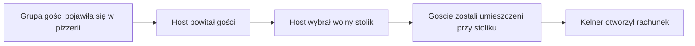
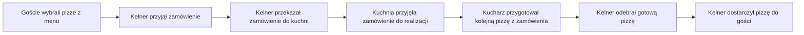
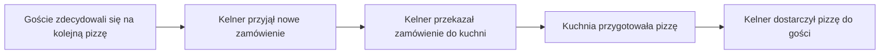
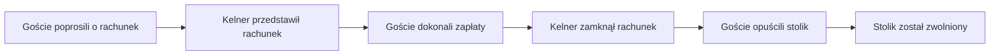
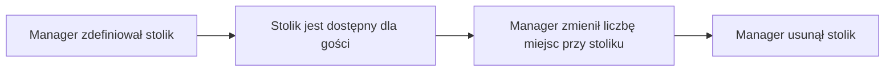
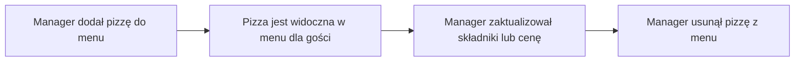
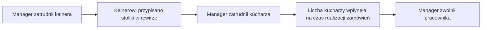
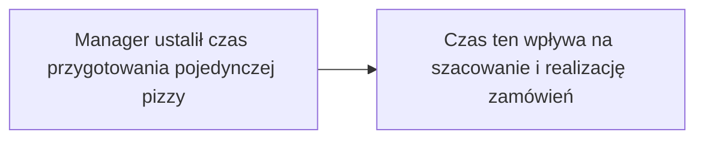
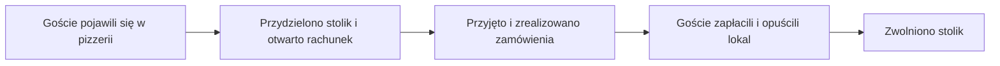
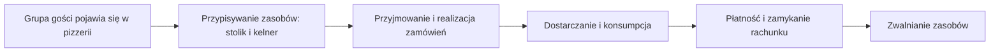

# Event Storming – Big Picture

## Cel

Celem pierwszego etapu Event Stormingu jest odkrycie głównych procesów biznesowych zachodzących w Pizzerii, bez projektowania modelu domenowego, agregatów oraz bounded contextów.

Na tym etapie odpowiadamy wyłącznie na pytanie:

> **Co dzieje się w świecie Pizzerii?**

---

# Wizja produktu

Pizzeria jest interaktywną symulacją restauracji, w której użytkownik wciela się w rolę gości lub obserwuje zachowania automatycznego personelu. Sercem domeny jest pełny cykl życia obsługi grupy gości — od wejścia do lokalu, przez zajęcie stolika, składanie zamówień, ich przygotowanie w kuchni, dostarczenie, konsumpcję, aż po zapłatę i opuszczenie lokalu.

---

# Uczestnicy procesu

Na poziomie Big Picture zidentyfikowano następujących uczestników:

* **GuestGroup** — grupa osób przychodząca do pizzerii, zamawiająca, konsumująca, płacąca
* **Host** — witający gości przy wejściu, przydzielający stolik (dokładnie jeden w pizzerii)
* **Waiter** — kelner obsługujący stolik, przyjmujący zamówienia, przekazujący je do kuchni, dostarczający pizze, przyjmujący płatność
* **Chef** — kucharz pracujący w kuchni, przygotowujący pizze z kolejki zamówień
* **Manager** — konfigurujący pizzerię: stoliki, menu, personel, parametry przygotowania

---

# Odkryte procesy biznesowe

## 1. Przyjęcie gości do lokalu

Proces rozpoczyna się w momencie pojawienia się grupy gości w pizzerii.

---

## 2. Zamówienie i przygotowanie pizzy

Goście składają zamówienie składające się z jednej lub wielu pozycji (pizz), które trafia do kuchni i jest realizowane przez kucharzy.

**Uwaga domenowa:** Kelner dostarcza pizze do stolika wtedy, gdy ma czas — nie czeka na zakończenie całego zamówienia. Pojedyncze pizze mogą być dostarczane niezależnie.

---

## 3. Rozszerzenie zamówienia

Goście mogą zamawiać kolejne pizze w ramach tego samego rachunku.

**Uwaga domenowa:** Zamówienie (Order) to pojęcie z domeny produktowej — grupa pizz zamówionych w jednym akcie przez gości. Zamówienie nie zawiera informacji o kosztach. Rachunek (Bill) to pojęcie z domeny finansowej — zbiera pozycje z jednego lub wielu zamówień i oblicza całkowity koszt do zapłaty. Każde zamówienie jest osobnym bytem, ale rachunek agreguje je w jedną transakcję płatniczą.

---

## 4. Płatność i opuszczenie lokalu

Goście proszą o rachunek, dokonują zapłaty i opuszczają pizzerię.

---

## 5. Zarządzanie stolikami

Manager definiuje dostępne stoliki w pizzerii.

---

## 6. Zarządzanie menu

Manager definiuje pizzę dostępną w ofercie.

---

## 7. Zarządzanie personelem

Manager zatrudnia personel i przypisuje go do stolików lub kuchni.

---

## 8. Konfiguracja parametrów pizzerii

Manager ustawia globalne parametry wpływające na działanie kuchni.

---

# Najważniejsze odkrycie

Podczas analizy zauważono, że:

* zamówienie pojedynczej pizzy,
* zamówienie wielu pizz jako jedna transakcja,
* dokładanie pizzy do istniejącego rachunku,

nie stanowią odrębnych bytów domenowych w sensie modelu danych, ale różnią się **kontekstem procesowym**.

Sercem domeny jest nie sama pizza ani stolik, lecz **cykl życia obsługi grupy gości** — złożony proces koordynujący dostępność zasobów (stoliki, kelnerzy, kucharze), przepływ zamówień oraz zamykanie rachunku.

Oznacza to, że sercem domeny jest koordynacja **przepływu gości przez pizzerię**, a nie statyczny katalog dań czy lista stolików.

---

# Pytania do dalszej analizy

Podczas kolejnych warsztatów należy odpowiedzieć między innymi na następujące pytania:

* Czy stolik może być rezerwowany z wyprzedzeniem, czy wyłącznie na żywo?
* Czy grupa gości może zmienić stolik w trakcie wizyty?
* Czy rachunek może być dzielony między osobami w grupie?
* Czy kelner może obsługiwać więcej niż jeden stolik jednocześnie?
* Czy kucharz może przygotowywać więcej niż jedną pizzę naraz?
* Czy zamówienie może być anulowane po przekazaniu do kuchni?
* Czy menu może zawierać pozycje czasowo niedostępne (brak składników)?
* Czy goście mogą zamawiać pozycje spoza menu (np. modyfikacje)?
* Czy system powinien obsługiwać napiwki?

---

# Wniosek

Najważniejszym odkryciem pierwszego etapu Event Stormingu jest to, że **Pizzeria nie jest systemem rezerwacyjnym ani systemem POS**.

Pizzeria jest symulacją koordynacji procesów domenowych, w której centralnym problemem jest zarządzanie równoczesnym przepływem wielu grup gości przez ograniczone zasoby (stoliki, kelnerzy, kucharze) oraz śledzenie ich cyklu życia w czasie rzeczywistym.

Centralnym procesem domenowym jest:

To właśnie wokół tego procesu powinien zostać zbudowany model domenowy w kolejnych etapach projektowania.
