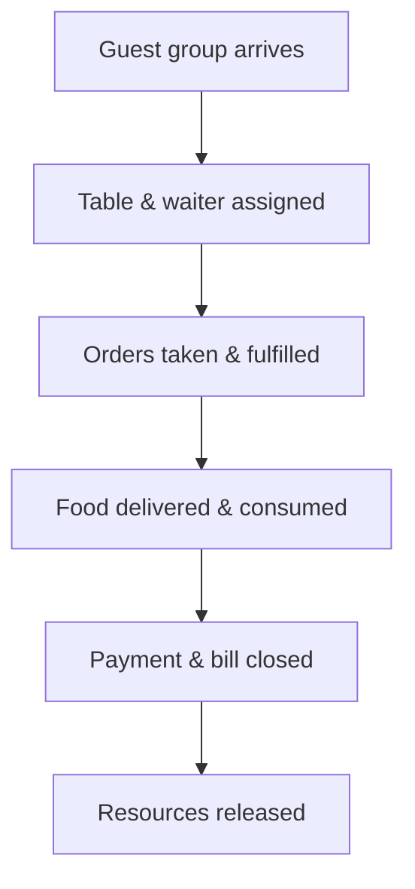

# 02. Discover — Big Picture EventStorming

**Step in the [DDD Starter Modelling Process](https://github.com/ddd-crew/ddd-starter-modelling-process):** 2 of 8 — *Discover* (part 1: Big Picture).

**Purpose:** collaboratively and visually explore domain knowledge — what actually happens in the Pizzeria world — without yet designing processes, aggregates, or bounded contexts.

**Key question:** *what happens in the world of Pizzeria?*

This document stays at the Big Picture level: a timeline of domain events, the actors who trigger them, and a rough first grouping into candidate process areas. Commands, policies, and read models are deferred to `02_discover_process_level.md`. Sub-domain boundaries are a deliberate decision left to step 3 (*Decompose*).

---

## 1. Actors

* **GuestGroup** — a group of people arriving at the pizzeria to order, eat, and pay, handled as a single unit. Tagged as `(Guest)` on individual events/commands below, for brevity.
* **Host** — greets arriving guests and assigns a table (exactly one Host in the pizzeria).
* **Waiter** — serves an assigned set of tables: takes orders, relays them to the kitchen, delivers food, handles payment.
* **Kitchen** — coordinates the kitchen as a whole: accepts incoming orders, splits them into pizzas, distributes pizzas to chefs, tracks per-order progress, and signals when an order is ready. Distinct from an individual `Chef`.
* **Chef** — works in the kitchen, preparing pizzas pulled from the kitchen's production queue.
* **Manager** — configures the pizzeria: tables, menu, staff, kitchen parameters, and the pizzeria's own open/closed status.

This matches the actors already identified in `01_understand.md` §2 — Host, Waiter, and Chef are the automated in-simulation roles; Guest and Manager are perspectives the human user can take on.

---

## 2. Timeline of domain events

Domain events, grouped by the process that owns them (see §3 for the full process hierarchy). Each event is named in the past tense and tagged with the actor whose action triggered it.

### 2.1 Guest Service (main process)

#### 2.1.1 Guest Arrival

* `GuestGroupArrived` (Guest)
* `TableAssigned` (Host)
* `GuestGroupRefused` (Host) — no qualifying table found; the group leaves and the process ends here for them. *(surfaced during process-level discovery, see `02_discover_process_level.md` §1.1)*
* `GuestGroupSeated` (Host)

#### 2.1.2 Bill Management

* `BillOpened` (Waiter)
* `BillRequested` (Guest)
* `PaymentReceived` (Waiter)
* `BillClosed` (Waiter)

#### 2.1.3 Ordering

* `OrderPlaced` (Guest, via Waiter)
* `OrderSentToKitchen` (Waiter)
* `OrderPickedUpFromKitchen` (Waiter)
* `OrderDelivered` (Waiter)

*This cycle repeats every time a guest group places an additional order within the same open bill.*

##### 2.1.3.1 Kitchen Order Fulfilment (sub-process of Ordering)

* `OrderSplitIntoPizzas` (Kitchen)
* `OrderAccepted` (Kitchen) — carries the estimated wait time to Guest Service; not stored anywhere, purely relayed to the GUI (`08_guest_service_read_models.md`).
* `PizzaPreparationStarted` (Chef)
* `PizzaPrepared` (Chef)
* `ChefFinishedPizza` (Chef) — carries which chef just finished, to Resource Management's Chef Management; feeds `FinalizeChefTermination` (`08_resource_management_aggregates.md` §4).
* `OrderReadyForPickup` (Kitchen)
* `PizzaPreparationTimeSet` (Manager) — configuration event, not tied to a specific order; the prep-time parameter belongs to this context.

#### 2.1.4 Departure

*Coordinated directly by the main process — not a dedicated sub-process.*

* `GuestGroupLeft` (Guest)
* `TableReleased` (system, consequence of `GuestGroupLeft`)

### 2.2 Supporting processes

#### 2.2.1 Table Management

* `TableAdded` (Manager)
* `TableCapacityChanged` (Manager)
* `TableRenamed` (Manager) — UI-only identification, no domain meaning beyond that. *(surfaced during tactical design, see `02_discover_process_level.md` §2)*
* `TableRemoved` (Manager)
* `TableAssignedToWaiter` (Manager)
* `TableUnassignedFromWaiter` (Manager)

#### 2.2.2 Menu Management

* `MenuItemAdded` (Manager)
* `MenuItemUpdated` (Manager)
* `MenuItemDisabled` (Manager) — soft delete; hidden from guests and kitchen, data retained. *(surfaced during tactical design, see `02_discover_process_level.md` §3)*
* `MenuItemEnabled` (Manager) — restores a `Disabled` item directly back to `Active`. *(surfaced during tactical design, see `02_discover_process_level.md` §3)*

#### 2.2.3 Waiter Management

* `WaiterHired` (Manager)
* `WaiterTerminationStarted` (Manager)
* `WaiterTerminated` (system, once all currently-served tables are done)
* `WaiterRehired` (Manager) — `Terminated` isn't final; only reachable from `Terminated`, never directly from `Terminating`. *(surfaced during tactical design, see `02_discover_process_level.md` §4)*

#### 2.2.4 Chef Management

* `ChefHired` (Manager)
* `ChefTerminationStarted` (Manager)
* `ChefTerminated` (system, once the pizza currently in progress is done)
* `ChefRehired` (Manager) — same shape as `WaiterRehired`. *(surfaced during tactical design, see `02_discover_process_level.md` §5)*

#### 2.2.5 Pizzeria Lifecycle

* `PizzeriaOpened` (Manager)
* `PizzeriaClosingStarted` (Manager)
* `PizzeriaClosed` (system, once the pizzeria is `Closing` and the last guest group has left — see `02_discover_process_level.md` §6)

---

## 3. Rough process groupings

A first process hierarchy — not yet a final sub-domain decision (that's step 3, *Decompose*), but already grounded in real process boundaries:

1. **Guest Service** — main process; coordinates the whole guest-visit lifecycle end-to-end.
   1. **Guest Arrival** — seats an incoming guest group; ends once the group is seated.
   2. **Bill Management** — owns the bill's `Open → Closed` lifecycle for the visit.
   3. **Ordering** — takes and fulfils a single order; repeatable while the bill stays open.
      1. **Kitchen Order Fulfilment** — internal kitchen mechanics for one order (splitting into pizzas, chef assignment, readiness).
   4. **Departure** — leaving and releasing the table. Coordinated directly by the main process, not a dedicated sub-process (unlike 1–3 above).
2. **Table Management** — defines tables, tracks `Free`/`Occupied` state, and assigns them to waiters.
3. **Menu Management** — defines and maintains menu items.
4. **Waiter Management** — hires/terminates waiters.
5. **Chef Management** — hires/terminates chefs.
6. **Pizzeria Lifecycle** — the `Open`/`Closing`/`Closed` status gating whether Guest Service can even start.

**Why Waiter Management and Chef Management are separate, not a shared "Staff" process:** both roles share an `Active`/`Terminating`/`Terminated` shape, but what "finish current work before terminating" means differs in a way that matters domain-wise — a waiter finishes serving every table currently assigned to them, a chef finishes only the one pizza currently in hand. Modelling them behind one generic "Staff" interface would hide that difference; keeping them as two independent supporting processes keeps each one's rules explicit.

---

## 4. Key insight

Placing single-pizza orders, multi-pizza orders, and additional orders added to an already-open bill side by side shows they aren't distinct domain concepts — they differ only in **process context**, not in shape.

The heart of the domain isn't the menu or the tables — it's the **guest group's service lifecycle**: a process that coordinates resource availability (tables, waiters, chefs), the flow of orders, and the closing of a bill.

Pizzeria is not a reservation system and not a POS system — it's a simulation of coordinating the concurrent flow of multiple guest groups through a shared, limited pool of resources (tables, waiters, chefs), tracked in real time. The model built in later steps should be organised around this flow, not around static catalogs like the menu or the table list.

---

## 5. Decisions made during Big Picture discovery

Several scope questions came up while sweeping the domain and were settled immediately, since they directly shaped which events belong on the timeline above:

* **No advance table reservations** — tables are assigned live only (`Free` / `Occupied`). Reservation windows, no-shows, and confirmations are a separate domain, out of scope.
* **No table changes mid-visit** — a guest group stays at the table the Host assigned for the whole visit.
* **No split bills** — a guest group is never broken down into individual people, so there's no basis for splitting payment.
* **A waiter can serve multiple tables** — sequentially, one action at a time; this is central to simulating realistic staff workload.
* **A chef prepares one pizza at a time** — multiple chefs can work in parallel, which is what drives simulation dynamics.
* **No order cancellation once sent to the kitchen** — orders always run to completion; this avoids modelling refunds and undoing ingredient usage.
* **No temporarily unavailable menu items** — the menu only ever lists items that are available; no ingredient-stock modelling.
* **No off-menu orders or modifications** — guests order only from ready-made menu items.
* **No tips** — out of scope; payment covers only the bill amount.

---

## Open Questions

* ~~Is a waiter's task queue FIFO, or does it prioritise certain actions?~~ Resolved: strictly FIFO in the simplified model. See `02_discover_process_level.md` §1.3.
* ~~Exact rules for when the pizzeria transitions `Open → Closing → Closed`, and what is/isn't allowed in each state.~~ Resolved in `02_discover_process_level.md` §6.

None remaining.
