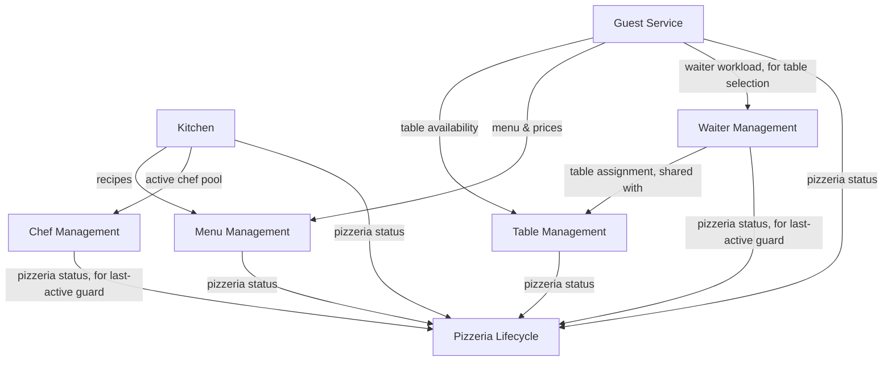

# 03. Decompose — Candidate Subdomains

**Step in the [DDD Starter Modelling Process](https://github.com/ddd-crew/ddd-starter-modelling-process):** 3 of 8 — *Decompose*.

**Purpose:** break the domain into loosely-coupled sub-domains, to reduce cognitive load and clarify ownership boundaries.

**Key question:** *where are the natural seams in this domain?*

This document groups the process hierarchy from `02_discover_big_picture.md` §3 into candidate **subdomains** — distinct areas of the business problem, each requiring its own domain knowledge, with its own pace of change and its own reasons to stay loosely coupled from its neighbours. This is purely a boundary-finding exercise: naming the seams and justifying why each one is a seam. Classifying each subdomain's business significance (Core/Supporting/Generic) is a separate judgment, deliberately deferred to step 4 (*Strategize*), which uses the boundaries drawn here as its input.

**Note on granularity vs. Bounded Contexts:** subdomains identified here are allowed to be fine-grained. Whether several of them later end up sharing one Bounded Context is a separate decision, deferred to step 7 (*Define*) — a subdomain boundary and a Bounded Context boundary don't have to coincide.

---

## 1. Candidate subdomains

| Subdomain | Related processes (`02_discover_process_level.md`) |
|---|---|
| **Guest Service** | §1.1 Guest Arrival, §1.2 Bill Management, §1.3 Ordering, §1.4 Departure |
| **Kitchen** | §1.3.1 Kitchen Order Fulfilment |
| **Table Management** | §2 Table Management |
| **Menu Management** | §3 Menu Management |
| **Waiter Management** | §4 Waiter Management |
| **Chef Management** | §5 Chef Management |
| **Pizzeria Lifecycle** | §6 Pizzeria Lifecycle |

---

## 2. Rationale

Each boundary below is justified by cohesion inside it and loose coupling at its edges — not by business importance (that's step 4's question).

### Guest Service

Everything here shares one linguistic and temporal boundary: a single guest visit. `GuestGroup`, the table-visit association, `Bill`, and `Order` (guest-facing side) all come into existence and get resolved within the same visit lifecycle, and change together — a rule about when a bill can close is inseparable from a rule about order delivery tracking. Splitting this further would cut through processes that are one continuous story (`02_discover_process_level.md` §1.1–§1.4).

### Kitchen

Has its own read models (Production Queue, Order Progress) and its own rate of change (chef-assignment strategy, prep-time estimation policy) that are independent of how guests are served at the table. The moment an order crosses into the kitchen, the vocabulary shifts from "order" to "pizza production tasks" — a distinct ubiquitous language pocket, even though it's triggered by Guest Service.

### Table Management

A self-contained resource lifecycle (`Free`/`Occupied`, capacity) with its own guard rules, usable independently of who's currently seated there or which waiter serves it. Cohesive on its own, and doesn't need to know anything about guests, bills, or orders.

### Menu Management

`MenuItem` definitions (name, ingredients, recipe, price) form a self-contained catalog, changed on its own schedule by the Manager, independent of any specific order or visit in progress.

### Waiter Management

The waiter hiring/termination lifecycle and table assignment form one cohesive story: a waiter's `Active`/`Terminating`/`Terminated` state and the "finish every currently-assigned table" completion rule are meaningless without also tracking which tables that waiter serves. That coupling is why table assignment sits here rather than in Table Management (`02_discover_process_level.md` §2's note).

### Chef Management

Same shape of reasoning as Waiter Management — a self-contained hire/terminate lifecycle — but a **separate** boundary from it. Per the callout in `02_discover_big_picture.md` §3: a chef's "finish current work" rule (complete the one pizza in hand) is a different rule from a waiter's, tied to a different resource (the production queue, not tables). Merging the two would force one shared completion-rule interface over two genuinely different rules.

### Pizzeria Lifecycle

A tightly self-contained state machine (`Open`/`Closing`/`Closed`) that's cohesive on its own terms, even though its guard conditions reach outward into nearly every other subdomain (`02_discover_process_level.md` §6). It stays a separate boundary because nothing else owns "is the pizzeria open" — every other subdomain only *consumes* that status, none of them *decides* it.

---

## 3. Subdomain boundaries

### Guest Service

**Includes:** `GuestGroup` identity for the duration of a visit, the table-visit association, `Bill` lifecycle, `Order` lifecycle (guest-facing side), coordination of arrival → ordering → payment → departure.

**Excludes:** internal kitchen mechanics, configuration of menu/tables/staff.

### Kitchen

**Includes:** the `Kitchen` coordinator role, per-pizza production tasks, the shared production queue, order-readiness tracking.

**Excludes:** how orders are placed by guests, how completed orders reach the table, menu configuration.

### Table Management

**Includes:** `Table` definition, capacity, `Free`/`Occupied` state.

**Excludes:** guest seating decisions (that's Guest Service reacting to/driving this state), which waiter a table is assigned to (that's Waiter Management).

### Menu Management

**Includes:** `MenuItem` definitions — name, ingredients, recipe, price.

**Excludes:** order placement, kitchen fulfilment.

### Waiter Management

**Includes:** waiter hiring/termination lifecycle, table-to-waiter assignment.

**Excludes:** the tables themselves (Table Management), direct guest interaction (Guest Service).

### Chef Management

**Includes:** chef hiring/termination lifecycle.

**Excludes:** the production queue and pizza preparation itself (Kitchen) — Chef Management only owns *whether* a chef is available to work, not their in-kitchen task execution.

### Pizzeria Lifecycle

**Includes:** `Open`/`Closing`/`Closed` state and the readiness/shutdown conditions gating it.

**Excludes:** the operational logic it gates (all other subdomains).

---

## 4. Subdomain map

Edges show structural/configuration dependencies (which subdomain's data or state another one needs to make a decision) — not process message flows. End-to-end scenario flows (e.g. an order travelling from Guest Service to Kitchen) are step 5's concern (*Connect*).

---

## 5. Decisions

* **Is Kitchen its own subdomain, or part of Guest Service?** Its own subdomain. Even though it's modelled as a sub-process of Ordering (`02_discover_process_level.md` §1.3.1), a subdomain boundary doesn't have to match process nesting — Kitchen has its own read models, its own pace of change, and its own coordinating role distinct from guest-facing concerns.
* **Are Waiter Management and Chef Management one subdomain or two?** Two — see rationale above. This mirrors the step 2 decision against a shared "Staff" grouping, applied one level up.
* **Are Table Management, Menu Management, Waiter Management, and Chef Management going to be separate Bounded Contexts, or grouped into one?** Deliberately not decided here — deferred to step 7 (*Define*).

---

## Open Questions

None at this stage.
