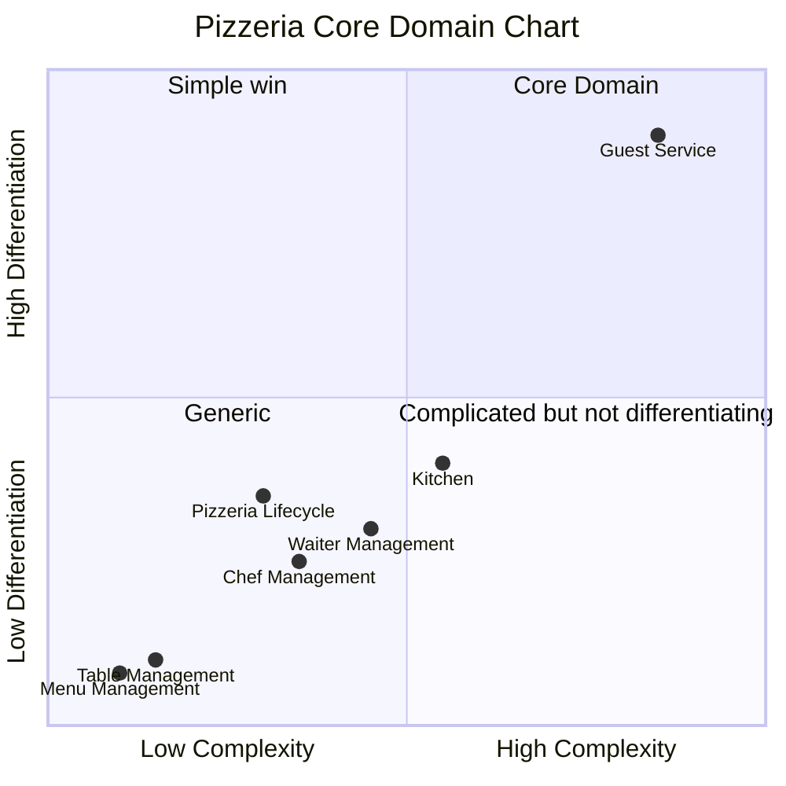

# 04. Strategize — Core Domain Chart

**Step in the [DDD Starter Modelling Process](https://github.com/ddd-crew/ddd-starter-modelling-process):** 4 of 8 — *Strategize*.

**Purpose:** identify which subdomains represent the greatest business differentiation, to prioritise modelling and implementation effort accordingly.

**Key question:** *which parts of this domain matter most, and which are just necessary plumbing?*

This document classifies each of the subdomains identified in `03_decompose_subdomains.md` §1 by business significance, and plots that against **complexity** to decide where modelling depth (and, later, implementation effort) actually pays off:

* **Core Domain** — where the business wins in the market; contains the most sophisticated business logic.
* **Supporting Subdomain** — needed for the Core Domain to work, but not a market differentiator.
* **Generic Subdomain** — solved by off-the-shelf approaches; no domain-specific logic.

Two subdomains can share a classification (e.g. both "Supporting") while deserving very different amounts of attention — that's what the complexity axis is for.

---

## 1. Classification

| Subdomain | Type |
|---|---|
| **Guest Service** | Core Domain |
| **Kitchen** | Supporting |
| **Waiter Management** | Supporting |
| **Chef Management** | Supporting |
| **Pizzeria Lifecycle** | Supporting |
| **Table Management** | Generic |
| **Menu Management** | Generic |

Reasoning for each is in §3 below, alongside its complexity positioning.

---

## 2. Core Domain Chart

Axes: **Complexity** (how much inherent logic/effort the subdomain requires) vs. **Differentiation** (how much this subdomain is *the point* of the simulation, as opposed to necessary plumbing around it).

---

## 3. Positioning rationale

### Guest Service — high complexity, high differentiation (Core)

Classified Core Domain: it earns the top-right corner on both axes — the richest guard logic (bill closing conditions, order-delivery tracking, table-selection load balancing), the most cross-subdomain coordination, and — per the Key Insight in `02_discover_big_picture.md` §4 — it's literally what the simulation exists to demonstrate.

### Kitchen — moderate-high complexity, low-moderate differentiation (Supporting)

Genuinely non-trivial (shared production queue, per-order progress tracking, time estimation policy feeding back to the Waiter), but its complexity is *necessary plumbing* for fulfilling orders, not something that differentiates the simulation. Placed right of center on complexity, well below Guest Service on differentiation.

### Waiter Management — moderate complexity, low-moderate differentiation (Supporting)

Meaningful complexity from its own domain: hire/terminate lifecycle, table assignment, and the guard against terminating the last active waiter, plus its "finish serving every assigned table" completion rule. Still supporting, not core — the pizzeria isn't differentiated by *how* it staffs waiters.

### Chef Management — lower complexity, low-moderate differentiation (Supporting)

Same shape as Waiter Management but simpler — its completion rule only concerns one pizza in hand, not a set of tables, and it has no table-assignment or load-balancing dimension. Placed left of Waiter Management on complexity.

### Pizzeria Lifecycle — moderate complexity, low-moderate differentiation (Supporting)

The state machine itself is small (`Open`/`Closing`/`Closed`), but per `02_discover_process_level.md` §6 its guard conditions reach into nearly every other subdomain (readiness checks, last-active-staff guards, auto-close condition). That structural reach is why it isn't pushed further left/down despite simple internal state — the complexity is in its *coupling*, not its own logic.

### Table Management — low complexity, low differentiation (Generic)

Classified Generic: `Free`/`Occupied` plus a couple of guard rules, no Pizzeria-specific logic beyond that. Bottom-left corner.

### Menu Management — lowest complexity, lowest differentiation (Generic)

Classified Generic: plain CRUD over `MenuItem` with two read views. The simplest subdomain in the system.

---

## 4. What this means for later steps

* **Guest Service** deserves the deepest tactical design in step 8 (*Code*) — the richest aggregates, the most carefully modelled invariants. It's also the natural first candidate whenever the modelling process loops back for a second pass.
* **Kitchen, Waiter Management, Chef Management, Pizzeria Lifecycle** need real modelling (they're not trivial CRUD), but design effort there should stay proportional — enough to capture their specific rules, without gold-plating.
* **Table Management and Menu Management** are the least interesting subdomains to model deeply. In a real (non-simulation) system these would be prime candidates for an off-the-shelf/generic solution rather than custom-built logic; here, they still need implementing, but they're not where design time should concentrate.

---

## Open Questions

None at this stage.
