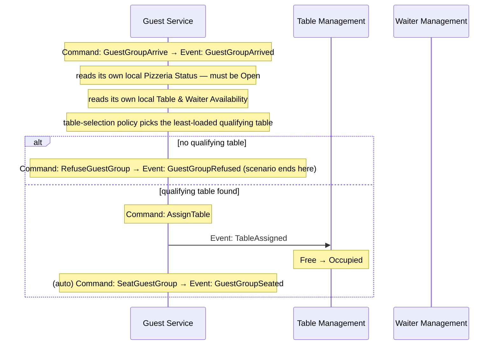
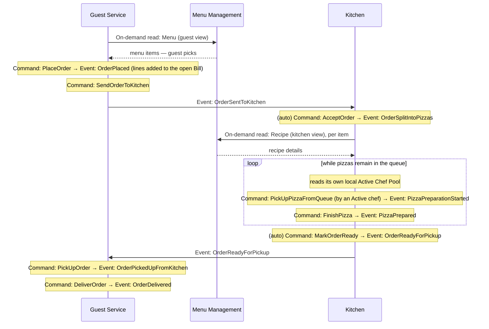
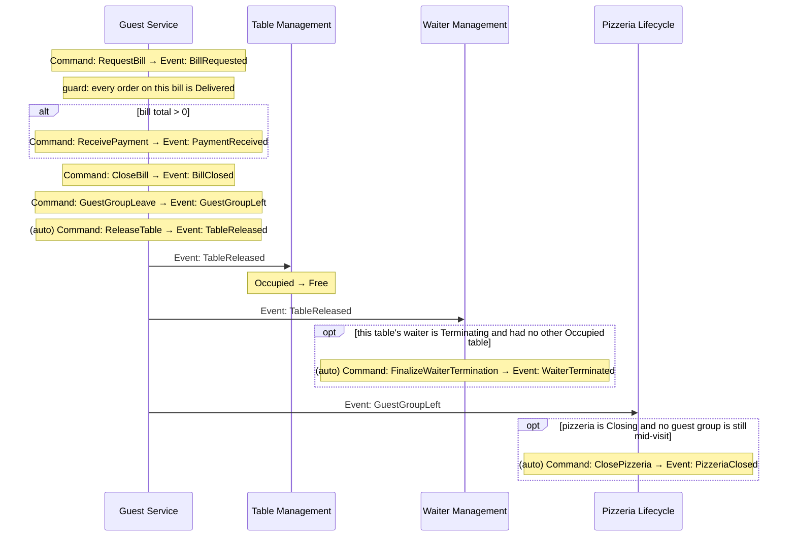
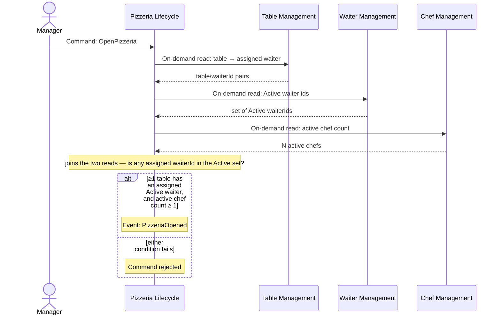
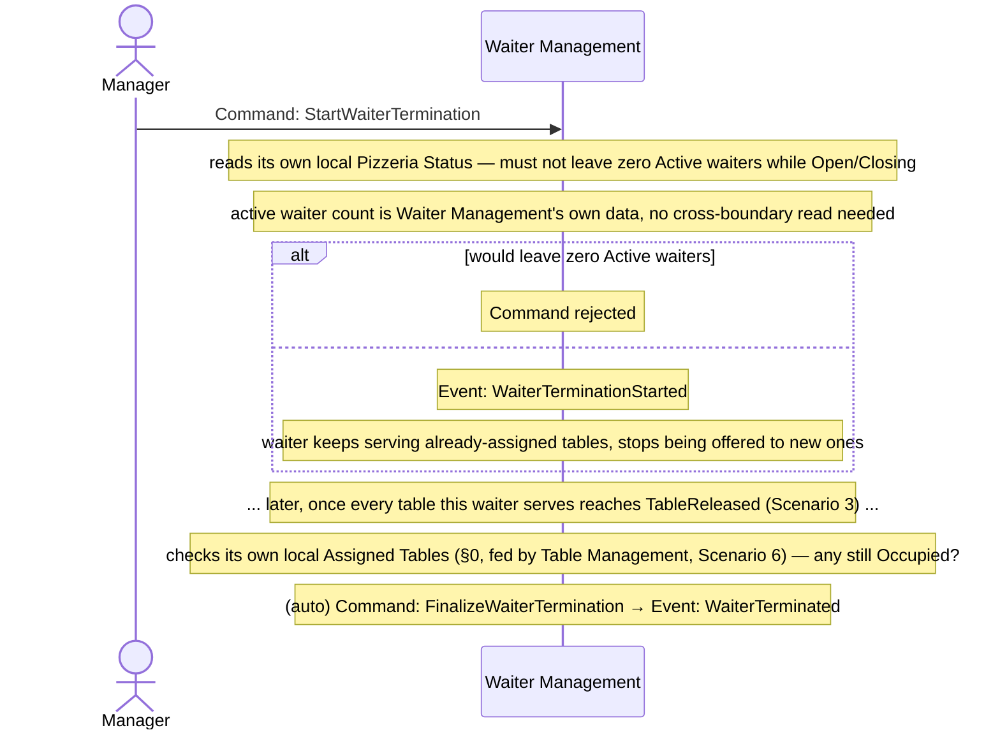
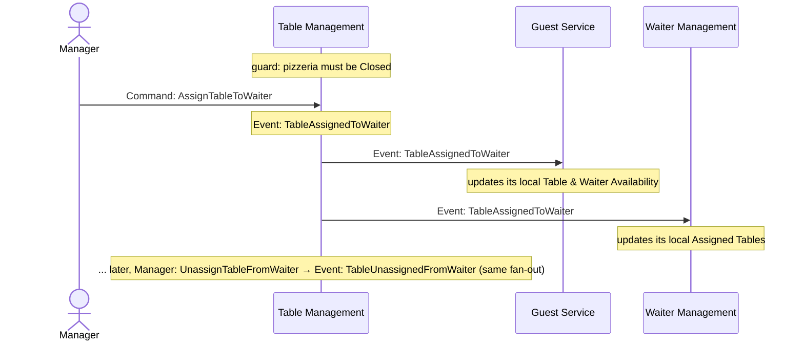

# 05. Connect — Domain Message Flow Modelling

**Step in the [DDD Starter Modelling Process](https://github.com/ddd-crew/ddd-starter-modelling-process):** 5 of 8 — *Connect*.

**Purpose:** design how the subdomains identified in `03_decompose_subdomains.md` collaborate to fulfil end-to-end business scenarios.

**Key question:** *how does a business scenario flow across subdomain boundaries?*

Each scenario below is a **Domain Message Flow** — commands, events, and reads crossing subdomain boundaries in sequence, for one concrete end-to-end story. Internal detail already captured in `02_discover_process_level.md` (which command produces which event, what guards apply) isn't repeated here; this document focuses purely on the *cross-boundary* hand-offs.

## Notation

Each diagram is a swimlane per subdomain (plus external actors where a scenario starts with a human decision).

* **Command** — solid arrow, e.g. `Command: PlaceOrder`.
* **Event** — solid arrow, e.g. `Event: OrderPlaced`.
* **On-demand read** — dashed arrow pair (request, then the data returned), used for the on-demand-read exceptions described in §0.

## 0. Integration rule: replicate for decisions, read live only when it's safe or cheap to

When a subdomain needs another subdomain's data to make a decision (a guard, a price, a status that blocks/allows an action), it keeps its **own local copy**, kept current by consuming that owner's **integration events** — it does not query the owner live in the middle of a scenario. That default is set aside only when one of these holds:

* the data is purely for **display**, not fed into a decision;
* the operation is **rare and deliberate** enough that a standing local copy would be wasteful to maintain (`OpenPizzeria`, below);
* the owner's **own domain rules already guarantee** the data can't change while it matters — so a live read is exactly as current as a replica would be, without the upkeep (Menu Management, below).

| Consumer | Local read model | Fed by (owner → integration events) | Why replicated |
|---|---|---|---|
| Guest Service | Table & Waiter Availability | Table Management: `TableAdded`, `TableCapacityChanged`, `TableRemoved`, `TableAssignedToWaiter`, `TableUnassignedFromWaiter` · Waiter Management: `WaiterHired`, `WaiterTerminationStarted`, `WaiterTerminated` | Feeds the Host's table-selection decision on every guest arrival. (`Free`/`Occupied` itself isn't replicated from elsewhere — Guest Service already knows it first-hand, from its own `TableAssigned`/`TableReleased` actions.) |
| Guest Service | Pizzeria Status | Pizzeria Lifecycle: `PizzeriaOpened`, `PizzeriaClosingStarted`, `PizzeriaClosed` | Gates whether the Host admits a guest group at all — checked on every arrival. |
| Kitchen | Active Chef Pool | Chef Management: `ChefHired`, `ChefTerminationStarted`, `ChefTerminated` | Checked every time a chef would pull from the production queue — feeds who's eligible to work. |
| Waiter Management | Assigned Tables | Table Management: `TableAssignedToWaiter`, `TableUnassignedFromWaiter` | Feeds the termination-completion guard — whether any `Occupied` table is still assigned to a `Terminating` waiter (`02` §4). |
| Waiter Management | Pizzeria Status | Pizzeria Lifecycle: `PizzeriaOpened`, `PizzeriaClosingStarted`, `PizzeriaClosed` | Feeds the last-active-waiter termination guard. |
| Chef Management | Pizzeria Status | Pizzeria Lifecycle: `PizzeriaOpened`, `PizzeriaClosingStarted`, `PizzeriaClosed` | Feeds the last-active-chef termination guard. |

`TableAssignedToWaiter`/`TableUnassignedFromWaiter`, like every other Table Management event, can only be published while the pizzeria is `Closed` (`02` §2) — both consumers above have caught up by the time it reopens.

**Exception 1 — rare operation:** Pizzeria Lifecycle reads Table Management, Waiter Management, and Chef Management **live**, on demand, only when a Manager attempts `OpenPizzeria` — see Scenario 4. Opening the pizzeria is a rare, deliberate, one-off action; maintaining a standing local copy of table-to-waiter assignment, waiter status, and chef count purely to validate it would be pure overhead for a check that fires maybe once a day.

**Exception 2 — domain-guaranteed stability:** Guest Service reads Menu Management's **Menu (guest view)** live, and Kitchen reads Menu Management's **Recipe (kitchen view)** live — see Scenario 2. Neither is replicated, even though both feed real decisions (order pricing, what the chef prepares). This is safe because Menu Management's own `Closed`-only guard (`02` §3) guarantees the menu cannot change while the pizzeria is `Open` or `Closing` — i.e. for the entire span of any guest visit or kitchen order. A live read during that window returns exactly what a replica would, so replication would only add upkeep, not safety. (This also *eliminates* the original menu-price race at its domain-rule source, rather than just papering over it with fresher reads — the guest sees a price, and it cannot possibly change before the bill closes.)

---

## Scenario 1: Guest group arrives and is seated

Crosses: **Guest Service** ↔ **Table Management**, **Waiter Management**, **Pizzeria Lifecycle**. Grounded in `02_discover_process_level.md` §1.1.

**Narrative:** the Host doesn't ask anyone anything at seating time — both "is the pizzeria even open" and "which tables are free, with which waiter" are already sitting in Guest Service's own locally-replicated read models (§0), kept current by events published independently, ahead of time, by Pizzeria Lifecycle, Table Management, and Waiter Management. The only live cross-boundary traffic in this scenario is outbound: `TableAssigned`, which Table Management picks up asynchronously to flip its own `Free → Occupied` state — Guest Service doesn't wait for or need a reply.

---

## Scenario 2: Order is placed and fulfilled

Crosses: **Guest Service** ↔ **Kitchen**. Grounded in `02_discover_process_level.md` §1.3 and §1.3.1.

**This scenario contains §0's Exception 2** (domain-guaranteed stability) — Menu/Recipe reads.

**Narrative:** unlike every other cross-boundary need in this document, Menu and Recipe are read live from Menu Management rather than replicated (§0 Exception 2) — safe because Menu Management's `Closed`-only guard means neither can change during this scenario. Active Chef Pool, by contrast, *is* replicated locally beforehand (§0) — Kitchen never calls out to Chef Management mid-fulfilment, since chef availability changes freely while the pizzeria is `Open`. The only messages that cross the Guest Service ↔ Kitchen boundary itself *in this scenario* are the order handoff (`OrderSentToKitchen`) and the readiness handoff back (`OrderReadyForPickup`).

---

## Scenario 3: End of visit — payment, departure, resource release

Crosses: **Guest Service** → **Table Management**, **Waiter Management**, **Pizzeria Lifecycle**. Grounded in `02_discover_process_level.md` §1.2, §1.4, §2, §4, §6.

**Narrative:** already event-only, no changes needed here — this was the scenario that first showed the shape §0 generalises: one subdomain's events fan out into independent reactions elsewhere. `TableReleased` is consumed by both Table Management (routine state sync) and Waiter Management (a conditional termination-completion check); `GuestGroupLeft` is separately watched by Pizzeria Lifecycle. None of these downstream subdomains are asked anything by Guest Service — they each just watch for the event they care about, exactly the pattern §0 asks for everywhere data feeds a decision.

---

## Scenario 4: Pizzeria opens

Crosses: **Pizzeria Lifecycle** ↔ **Table Management**, **Waiter Management**, **Chef Management**. Grounded in `02_discover_process_level.md` §6.

**This is §0's Exception 1** (rare operation).

**Narrative:** Pizzeria Lifecycle owns the `Open`/`Closing`/`Closed` state, but it owns none of the data needed to validate the transition — not even the readiness check itself, since "at least one table has an assigned `Active` waiter" (`02` §6) is a join across two other subdomains' data (Table Management's assignment, Waiter Management's status) that Pizzeria Lifecycle performs itself, on the fly, rather than delegating to either side. Unlike every other cross-boundary data need in this document, all of this is deliberately read live rather than replicated — opening the pizzeria happens rarely and is always a conscious Manager action, so keeping a standing local projection of table/waiter/chef data solely to serve this one check isn't worth the upkeep.

---

## Scenario 5: A waiter's termination completes

Crosses: **Waiter Management** ↔ **Guest Service** (at the end, via Scenario 3). Grounded in `02_discover_process_level.md` §4.

**Narrative:** the only genuinely cross-boundary data here is pizzeria status, already covered by Waiter Management's own local copy (§0) — the active-waiter count itself is data Waiter Management already owns, not something it needs to fetch from anywhere. The guard at the start and the completion at the end are far apart in time and driven by entirely different sources: the guard is a local read, the completion is driven by two independent sources — Guest Service's departure flow (Scenario 3) triggering via `TableReleased` the moment a table becomes free, and Waiter Management's own locally-replicated Assigned Tables (§0, fed by Table Management's `TableAssignedToWaiter`/`TableUnassignedFromWaiter`, Scenario 6) confirming whether that table was one of this waiter's.

---

## Scenario 6: Manager assigns or unassigns a waiter to a table

Crosses: **Table Management** → **Guest Service**, **Waiter Management**. Grounded in `02_discover_process_level.md` §2 and §4.

**Narrative:** table-to-waiter assignment is entirely Table Management's own decision — it doesn't ask Guest Service or Waiter Management anything, it just publishes the fact once made, exactly like `TableAdded`/`TableCapacityChanged`/`TableRemoved`. Both downstream subdomains pick it up independently to keep their own local replicas current (§0): Guest Service needs it for its table-selection policy, Waiter Management needs it for its termination-completion guard (Scenario 5). Like every Table Management command, this can only run while the pizzeria is `Closed` — by the next `OpenPizzeria` (Scenario 4), every consumer has already caught up.

---

## Observations

* Every cross-boundary interaction in this domain is either a **published event another subdomain independently watches** (feeding either a local read-model replica or a direct reaction) or a deliberately justified **on-demand read** — for a rare, low-frequency decision (`OpenPizzeria`, Scenario 4), or for data whose owning subdomain's own guard rules already make a live read as safe as a replica (Menu/Recipe, Scenario 2). There is no scenario here where one subdomain issues a command directly into another subdomain's command surface, and — per §0 — hot-path, decision-feeding data is only ever fetched live when a domain rule already neutralises the staleness risk that replication would otherwise exist to solve.
* **Pizzeria Lifecycle** is the upstream every other subdomain replicates status from (Scenarios 1 and 5), while itself being one of the two subdomains allowed to read others live — and only for its own rare `OpenPizzeria` check (Scenario 4).
* **Menu Management** is the other subdomain read live rather than replicated from (Scenario 2) — not because it's rare, but because its own `Closed`-only guard makes staleness structurally impossible during the window it matters.
* **Table Management** is upstream of two independent consumers for the same fact (Scenario 6) — Guest Service and Waiter Management each keep their own replica of table-to-waiter assignment, for two unrelated decisions (table selection vs. termination completion). Neither consumer needs the other's replica.
* **Guest Service** is the only subdomain that appears in every scenario — consistent with its Core Domain classification in `04_strategize_core_domain_chart.md`.

---

## Open Questions

None at this stage.
