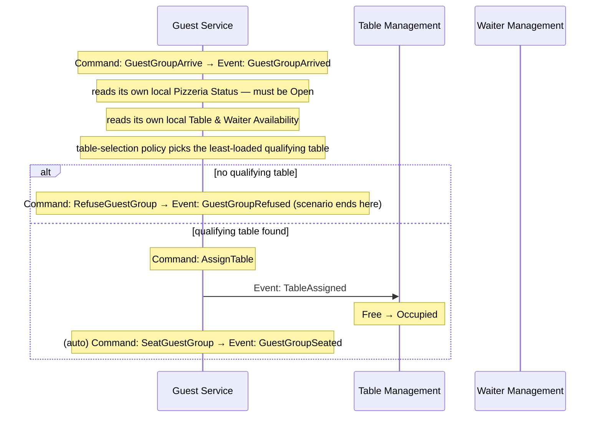
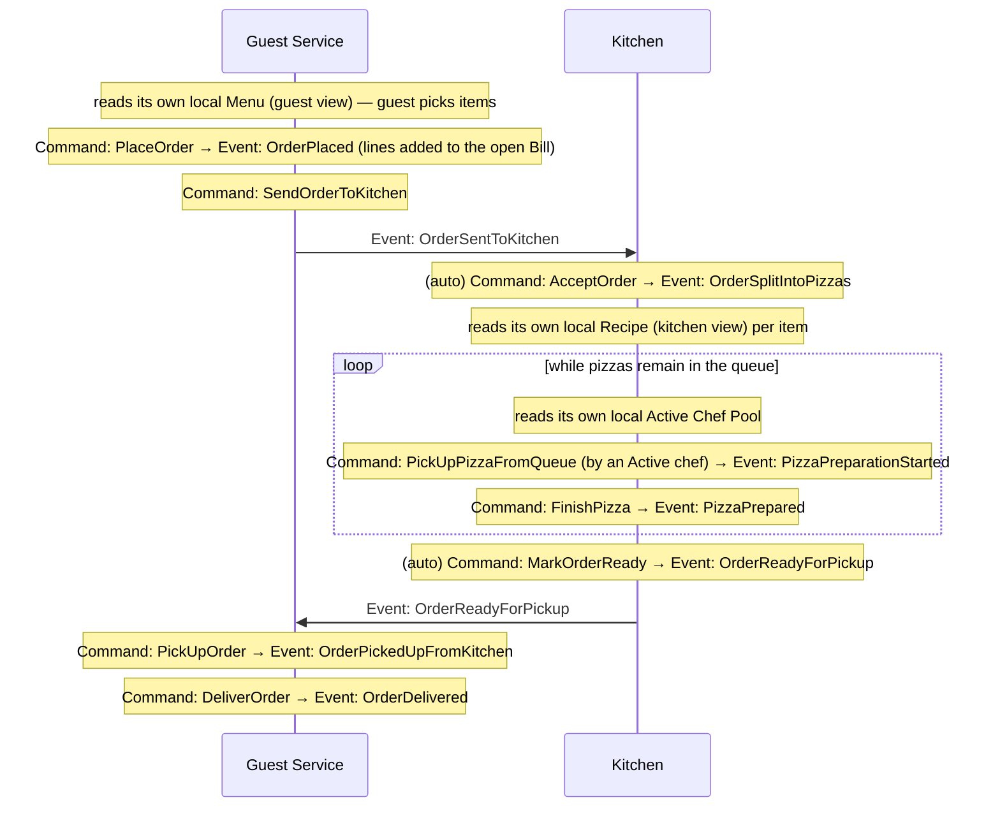
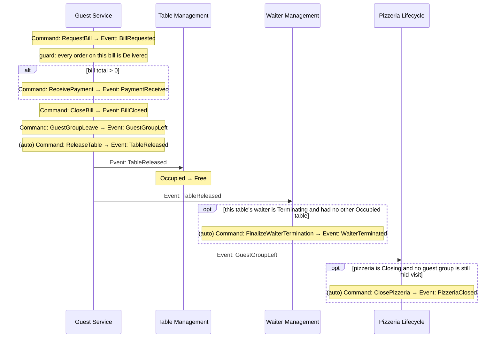
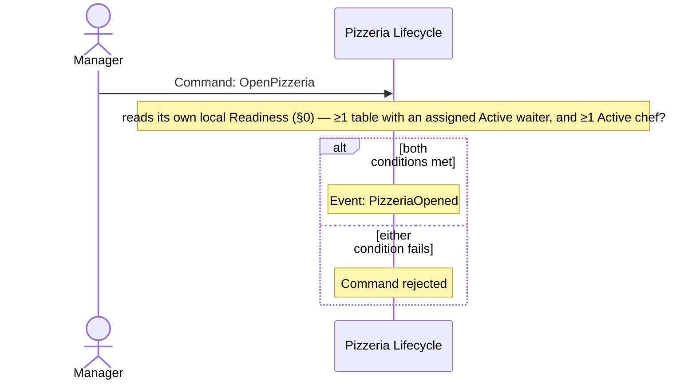
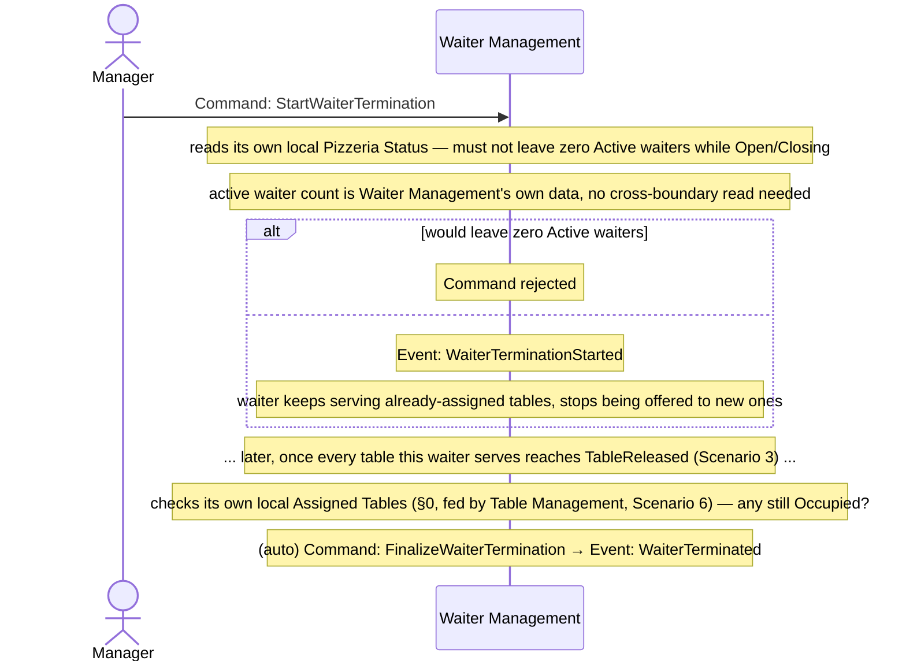
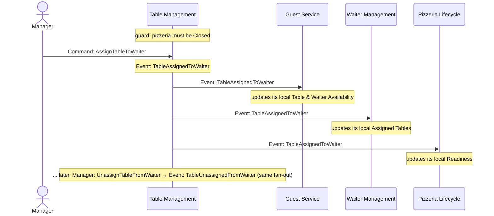

# 05. Connect — Domain Message Flow Modelling

**Step in the [DDD Starter Modelling Process](https://github.com/ddd-crew/ddd-starter-modelling-process):** 5 of 8 — *Connect*.

**Purpose:** design how the subdomains identified in `03_decompose_subdomains.md` collaborate to fulfil end-to-end business scenarios.

**Key question:** *how does a business scenario flow across subdomain boundaries?*

Each scenario below is a **Domain Message Flow** — commands, events, and reads crossing subdomain boundaries in sequence, for one concrete end-to-end story. Internal detail already captured in `02_discover_process_level.md` (which command produces which event, what guards apply) isn't repeated here; this document focuses purely on the *cross-boundary* hand-offs.

## Notation

Each diagram is a swimlane per subdomain (plus external actors where a scenario starts with a human decision).

* **Command** — solid arrow, e.g. `Command: PlaceOrder`.
* **Event** — solid arrow, e.g. `Event: OrderPlaced`.

## 0. Integration rule: every module replicates what it needs — no live cross-module reads

Maximum decoupling is the priority for this system: every subdomain keeps locally everything it needs to operate or decide, and never queries another subdomain live/synchronously — not for a rare operation, and not even when the owner's own domain rules would make a live read provably safe. A subdomain that needs another subdomain's data (a guard, a price, a status, a count) keeps its **own local copy**, kept current by consuming that owner's **integration events**. There are no exceptions to this in the current model.

| Consumer | Local read model | Fed by (owner → integration events) | Why replicated |
|---|---|---|---|
| Guest Service | Table & Waiter Availability | Table Management: `TableAdded`, `TableCapacityChanged`, `TableRemoved`, `TableAssignedToWaiter`, `TableUnassignedFromWaiter` · Waiter Management: `WaiterHired`, `WaiterTerminationStarted`, `WaiterTerminated` | Feeds the Host's table-selection decision on every guest arrival. (`Free`/`Occupied` itself isn't replicated from elsewhere — Guest Service already knows it first-hand, from its own `TableAssigned`/`TableReleased` actions.) |
| Guest Service | Pizzeria Status | Pizzeria Lifecycle: `PizzeriaOpened`, `PizzeriaClosingStarted`, `PizzeriaClosed` | Gates whether the Host admits a guest group at all — checked on every arrival. |
| Guest Service | Menu (guest view) | Menu Management: `MenuItemAdded`, `MenuItemUpdated`, `MenuItemRemoved` | Feeds order pricing — the guest picks items and sees prices without ever calling out to Menu Management. |
| Kitchen | Recipe (kitchen view) | Menu Management: `MenuItemAdded`, `MenuItemUpdated`, `MenuItemRemoved` | Feeds what the chef actually prepares — a production decision, not a display. |
| Kitchen | Active Chef Pool | Chef Management: `ChefHired`, `ChefTerminationStarted`, `ChefTerminated` | Checked every time a chef would pull from the production queue — feeds who's eligible to work. |
| Waiter Management | Assigned Tables | Table Management: `TableAssignedToWaiter`, `TableUnassignedFromWaiter` | Feeds the termination-completion guard — whether any `Occupied` table is still assigned to a `Terminating` waiter (`02` §4). |
| Waiter Management | Pizzeria Status | Pizzeria Lifecycle: `PizzeriaOpened`, `PizzeriaClosingStarted`, `PizzeriaClosed` | Feeds the last-active-waiter termination guard. |
| Chef Management | Pizzeria Status | Pizzeria Lifecycle: `PizzeriaOpened`, `PizzeriaClosingStarted`, `PizzeriaClosed` | Feeds the last-active-chef termination guard. |
| Table Management | Pizzeria Status | Pizzeria Lifecycle: `PizzeriaOpened`, `PizzeriaClosingStarted`, `PizzeriaClosed` | Feeds the `Closed`-only guard on every Table Management command (`02` §2). |
| Menu Management | Pizzeria Status | Pizzeria Lifecycle: `PizzeriaOpened`, `PizzeriaClosingStarted`, `PizzeriaClosed` | Feeds the `Closed`-only guard on every Menu Management command (`02` §3). |
| Pizzeria Lifecycle | Readiness | Table Management: `TableAssignedToWaiter`, `TableUnassignedFromWaiter` · Waiter Management: `WaiterHired`, `WaiterTerminationStarted`, `WaiterTerminated` · Chef Management: `ChefHired`, `ChefTerminationStarted`, `ChefTerminated` | Needed to validate `OpenPizzeria` (`02` §6) without asking any of the three subdomains live — see Scenario 4. |

`TableAssignedToWaiter`/`TableUnassignedFromWaiter`, like every other Table Management event, can only be published while the pizzeria is `Closed` (`02` §2) — every consumer above (Guest Service, Waiter Management, and Pizzeria Lifecycle) has caught up by the time it reopens.

---

## Scenario 1: Guest group arrives and is seated

Crosses: **Guest Service** ↔ **Table Management**, **Waiter Management**, **Pizzeria Lifecycle**. Grounded in `02_discover_process_level.md` §1.1.

**Narrative:** the Host doesn't ask anyone anything at seating time — both "is the pizzeria even open" and "which tables are free, with which waiter" are already sitting in Guest Service's own locally-replicated read models (§0), kept current by events published independently, ahead of time, by Pizzeria Lifecycle, Table Management, and Waiter Management. The only cross-boundary traffic in this scenario is outbound: `TableAssigned`, which Table Management picks up asynchronously to flip its own `Free → Occupied` state — Guest Service doesn't wait for or need a reply.

---

## Scenario 2: Order is placed and fulfilled

Crosses: **Guest Service** ↔ **Kitchen**. Grounded in `02_discover_process_level.md` §1.3 and §1.3.1.

**Narrative:** the only messages that actually cross the Guest Service ↔ Kitchen boundary *in this scenario* are the order handoff (`OrderSentToKitchen`) and the readiness handoff back (`OrderReadyForPickup`). Everything Kitchen needs to know about menu items and available chefs was already replicated locally beforehand (§0) — it never calls out to Menu Management or Chef Management mid-fulfilment. Same for Guest Service's guest-facing menu view.

---

## Scenario 3: End of visit — payment, departure, resource release

Crosses: **Guest Service** → **Table Management**, **Waiter Management**, **Pizzeria Lifecycle**. Grounded in `02_discover_process_level.md` §1.2, §1.4, §2, §4, §6.

**Narrative:** already event-only, no changes needed here — this was the scenario that first showed the shape §0 generalises: one subdomain's events fan out into independent reactions elsewhere. `TableReleased` is consumed by both Table Management (routine state sync) and Waiter Management (a conditional termination-completion check); `GuestGroupLeft` is separately watched by Pizzeria Lifecycle. None of these downstream subdomains are asked anything by Guest Service — they each just watch for the event they care about, exactly the pattern §0 asks for everywhere data feeds a decision.

---

## Scenario 4: Pizzeria opens

Crosses: nothing, at command time — the crossing already happened, asynchronously, ahead of time (§0). Grounded in `02_discover_process_level.md` §6.

**Narrative:** Pizzeria Lifecycle owns the `Open`/`Closing`/`Closed` state, and — like every other subdomain in this document — it owns none of the data needed to validate the transition, but it doesn't ask anyone for it at the moment it's needed either. Its local **Readiness** read model (§0) is a join of Table Management's table-to-waiter assignment, Waiter Management's `Active` waiter set, and Chef Management's active-chef count, kept current independently and continuously — the same pattern Guest Service uses for Table & Waiter Availability (Scenario 1) and Waiter Management uses for Assigned Tables (Scenario 6). By the time a Manager issues `OpenPizzeria`, every fact needed to validate it is already sitting locally; there is no cross-boundary traffic in this scenario at all.

---

## Scenario 5: A waiter's termination completes

Crosses: **Waiter Management** ↔ **Guest Service** (at the end, via Scenario 3). Grounded in `02_discover_process_level.md` §4.

**Narrative:** the only genuinely cross-boundary data here is pizzeria status, already covered by Waiter Management's own local copy (§0) — the active-waiter count itself is data Waiter Management already owns, not something it needs to fetch from anywhere. The guard at the start and the completion at the end are far apart in time and driven by entirely different sources: the guard is a local read, the completion is driven by two independent sources — Guest Service's departure flow (Scenario 3) triggering via `TableReleased` the moment a table becomes free, and Waiter Management's own locally-replicated Assigned Tables (§0, fed by Table Management's `TableAssignedToWaiter`/`TableUnassignedFromWaiter`, Scenario 6) confirming whether that table was one of this waiter's.

---

## Scenario 6: Manager assigns or unassigns a waiter to a table

Crosses: **Table Management** → **Guest Service**, **Waiter Management**, **Pizzeria Lifecycle**. Grounded in `02_discover_process_level.md` §2, §4, and §6.

**Narrative:** table-to-waiter assignment is entirely Table Management's own decision — it doesn't ask Guest Service, Waiter Management, or Pizzeria Lifecycle anything, it just publishes the fact once made, exactly like `TableAdded`/`TableCapacityChanged`/`TableRemoved`. Three downstream subdomains pick it up independently to keep their own local replicas current (§0): Guest Service needs it for its table-selection policy, Waiter Management needs it for its termination-completion guard (Scenario 5), and Pizzeria Lifecycle needs it for its `OpenPizzeria` readiness check (Scenario 4) — none of them asks Table Management anything at the moment they actually need the answer. Like every Table Management command, this can only run while the pizzeria is `Closed` — by the next `OpenPizzeria`, every consumer has already caught up.

---

## Observations

* Every cross-boundary interaction in this domain is a **published event another subdomain independently watches**, feeding a local read-model replica. There is no scenario in this document where one subdomain queries another live, and none where one subdomain issues a command directly into another's command surface — maximum decoupling is the explicit priority here, not just avoiding hot-path staleness: every subdomain can always act using only what it already has locally.
* **Pizzeria Lifecycle** is both upstream and downstream of the rest of the domain: every other subdomain replicates its `Open`/`Closing`/`Closed` status (Scenarios 1 and 5), while it in turn replicates Table Management's assignment, Waiter Management's status, and Chef Management's count for its own `OpenPizzeria` readiness check (Scenario 4) — it decides using only local data, same as everyone else.
* **Table Management** is upstream of three independent consumers for the same fact (Scenario 6) — Guest Service, Waiter Management, and Pizzeria Lifecycle each keep their own replica of table-to-waiter assignment, for three unrelated decisions (table selection, termination completion, opening readiness). None of them needs another consumer's replica, or Table Management itself, at decision time.
* **Guest Service** is the only subdomain that appears in every scenario — consistent with its Core Domain classification in `04_strategize_core_domain_chart.md`.

---

## Open Questions

None at this stage.
