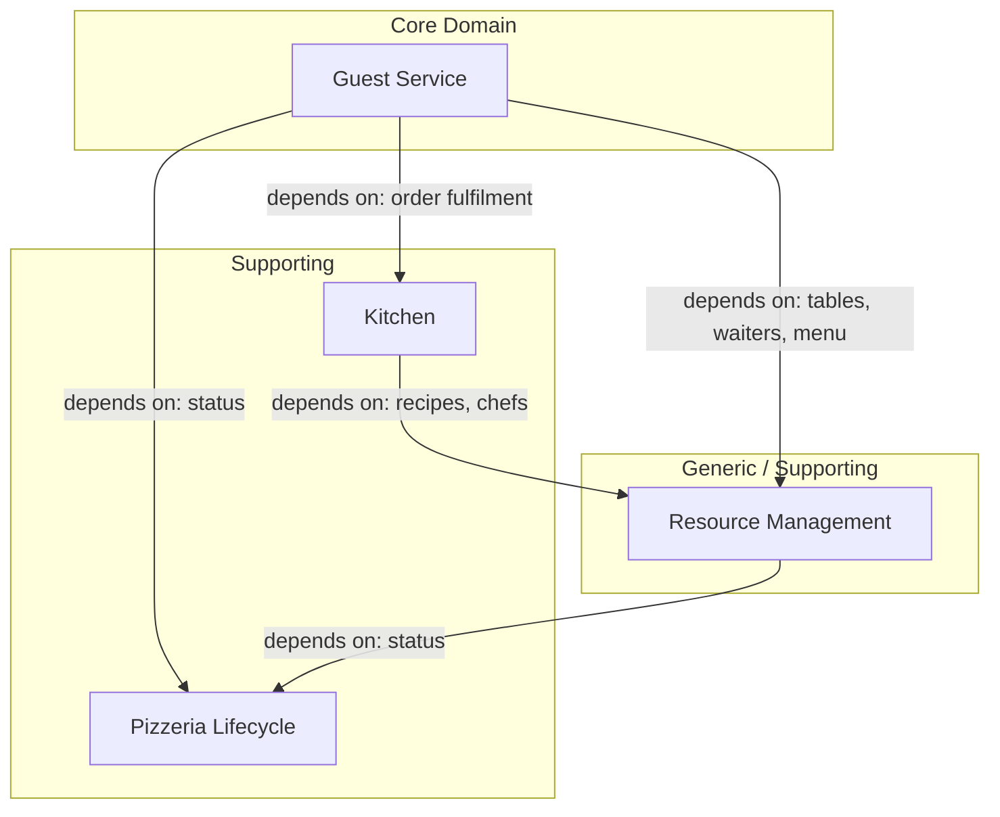

# 07. Define — Context Map

**Step in the [DDD Starter Modelling Process](https://github.com/ddd-crew/ddd-starter-modelling-process):** 7 of 8 — *Define*.

**Purpose:** specify the responsibilities, boundaries, and language of each Bounded Context precisely, before committing to internal design.

**Key question:** *what is this context responsible for, and how does it talk to the rest of the world?*

This document finalises the Bounded Context grouping deliberately deferred in `03_decompose_subdomains.md` §5, and maps the relationships between the resulting contexts. One Bounded Context Canvas per context follows in separate `07_define_<context-name>.md` files.

---

## 1. Bounded Contexts

The subdomains from `03_decompose_subdomains.md` §1 collapse into **four Bounded Contexts**:

| Bounded Context | Subdomains (`03` §1) | Classification (`04` §1) |
|---|---|---|
| **Guest Service** | Guest Service | Core |
| **Kitchen** | Kitchen | Supporting |
| **Resource Management** | Table Management, Menu Management, Waiter Management, Chef Management | Generic / Supporting |
| **Pizzeria Lifecycle** | Pizzeria Lifecycle | Supporting |

**Why Resource Management merges four subdomains:** each stays a distinct subdomain at the modelling level — `02_discover_big_picture.md` §3 explicitly keeps Waiter and Chef Management apart over their different termination-completion rules — but a subdomain boundary and a Bounded Context boundary don't have to coincide (`03_decompose_subdomains.md` §1, note on granularity). Organisationally these four share one actor (the `Manager`), a common configuration shape, and — for Table and Menu Management — the identical `Closed`-only guard (`02_discover_process_level.md` §2, §3). Team ownership in `06_organise.md` already reflects this same grouping.

**Why Pizzeria Lifecycle stays separate:** it isn't something the Manager configures the way tables, menu, and staff are — it's the one piece of state every other context depends on (`03_decompose_subdomains.md`: "nothing else owns 'is the pizzeria open'... every other subdomain only consumes that status, none of them decides it"). Folding it into Resource Management would dilute that otherwise-uniform "Manager configures a resource" shape with a context nobody configures.

---

## 2. A note on direction

Before mapping relationships: **upstream/downstream describes whose model is authoritative** — who conforms to whom — not which way any individual event flows. A context can be upstream for one kind of data and downstream for another, even between the same two contexts, and an upstream context freely consuming events published by its own downstream is normal operational integration, not an exception needing special justification. Two cases below are exactly this:

* **Guest Service ↔ Resource Management:** Resource Management is upstream for table/menu/staff *definitions* (capacity, price, who's assigned where) — Guest Service conforms to that model. But `Free`/`Occupied` table state is Guest Service's own first-hand knowledge (`TableAssigned`/`TableReleased`), which Resource Management (Table Management) merely mirrors — Guest Service is upstream for *that* fact.
* **Guest Service ↔ Pizzeria Lifecycle:** Pizzeria Lifecycle is upstream for the `Open`/`Closing`/`Closed` model — Guest Service conforms. But Guest Service is upstream for its own visit lifecycle (`GuestGroupSeated`/`GuestGroupLeft`), which Pizzeria Lifecycle merely counts, to know when it's safe to auto-close.

Per `05_connect_message_flows.md` §0, **every** relationship in this system is event-driven replication — no context ever queries another live. That's a project-wide integration-mechanism decision (maximum decoupling), independent of the upstream/downstream calls made below.

---

## 3. Relationships

### Pizzeria Lifecycle → Guest Service

* **Pattern:** Open Host Service + Published Language. Pizzeria Lifecycle publishes `PizzeriaOpened`/`PizzeriaClosingStarted`/`PizzeriaClosed` as one well-defined, stable status — the same events, unmodified, reach Guest Service *and* Resource Management (below). No per-consumer negotiation.
* **What crosses:** Guest Service replicates this into its own local Pizzeria Status (`05` §0), gating whether the Host admits a guest group at all.
* **Reverse traffic:** Guest Service publishes `GuestGroupSeated`/`GuestGroupLeft`; Pizzeria Lifecycle consumes both into its own Active Visits Count, used to auto-trigger `PizzeriaClosed` once `Closing` and no visit remains (`02` §6, `05` Scenario 1 and 3). Per §2 above, this doesn't make Guest Service upstream for the *status* — only for the visit-count facts.

### Pizzeria Lifecycle → Resource Management

* **Pattern:** Open Host Service + Published Language — the same published status from the relationship above, consumed by a second downstream.
* **What crosses:** Table Management and Menu Management replicate it to enforce their `Closed`-only guard (`02` §2, §3); Waiter Management and Chef Management replicate it to enforce their last-active-staff termination guard (`02` §4, §5).
* **Reverse traffic:** Resource Management publishes `TableAssignedToWaiter`/`TableUnassignedFromWaiter`, `WaiterHired`/`WaiterTerminationStarted`/`WaiterTerminated`, `ChefHired`/`ChefTerminationStarted`/`ChefTerminated`; Pizzeria Lifecycle replicates these into its own Readiness read model, to validate `OpenPizzeria` — at least one table with an assigned `Active` waiter, at least one `Active` chef (`02` §6, `05` Scenario 4). Per §2, this doesn't make Pizzeria Lifecycle upstream for the *status* — only for these narrower readiness facts, and deliberately not drawn as its own arrow below (§4) to avoid implying a cyclic dependency between the same two contexts; see `03_decompose_subdomains.md` §4 for why the underlying subdomain map treats this the same way.

### Resource Management → Guest Service

* **Pattern:** Open Host Service + Published Language. Resource Management publishes table/waiter/menu facts (`TableAdded`, `TableCapacityChanged`, `TableRemoved`, `TableAssignedToWaiter`, `TableUnassignedFromWaiter`, `WaiterHired`, `WaiterTerminationStarted`, `WaiterTerminated`, `MenuItemAdded`, `MenuItemUpdated`, `MenuItemRemoved`) as one standard interface, reused identically by Guest Service and Kitchen (below).
* **What crosses:** Guest Service replicates into Table & Waiter Availability and Menu (guest view) — feeding its table-selection policy and order pricing (`05` §0).
* **Reverse traffic:** Guest Service publishes `TableAssigned`/`TableReleased`; Table Management (inside Resource Management) consumes them to flip its own `Free`/`Occupied` state. Resource Management stays upstream for the table *definition*; Guest Service stays upstream for *occupancy*, per §2.

### Resource Management → Kitchen

* **Pattern:** Open Host Service + Published Language — same publishing context, different subset of the interface (`MenuItemAdded`/`Updated`/`Removed`, `ChefHired`/`ChefTerminationStarted`/`ChefTerminated`).
* **What crosses:** Kitchen replicates into Recipe (kitchen view) and Active Chef Pool, feeding what a chef prepares and who's eligible to pick up work (`05` §0).

### Kitchen → Guest Service

* **Pattern:** Customer-Supplier + async events. Kitchen is the Supplier (upstream) — the production service Guest Service depends on. Guest Service is the Customer (downstream): it requests pizza production and depends on Kitchen delivering it, same as any other downstream depends on its upstream. Unlike every relationship above, this isn't one upstream broadcasting to many downstreams — it's a bespoke exchange between exactly these two contexts, specific to order fulfilment.
* **What crosses:** Guest Service publishes `OrderSentToKitchen`, requesting production.
* **Reverse traffic:** Kitchen publishes `OrderReadyForPickup` back once every pizza in the order is ready (`05` Scenario 2). Per §2, this doesn't make Kitchen downstream — it stays the Supplier throughout; `OrderReadyForPickup` is just the completion signal for the one job Guest Service asked for. Nothing else crosses this boundary live — recipes and chef availability are replicated from Resource Management independently by each side (above).

---

## 4. Context Map diagram

**Arrow convention:** `A --> B` means *A depends on B* (A is downstream, B is upstream) — same convention as `03_decompose_subdomains.md` §4.

Reverse traffic exists for four pairs — Guest Service → Pizzeria Lifecycle (visit counts), Guest Service → Resource Management (table occupancy), Resource Management → Pizzeria Lifecycle (readiness data), and Kitchen → Guest Service (`OrderReadyForPickup`) — and is documented in §3, but is deliberately omitted here: drawing it would show a cycle between the same two contexts for what's actually one relationship (or, for the first three, two independent, differently-shaped dependencies). See §2 for why that's not actually a contradiction, and `03_decompose_subdomains.md` §4 for the same reasoning applied to the underlying subdomain map.

---

## 5. Pattern summary

| Relationship | Upstream | Downstream | Pattern |
|---|---|---|---|
| Pizzeria Lifecycle → Guest Service | Pizzeria Lifecycle | Guest Service | Open Host Service + Published Language |
| Pizzeria Lifecycle → Resource Management | Pizzeria Lifecycle | Resource Management | Open Host Service + Published Language |
| Resource Management → Guest Service | Resource Management | Guest Service | Open Host Service + Published Language |
| Resource Management → Kitchen | Resource Management | Kitchen | Open Host Service + Published Language |
| Kitchen → Guest Service | Kitchen | Guest Service | Customer-Supplier + async events |

Almost everything in this system reduces to the same pattern — **Open Host Service + Published Language** — which is the direct organisational consequence of `05_connect_message_flows.md` §0's maximum-decoupling rule: every upstream publishes one stable, well-defined event contract, and every downstream builds its own replica against it independently. Kitchen → Guest Service is the one genuine exception, because it's a bespoke exchange between exactly two contexts about one specific handoff (order fulfilment), not a broadcast to multiple consumers.

**No Shared Kernel exists anywhere** — each context owns its own model; the only things shared across boundaries are identifier values (`tableId`, `menuItemId`, `waiterId`, …), never behaviour or shared storage.

**No Anti-Corruption Layer is needed at this stage** — every model here is simple enough that a direct field-level translation at the boundary is sufficient (§6). Revisit if a context's model grows enough internal complexity that a published event stops mapping cleanly onto it.

---

## 6. Model translation at the boundaries

### Order, between Guest Service and Kitchen

In Guest Service, an `Order` is a guest-facing entity — order lines referencing `MenuItem`s with quantities, tied to a `Bill`/`GuestGroup`/`Table`. When it crosses into Kitchen (`OrderSentToKitchen`), Kitchen interprets it purely as a set of pizzas to produce (`02` §1.3.1: one production task per `OrderLine` quantity) — it never sees `tableId`, `billId`, or prices, only menu item identifiers and quantities.

### Table, between Resource Management and Guest Service

In Resource Management, `Table` is a resource definition — capacity, assigned waiter, `Free`/`Occupied` state. In Guest Service, a table is referenced only as a `tableId` tied to the current visit; Guest Service doesn't hold or reason about capacity or waiter assignment beyond what its own Table & Waiter Availability replica already tells it.

### Menu, between Resource Management and Guest Service/Kitchen

In Resource Management, `MenuItem` holds the full picture — name, ingredients, recipe, price. Guest Service's Menu (guest view) replica carries name, ingredients, and price only (no recipe); Kitchen's Recipe (kitchen view) replica carries name, ingredients, and recipe only (no price) — this split is already established in `02_discover_process_level.md` §3.

### Pizzeria status, as a shared upstream fact

`Open`/`Closing`/`Closed` is broadcast identically to Guest Service and every subdomain inside Resource Management — there's no per-consumer negotiation or translation; everyone who needs it consumes the exact same three events.

---

## Open Questions

None at this stage.
