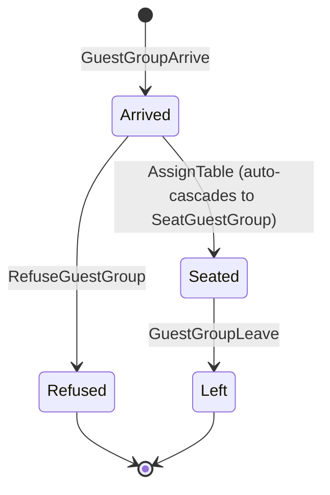
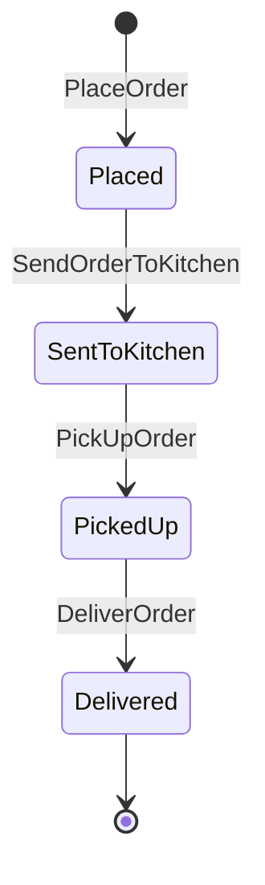

# 08. Code — Aggregates: Guest Service

Part of the tactical design for the **Guest Service** Bounded Context. Builds on `08_guest_service_domain_model.md` — this document details each aggregate's state machine, fields, and invariants.

---

## 1. `GuestGroup`

**Identity:** `guestGroupId`.

**Fields:**
* `name`: string, set at `GuestGroupArrive`, immutable — external input, unique among currently-active groups only (invariant 7).
* `status`: `Arrived` → `Seated` (or `Refused`, terminal) → `Left`.
* `tableId`: set once, at seating; absent before then.
* `bill`: the `Bill` entity (§3) — absent until seated.

**Invariants:**

1. **A table is assigned exactly once, and never changes afterward.** `AssignTable` is only valid from `Arrived`; no command exists to reassign `tableId` once set (`02_discover_big_picture.md` §5: "no table changes mid-visit"). `GuestGroup` doesn't re-validate the table's capacity or `Active`-waiter requirement — that's already been checked by the Host against the **Available Tables** read model before the command is issued (`02_discover_process_level.md` §1.1); this aggregate trusts the table it's given.
2. **`AssignTable` and `SeatGuestGroup` happen together.** `SeatGuestGroup` is explicitly marked `(auto)` in `02_discover_process_level.md` §1.1 — there's no real gap between them, so one command handler performs both transitions and raises both events (`TableAssigned`, `GuestGroupSeated`).
3. **`OpenBill` is automatic on seating**, creating the `Bill` entity in `Open` status (`02` §1.2, marked `(auto)`) — a `GuestGroup` in `Seated` status always has a `Bill`; there's no valid intermediate state without one.
4. **`GuestGroupLeave` is only valid once `Bill.status` is `Closed`.** This is the entry gate to Departure (`02` §1.4: "Whenever `BillClosed` → the guest group *may* `GuestGroupLeave`") — and it's guest-driven, not automatic: a closed bill doesn't force departure. A `GuestGroup` can sit in `Seated` with a `Closed` bill indefinitely before this command arrives.
5. **`ReleaseTable` auto-cascades from `GuestGroupLeave`**, same reasoning as invariant 2 (`02` §1.4, marked `(auto)`) — one command handler, both events (`GuestGroupLeft`, `TableReleased`).
6. **`RefuseGuestGroup` is terminal and mutually exclusive with `AssignTable`** — both are only valid from `Arrived`, and only one of them ever fires for a given `GuestGroup` (`02` §1.1's policy is an `alt`/`else` split, not two independent paths).
7. **`GuestGroupArrive` is rejected if `name` duplicates a currently-active group's** — scoped to groups in `Arrived` or `Seated` (not yet `Left`/`Refused`), resolved during tactical design: a name only needs to disambiguate groups the simulation's user is driving *right now* (`01_understand.md` §2.1), not every group that's ever visited — an unbounded, ever-growing global-uniqueness set would be both impractical and pointless once a group has left. Checked via `UniqueActiveGuestGroupNameGuard` (`08_guest_service_domain_services.md`) against the **Active Guest Group Names** read model (`08_guest_service_read_models.md`) — not something a single `GuestGroup` instance can answer about itself.

---

## 2. `Bill` (entity of `GuestGroup`)

**Fields:**
* `status`: `Open` → `Closed`.
* `requested`: whether `RequestBill` has fired yet.
* `paymentReceived`: boolean — whether `ReceivePayment` has fired (only meaningful once the bill total is `> 0`).

No total is held here — see §3 for why, and `08_guest_service_entities.md` for the redelivery-safety reasoning.

**Invariants:**

1. **`CloseBill` requires every `Order` on this bill to be `Delivered`.** Checked against the **Order Delivery Status** read model (§3), not a field `Bill` maintains itself — `Bill` doesn't hold a live view of `Order` state.
2. **Payment is only required if the bill total is `> 0`.** `02_discover_process_level.md` §1.2's policy is an explicit split: total `= 0` → skip straight to `CloseBill`; total `> 0` → wait for `ReceivePayment`, then `CloseBill`. Both paths still require invariant 1 to hold. The total itself is read from **Bill Summary** (`08_guest_service_read_models.md`), not a `Bill` field — checked by `BillClosingEligibility` (`08_guest_service_domain_services.md`).
3. **No partial payment.** `ReceivePayment` is a single, whole-amount event — consistent with `02_discover_big_picture.md` §5 ("No split bills... No tips"). This context doesn't model an amount-tendered/change-due flow.
4. **`RequestBill` doesn't close the bill by itself** — it only starts the countdown (invariant 1 must independently become true, whether it already was at request time or becomes true later via a subsequent `OrderDelivered`). Two triggers can complete the close: `BillRequested` arriving after every order is already `Delivered`, or the last `OrderDelivered` arriving after `BillRequested` already happened. Either way the guard is the same (`02` §1.2).

---

## 3. `Order`

**Identity:** `orderId`.

**Fields:**
* `guestGroupId` — reference only, not an embedded `GuestGroup`.
* `lines`: `{ menuItemId, quantity, price }[]` — `price` captured at `PlaceOrder` time (`08_guest_service_domain_model.md` §1).
* `status`: `Placed` → `SentToKitchen` → `PickedUp` → `Delivered`.

**Invariants:**

1. **Every transition is a distinct, separately-invoked command** — unlike `GuestGroup`'s two auto-cascades, none of `SendOrderToKitchen`, `PickUpOrder`, or `DeliverOrder` is marked `(auto)` in `02_discover_process_level.md` §1.3, even though the policy prose reads as if they follow immediately ("the Waiter proceeds to..."). Modelled as four separate states rather than collapsed, so an implementation isn't forced to assume zero gap between them.
2. **`PickUpOrder` can only happen once Kitchen has signalled `OrderReadyForPickup`**, and only when the Waiter's task queue reaches this item — strictly FIFO, no prioritisation (`02` §1.3). This ordering constraint lives in the Waiter's task queue, not on `Order` itself; `Order` only enforces that `PickUpOrder` requires `status = SentToKitchen`.
3. **`PlaceOrder` requires `GuestGroup.status = Seated`, `Bill.status = Open`, and `Bill.requested = false`.** An order can't exist for a group that hasn't been seated, against an already-closed bill, or once the guest has asked for the bill — `RequestBill` is a point of no return for new orders (resolved: rejecting `PlaceOrder` once requested, rather than letting `RequestBill`'s guard re-evaluate against a still-growing order list).

---

## Open Questions

None at this stage — `PlaceOrder` after `RequestBill` resolved above (invariant 3): rejected.
