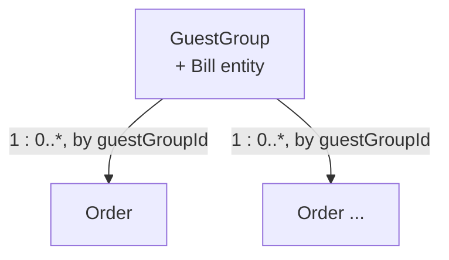

# 08. Code — Domain Model: Guest Service

**Step in the [DDD Starter Modelling Process](https://github.com/ddd-crew/ddd-starter-modelling-process):** 8 of 8 — *Code*.

Part of the tactical design for the **Guest Service** Bounded Context (`07_define_guest_service.md`) — the Core Domain (`04_strategize_core_domain_chart.md` §1).

**Purpose:** identify the aggregates inside this context and how they relate, close enough to actual code to implement against. Invariants and consistency rules per aggregate are detailed in `08_guest_service_aggregates.md`; this document is the map, not the rulebook.

---

## 1. Aggregates

### GuestGroup

**Root of the visit.** Tracks one guest group's presence in the pizzeria from arrival to departure. The group's own *definition* (its size) is given as input by the user before the process begins (`07_define_guest_service.md`, Ubiquitous Language) — this aggregate doesn't own that definition, it owns everything that happens to that group *during* one visit.

Owns:
* Visit status: `Arrived → Seated` (or `Refused`, terminal) `→ Left`.
* The assigned table, by reference (`tableId`) — set once at seating, immutable for the rest of the visit (`02_discover_big_picture.md` §5: "no table changes mid-visit").
* **`Bill`** — modelled as an internal entity of `GuestGroup`, not a separate aggregate. See §3 for why.

Driven by commands: `GuestGroupArrive`, `AssignTable`, `RefuseGuestGroup`, `SeatGuestGroup` (auto), `RequestBill`, `ReceivePayment`, `CloseBill`, `GuestGroupLeave`, `ReleaseTable` (auto). (`02_discover_process_level.md` §1.1, §1.2, §1.4)

### Order

**One guest order, own lifecycle.** A `GuestGroup` can place multiple orders over the course of a visit (`02_discover_big_picture.md` §2.1.3: "*This cycle repeats every time a guest group places an additional order within the same open bill.*"), and each order's status advances independently and asynchronously — it waits on Kitchen, a different Bounded Context, to signal readiness. That async, one-to-many, independently-progressing shape is exactly the case for a separate aggregate rather than an entity nested in `GuestGroup`: locking the whole visit every time one order's Kitchen response arrives would be unnecessary contention for no invariant that requires it.

Owns:
* Reference to its `GuestGroup` (`guestGroupId`) — not a reference to `Bill` directly, since `Bill` isn't independently addressable (§3).
* Order lines: `menuItemId`, quantity, and price — captured at `PlaceOrder` time, not re-derived later (`02_discover_process_level.md` §1.2: "the order's lines (*with current menu prices*) are added to this bill"). Freezing the price here is actually redundant-but-safe: Menu Management's `Closed`-only guard already guarantees the price can't change mid-visit (`02` §3) — but capturing it on the line is still correct practice, independent of that guarantee.
* Status: `Placed → SentToKitchen → PickedUp → Delivered`. (`ReadyForPickup` is Kitchen's own status for the same order, signalled back via the `OrderReadyForPickup` integration event, not a status this aggregate holds mid-transition — see `07_define_context_map.md` §3.)

Driven by commands: `PlaceOrder`, `SendOrderToKitchen`, `PickUpOrder`, `DeliverOrder`. (`02_discover_process_level.md` §1.3)

---

## 2. Relationships

* **`GuestGroup` to `Order`: one-to-many, referenced by ID only** — `Order` holds `guestGroupId`; `GuestGroup` doesn't hold a live collection of `Order`s. The running total on `Bill` is kept in sync via the `OrderPlaced` domain event (§4), not by `GuestGroup` reaching into `Order`.
* **No aggregate in this context references another Bounded Context's aggregate directly.** `tableId` and `menuItemId` are opaque identifiers — Resource Management owns what they mean; Guest Service only carries them (`07_define_context_map.md` §6, "no Shared Kernel... only identifier values").

---

## 3. Why `Bill` isn't its own aggregate

`Bill` has a real sub-lifecycle (`Open → Closed`) and its own guard (every `Order` on it must be `Delivered` before it can close, `02_discover_process_level.md` §1.2) — a plausible case for aggregate-hood on its own. It's modelled as an entity inside `GuestGroup` instead, because:

* **Identical lifespan.** A `Bill` is created the moment its `GuestGroup` is seated (`OpenBill`, auto) and closes before that same group can leave — there's no scenario where a `Bill` outlives its `GuestGroup`, is created independently of one, or is ever addressed without also addressing the visit it belongs to.
* **No split bills** (`02_discover_big_picture.md` §5) — the relationship is strictly 1:1, never 1:many, so there's no independent identity for `Bill` to justify.
* **No concurrent-modification case.** The reason to split an aggregate is usually to avoid two legitimate, independent writers contending for the same lock. Nothing modifies `Bill` except `GuestGroup`'s own visit process (bill open/request/pay/close) and the `Order`-driven total recalculation (§4) — both already funnel through `GuestGroup`.

If a future requirement introduced split bills or a bill outliving a single visit, this decision would need revisiting — noted as the one thing that would force a re-split.

---

## 4. Cross-aggregate coordination

`Order` and `GuestGroup` are separate aggregates but not independent of each other. Two domain-event-driven paths keep them in sync — both internal to this Bounded Context (`01_understand.md` §4's domain-event definition; not the cross-context mechanism, that's `05_connect_message_flows.md`'s integration events):

* **Whenever `OrderPlaced`** → the order's lines are recorded in the **Bill Summary** read model, keyed by `orderId` (`08_guest_service_read_models.md`), matching `02_discover_process_level.md` §1.2's policy verbatim ("the order's lines... are added to this bill and its total is recalculated"). Keyed, not accumulated: a redelivered `OrderPlaced` for the same order overwrites the same entry rather than adding a second one, so the derived total can't be inflated by duplicate delivery — see `design_notes/dn_0002.md`. `Bill` itself holds no total (`08_guest_service_entities.md`).
* **Whenever `OrderPlaced` or `OrderDelivered`** → feeds the **Order Delivery Status** read model (`02_discover_process_level.md` §1.2: "which orders on this bill are `Delivered` vs. still in flight") — this, not a field on `Bill` itself, is what `CloseBill`'s guard ("every order on this bill is `Delivered`") actually checks. `Bill` doesn't hold a live view of every `Order`'s status; the guard is evaluated against this locally-fed read model instead, the same replicate-don't-reach-in pattern `05_connect_message_flows.md` §0 uses across Bounded Context boundaries, applied here one level down, between two aggregates in the same context. Full guard detail in `08_guest_service_aggregates.md`.

Everything else `GuestGroup` needs (table/waiter availability, pizzeria status, menu) comes from replicated read models fed by *other* Bounded Contexts (`07_define_guest_service.md`, Inbound Communication) — not from another aggregate in *this* one.

---

## 5. Not modelled as aggregates

* **Host, Waiter** — automated actors that issue commands against `GuestGroup`/`Order` (`01_understand.md` §2.2); they hold no persisted state of their own *inside this context*. Their resource-state (`Active`/`Terminating`/`Terminated`, table assignments) belongs to Resource Management (`07_define_resource_management.md`) — Guest Service only ever sees them through replicated read models.
* **Table & Waiter Availability, Menu (guest view), Pizzeria Status** — locally-replicated read models (`05_connect_message_flows.md` §0), not write-side aggregates. Detailed in `08_guest_service_read_models.md` (later in this step), not here.

---

## Open Questions

None at this stage.
