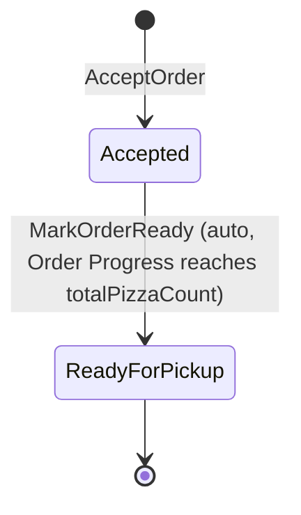
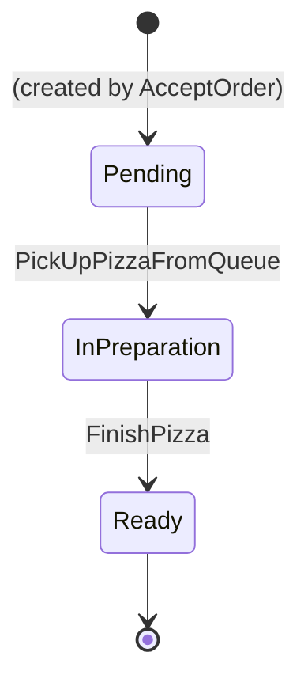

# 08. Code — Aggregates: Kitchen

Part of the tactical design for the **Kitchen** Bounded Context. Builds on `08_kitchen_domain_model.md`.

---

## 1. `KitchenOrder`

**Identity:** `kitchenOrderId` — correlates 1:1 with Guest Service's `orderId` (`08_guest_service_value_objects.md`'s `OrderId`), but modelled as Kitchen's own opaque value, not a shared type (`07_define_context_map.md` §6, no Shared Kernel).

**Fields:**
* `lines`: `{ menuItemId, quantity }[]` — from `OrderSentToKitchen`.
* `totalPizzaCount`: sum of `quantity` across `lines` — computed once at creation, doesn't change.
* `status`: `Accepted` → `ReadyForPickup`.

Deliberately **not** a field: any count or set of *ready* pizzas. Earlier drafts of this document had a `readyCount` incremented per `PizzaPrepared` — dropped because a raw counter isn't safe against redelivery (a duplicate `PizzaPrepared` for the same task would double-count it). That tracking now lives in the **Order Progress** read model instead (`08_kitchen_read_models.md`), which stores a *set* of completed `pizzaTaskId`s — adding the same ID twice is a no-op, so it's safe under at-least-once delivery. Same shape as `Bill` not holding a live view of `Order` state in Guest Service (`08_guest_service_entities.md`).

**Invariants:**

1. **Created together with its `PizzaTask`s, in one logical operation.** `AcceptOrder` both creates `KitchenOrder` (`status: Accepted`) and spawns one `PizzaTask` per pizza across `lines`, all `Pending` (`02_discover_process_level.md` §1.3.1). Two kinds of aggregate, one use case — see `08_kitchen_domain_services.md` for where this coordination actually lives, since `KitchenOrder` can't create other aggregates from inside itself.
2. **`MarkOrderReady` only fires once the Order Progress read model's completed set reaches `totalPizzaCount` in size**, and only ever auto-triggered by the `PizzaPrepared` that makes it reach that size (`08_kitchen_domain_model.md` §3) — never called directly. Checked by `OrderReadinessCheck` (`08_kitchen_domain_services.md`), not by a field this aggregate maintains itself.
3. **`totalPizzaCount` is fixed at creation.** No command changes `lines` after `AcceptOrder` — matches `02_discover_big_picture.md` §5 ("No order cancellation once sent to the kitchen"). This is exactly why it's safe to keep on the aggregate directly, unlike the ready-tracking above: it's written once, never mutated.

---

## 2. `PizzaTask`

**Identity:** `pizzaTaskId`.

**Fields:**
* `kitchenOrderId` — reference only.
* `menuItemId` — reference only; used to look up the **Recipe (kitchen view)** read model (`08_kitchen_read_models.md`) at preparation time, not copied onto the task itself.
* `status`: `Pending` → `InPreparation` → `Ready`.
* `chefId` — absent until `PickUpPizzaFromQueue`.

**Invariants:**

1. **`PickUpPizzaFromQueue` requires the chef to be `Active`** (checked against the replicated Active Chef Pool, `08_kitchen_read_models.md`) **and currently free** — not already `InPreparation` on another `PizzaTask` (`02_discover_big_picture.md` §5: "A chef prepares one pizza at a time"). "Currently free" isn't a fact `PizzaTask` holds on itself; it's checked against a small local read model tracking busy chefs, fed by `PizzaTask`'s own `PizzaPreparationStarted`/`PizzaPrepared` events (§3) — same "replicate, don't reach into another aggregate instance" shape used throughout this series.
2. **`FinishPizza` requires `status = InPreparation`**, and always transitions to `Ready` — no partial/failed preparation modelled (`02_discover_big_picture.md` §5 rules out cancellation generally).
3. **No ordering constraint on *which* `Pending` task a free chef picks up.** Unlike the Waiter's task queue in Guest Service, which is explicitly FIFO (`02_discover_process_level.md` §1.3), nothing in `02` states an equivalent rule for the shared Production Queue — see Open Questions.

---

## 3. Cross-aggregate consistency rules

* **`PizzaPrepared` → `pizzaTaskId` added to the Order Progress read model's completed set for this `kitchenOrderId`**, then `OrderReadinessCheck` re-evaluated — if the set now covers every pizza, `MarkOrderReady` fires. (`08_kitchen_domain_model.md` §3, `08_kitchen_domain_services.md`)
* **`PizzaPreparationStarted` / `PizzaPrepared` → Busy Chefs read model.** Marks/unmarks `chefId` as busy, enforcing invariant 1 above without `PizzaTask` instances needing to know about each other directly (`08_kitchen_read_models.md`).

---

## Open Questions

* **Is there an ordering rule for the shared Production Queue?** `02_discover_process_level.md` §1.3.1 only says a free chef picks up *a* `Pending` task when the queue is non-empty — no FIFO or priority rule is stated, unlike the Waiter's queue in `02` §1.3 (explicitly resolved as strictly FIFO). Left open rather than assumed; either FIFO-by-default or genuinely chef's/implementation's choice are both consistent with everything discovered so far.
