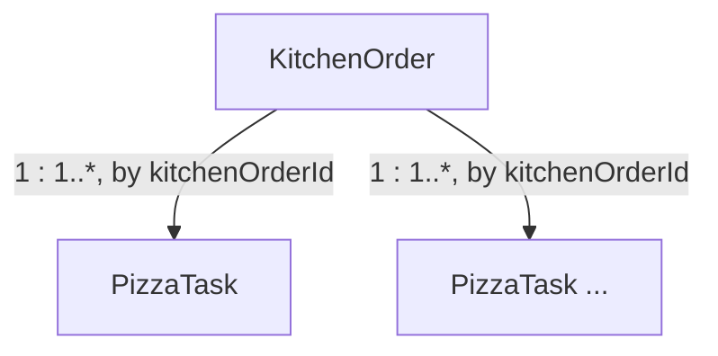

# 08. Code — Domain Model: Kitchen

Part of the tactical design for the **Kitchen** Bounded Context (`07_define_kitchen.md`) — Supporting (`04_strategize_core_domain_chart.md` §1).

**Purpose:** identify the aggregates inside this context and how they relate. Invariants are detailed in `08_kitchen_aggregates.md`.

---

## 1. Aggregates

### KitchenOrder

**Root of one order's production.** Created when `OrderSentToKitchen` arrives; tracks the order as a *production* concern — how many pizzas it needs in total — until every pizza is done (per the Order Progress read model, §3) and it signals back to Guest Service.

Owns:
* `lines`: what to produce — `menuItemId` + `quantity` per line, carried over from `OrderSentToKitchen`'s payload (`08_guest_service_integration_events.md`).
* `totalPizzaCount`: fixed once at creation — never mutated afterward, so unlike "how many are ready" it's safe to hold directly on this aggregate (§3).
* `status`: `Accepted → ReadyForPickup` — the transition is decided by comparing the **Order Progress** read model against `totalPizzaCount` (§3), not by a count this aggregate maintains itself.

Driven by commands: `AcceptOrder` (auto), `MarkOrderReady` (auto). (`02_discover_process_level.md` §1.3.1)

### PizzaTask

**One pizza, own lifecycle.** A `KitchenOrder` spawns one `PizzaTask` per unit of quantity across its lines. Multiple chefs pull different `PizzaTask`s from the same shared **Production Queue** concurrently and independently — the same async, one-to-many, independently-progressing shape that put `Order` in its own aggregate in Guest Service (`08_guest_service_domain_model.md` §1) applies here even more directly, since the queue is explicitly shared across *all* chefs, not just this order's.

Owns:
* Reference to its `KitchenOrder` (`kitchenOrderId`) — not embedded.
* `menuItemId` — which recipe to follow.
* `status`: `Pending → InPreparation → Ready`.
* `chefId` — set once picked up.

Driven by commands: `PickUpPizzaFromQueue`, `FinishPizza`. (`02_discover_process_level.md` §1.3.1)

---

## 2. Relationships

* **`KitchenOrder` to `PizzaTask`: one-to-many, referenced by ID only** — same shape as `GuestGroup`↔`Order` in Guest Service. `KitchenOrder` doesn't hold a live collection of tasks, and doesn't reach into `PizzaTask` instances to ask whether they're done — that's what the Order Progress read model (§3) is for.
* **No aggregate here references another Bounded Context's aggregate directly.** `menuItemId` and `chefId` are opaque identifiers owned by Resource Management (`07_define_context_map.md` §6) — Kitchen only carries them.

---

## 3. Cross-aggregate coordination

* **Whenever `PizzaPrepared`** (a `PizzaTask` finishing) → its `pizzaTaskId` is added to the **Order Progress** read model's completed set for that `kitchenOrderId` (`08_kitchen_read_models.md`) — a *set*, not a counter, so a redelivered `PizzaPrepared` for the same task is a no-op instead of double-counting. Once that set reaches `KitchenOrder.totalPizzaCount`, `MarkOrderReady` fires automatically, raising `OrderReadyForPickup` (`02_discover_process_level.md` §1.3.1's policy verbatim; eligibility check detailed in `08_kitchen_domain_services.md`). Internal domain event, per `01_understand.md` §4 / `design_notes/dn_0001.md` — stays inside this Bounded Context right up until `OrderReadyForPickup` itself, which is the one that crosses.
* **No internal counterpart needed for `OrderReadyForPickup` itself**, unlike `AcceptOrder`'s split into `OrderSplitIntoPizzas` (internal) + `OrderAccepted` (external, `08_guest_service_domain_model.md` §4). There, two genuinely different audiences needed two different payloads. Here, nothing inside Kitchen consumes "this order is ready" for its own purposes — `02` §1.3.1's scope ends exactly there — so the aggregate's own completion signal *is* the integration event, with no internal shadow event to split off.

---

## 4. Not modelled as aggregates

* **Chef** — an actor that issues `PickUpPizzaFromQueue`/`FinishPizza` against `PizzaTask`; holds no persisted state of its own inside this context. Employment state (`Active`/`Terminating`/`Terminated`) belongs to Resource Management (`07_define_kitchen.md`, Inbound Communication) — Kitchen only sees it through the replicated Active Chef Pool read model. *Whether a given chef is currently busy* (mid-`PizzaTask`) is a different, Kitchen-owned fact — not stored on any `Chef` entity (there isn't one), but derived from `PizzaTask` state (`08_kitchen_read_models.md`).
* **Production Queue** — not a write-side entity, just the set of `PizzaTask`s with `status = Pending`, queried directly. No separate aggregate needed to hold what's already a derived view over `PizzaTask` (`08_kitchen_read_models.md`).

---

## Open Questions

None at this stage.
