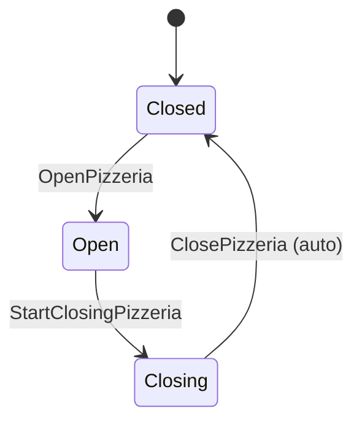

# 08. Code — Aggregates: Pizzeria Lifecycle

Part of the tactical design for the **Pizzeria Lifecycle** Bounded Context. Builds on `08_pizzeria_lifecycle_domain_model.md`.

---

## 1. `Pizzeria`

**Identity:** singleton — no `pizzeriaId` field, since there is exactly one instance for the lifetime of the system (`08_pizzeria_lifecycle_domain_model.md` §1).

**Fields:** `status`: `Closed` → `Open` → `Closing` → `Closed` (the cycle repeats).

**Invariants:**

1. **`OpenPizzeria` is only valid from `Closed`**, and requires the Readiness read model to show both conditions met: at least one table with an assigned `Active` waiter, and at least one `Active` chef (`02_discover_process_level.md` §6). Checked via `OpenPizzeriaEligibility` (`08_pizzeria_lifecycle_domain_services.md`) — `Pizzeria` holds no readiness data itself.
2. **`StartClosingPizzeria` is only valid from `Open`.** No additional guard — `02` §6 states none, unlike `OpenPizzeria`.
3. **`ClosePizzeria` (auto) is only valid from `Closing`, and only once the Active Visits set is empty** (`02` §6) — checked via `AutoCloseEligibility` (`08_pizzeria_lifecycle_domain_services.md`), triggered by the `GuestGroupLeft` that empties it. `BillClosed` is guaranteed to have already happened for every group by this point (`02` §6: departure only follows bill closure, `08_guest_service_aggregates.md` §1 invariant 4), so it isn't checked separately here.
4. **No guard prevents `StartClosingPizzeria` or `ClosePizzeria` from being re-triggered redundantly** — but neither needs one: both are only valid from one specific `status`, so a redelivered command or trigger event that arrives after the transition has already happened simply fails invariant 1/2/3 above and is rejected as a no-op. No separate idempotency tracking needed, unlike the read models in `08_pizzeria_lifecycle_read_models.md`.

---

## Open Questions

None at this stage.
