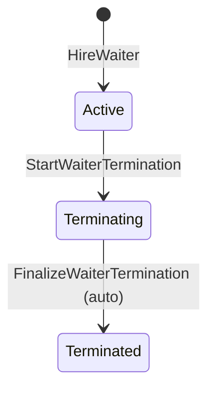
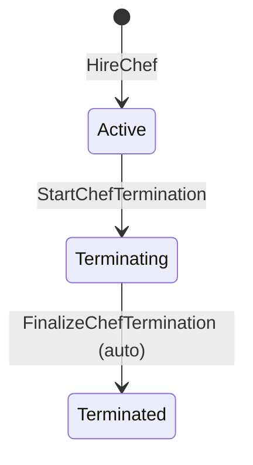

# 08. Code — Aggregates: Resource Management

Part of the tactical design for the **Resource Management** Bounded Context. Builds on `08_resource_management_domain_model.md`.

---

## 1. `Table`

**Identity:** `tableId`.

**Fields:**
* `capacity`: positive integer.
* `status`: `Free` ↔ `Occupied` — mirrored from Guest Service's `TableAssigned`/`TableReleased`, this context doesn't decide it (`08_resource_management_domain_model.md` §1).
* `assignedWaiterId`: nullable reference.

**Invariants:**

1. **`AddTable`, `ChangeTableCapacity`, `RemoveTable`, `AssignTableToWaiter`, `UnassignTableFromWaiter` are all rejected unless the pizzeria is `Closed`.** Read from this context's own local Pizzeria Status replica (`08_resource_management_domain_model.md` §3). This supersedes an earlier, narrower per-table `Occupied` guard: while `Closed`, no table is ever `Occupied` (`02_discover_process_level.md` §2), so the state-level guard makes the table-level one unreachable — same reasoning as `02` §2 originally, carried over unchanged.
2. **`RemoveTable` is also rejected if it's the last table** — checked against the Table Directory read model's entry count (`08_resource_management_domain_model.md` §3), not something `Table` can answer about itself.
3. **`status` transitions are driven externally, not by a Manager command, and aren't `Closed`-gated.** `TableAssigned`/`TableReleased` come from Guest Service and only ever fire while the pizzeria is `Open` (that's when guests exist) — the two guard regimes never overlap in practice, but they're still two structurally different things: Manager intent vs. mirrored fact.
4. **`AssignTableToWaiter` additionally requires the target `Waiter.status = Active`** — resolved: rejected for `Terminating` (assigning new work contradicts the point of winding a waiter down) and `Terminated` (the waiter is gone; this would almost certainly be a mistake, and silently produce a table `Available Tables` never offers, with no signal to the Manager). Checked via `ActiveWaiterGuard` (`08_resource_management_domain_services.md`) against the Waiter Directory (`08_resource_management_domain_model.md` §3) — not something `Table` can answer about itself.

---

## 2. `MenuItem`

**Identity:** `menuItemId`.

**Fields:** `name`, `ingredients`, `recipe`, `price`.

**Invariants:**

1. **`AddMenuItem`, `UpdateMenuItem`, `RemoveMenuItem` are all rejected unless the pizzeria is `Closed`** (`02_discover_process_level.md` §3) — same Pizzeria Status replica as `Table`'s guard 1, same reasoning (protects an in-progress guest visit from a definition change underneath it).

No other invariants — a self-contained catalog entry with no cross-aggregate dependency.

---

## 3. `Waiter`

**Identity:** `waiterId`.

**Fields:** `status`: `Active` → `Terminating` → `Terminated`.

**Invariants:**

1. **`HireWaiter` has no guard** — unlike `Table`/`MenuItem`, staffing changes aren't `Closed`-gated at all (`02_discover_process_level.md` §4 states no such rule; this is a deliberate asymmetry within this context, not an oversight — worth stating explicitly since three of the four aggregates here *do* share the `Closed`-only guard).
2. **`StartWaiterTermination` is rejected if it would leave zero `Active` waiters while the pizzeria is `Open` or `Closing`.** Checked against the Waiter Directory read model's count of `Active` entries (`08_resource_management_domain_model.md` §3) and this context's own Pizzeria Status replica.
3. **`FinalizeWaiterTermination` requires `status = Terminating` and no `Occupied` table still pointing at this waiter.** Auto-triggered whenever Guest Service's `TableReleased` fires for a table assigned to a `Terminating` waiter, checked against the Table Directory filtered by `assignedWaiterId` (`08_resource_management_domain_model.md` §3) — not something `Waiter` holds on itself.

---

## 4. `Chef`

**Identity:** `chefId`.

**Fields:** `status`: `Active` → `Terminating` → `Terminated`.

**Invariants:**

1. **`HireChef` has no guard**, same as `Waiter`'s invariant 1.
2. **`StartChefTermination` is rejected if it would leave zero `Active` chefs while the pizzeria is `Open` or `Closing`.** Same shape as `Waiter`'s invariant 2, against the Chef Directory.
3. **`FinalizeChefTermination` requires `status = Terminating`, and fires when Kitchen's `ChefFinishedPizza` arrives for this `chefId`** (`02_discover_process_level.md` §5, `08_kitchen_integration_events.md`). Unlike `Waiter`'s equivalent, this needs no cross-aggregate read model: a chef prepares one pizza at a time (`02_discover_big_picture.md` §5), so `ChefFinishedPizza` for this `chefId` is already the complete answer — `Chef` checks its own `status` field directly, no `Chef Directory` lookup involved. `Waiter`'s case is genuinely harder because one waiter can hold several tables at once, forcing a multi-instance check; `Chef`'s 1-to-1 relationship with its current task doesn't.

---

## Open Questions

None at this stage — table assignment to a non-`Active` waiter resolved above (§1, invariant 4): rejected.
