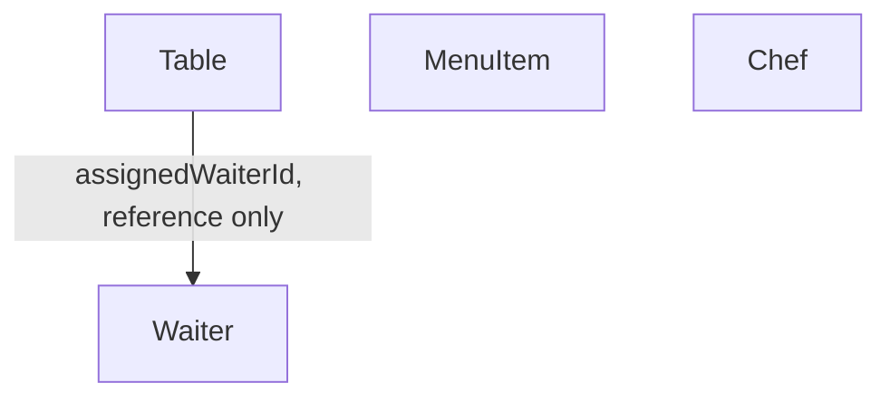

# 08. Code — Domain Model: Resource Management

Part of the tactical design for the **Resource Management** Bounded Context (`07_define_resource_management.md`) — Generic/Supporting mix (`04_strategize_core_domain_chart.md` §1).

**Purpose:** identify the aggregates inside this context and how they relate. Invariants are detailed in `08_resource_management_aggregates.md`.

This context merges four subdomains (`03_decompose_subdomains.md` §1: Table Management, Menu Management, Waiter Management, Chef Management) — four independent aggregate types below, not one shared model (`07_define_resource_management.md`'s Domain Roles: "sharing infrastructure... rather than a shared model").

---

## 1. Aggregates

### Table

**Identity:** `tableId`.

Owns: `capacity`, a UI-only `name` (`02_discover_process_level.md` §2), `status` (`Free`/`Occupied` — mirrored from Guest Service, not decided here), `assignedWaiterId` (nullable). Driven by commands: `AddTable`, `ChangeTableCapacity`, `RenameTable`, `RemoveTable`, `AssignTableToWaiter`, `UnassignTableFromWaiter` (`02_discover_process_level.md` §2), plus reactions to Guest Service's own `TableAssigned`/`TableReleased`.

### MenuItem

**Identity:** `menuItemId`.

Owns: `name`, `ingredients`, `recipe`, `price`, `status` (`Active`/`Disabled` — a reversible soft delete, `02_discover_process_level.md` §3). Driven by commands: `AddMenuItem`, `UpdateMenuItem`, `DisableMenuItem`, `EnableMenuItem` (`02_discover_process_level.md` §3). No relationships to any other aggregate in this context — a self-contained catalog.

### Waiter

**Identity:** `waiterId`.

Owns: a display-only `name`, `status` (`Active` → `Terminating` → `Terminated` → `Active`, rehireable — `02_discover_process_level.md` §4). Driven by commands: `HireWaiter`, `StartWaiterTermination`, `FinalizeWaiterTermination` (auto), `RehireWaiter` (`02_discover_process_level.md` §4). Does **not** own which tables it serves — that's `Table.assignedWaiterId`, referenced by ID only (`03_decompose_subdomains.md` §5 Decisions).

### Chef

**Identity:** `chefId`.

Owns: a display-only `name`, `status` (`Active` → `Terminating` → `Terminated` → `Active`, rehireable — `02_discover_process_level.md` §5). Driven by commands: `HireChef`, `StartChefTermination`, `FinalizeChefTermination` (auto), `RehireChef` (`02_discover_process_level.md` §5).

---

## 2. Relationships

* **`Table` to `Waiter`: many-to-one, by ID only.** `Table` carries `assignedWaiterId`; `Waiter` carries nothing pointing back. Any "which tables does this waiter serve" question is answered by a read model (§3), not by `Waiter` holding a collection.
* **`MenuItem` and `Chef` have no relationship to any other aggregate here.** `MenuItem` is a pure catalog entry; `Chef` (unlike `Waiter`) isn't referenced by `Table` at all — nothing in this context tracks which chef is doing what (that's Kitchen's `PizzaTask.chefId`, `08_kitchen_aggregates.md` §2, a different Bounded Context entirely).
* **No aggregate here references another Bounded Context's aggregate.** `Table`'s occupancy state is driven by Guest Service's events but that's data flow, not a reference — `Table` doesn't hold a `guestGroupId` (`07_define_context_map.md` §6).

---

## 3. Cross-aggregate coordination

Three small keyed read models exist purely to let one aggregate's guard answer a question about *many instances* of another (or its own) aggregate type, without reaching into them live — the same discipline as everywhere else in this series, applied per `design_notes/dn_0002.md` from the start this time (keyed directories, not raw counters):

* **Table Directory** — `tableId → { name, capacity, status, assignedWaiterId }`, fed by every `Table` event plus Guest Service's `TableAssigned`/`TableReleased` (`08_resource_management_read_models.md`). Feeds: `RemoveTable`'s "not the last table" guard (count of entries); `AddTable`/`RenameTable`'s name-uniqueness guard (scan of `name`); `Waiter`'s `FinalizeWaiterTermination` check ("no `Occupied` table left pointing at this waiter" — filter by `assignedWaiterId`, `08_resource_management_aggregates.md` §3) and `RehireWaiter`'s stale-assignment cleanup (same filter, unscoped by `status`, §3 invariant 4); and is also what this context's exposed **Available Tables** / **Waiter Workload** read models (`02_discover_process_level.md` §2) are computed from.
* **Waiter Directory** — `waiterId → status`, fed by every `Waiter` event. Feeds `StartWaiterTermination`'s "not the last `Active` waiter" guard (count of `Active` entries) — a derived count, not a separately-mutated counter.
* **Chef Directory** — `chefId → status`, fed by every `Chef` event. Same shape, feeds `StartChefTermination`'s equivalent guard.

`Chef`'s `FinalizeChefTermination` doesn't consult a directory at all — simpler than `Waiter`'s equivalent, not just a variant of it. Kitchen's `ChefFinishedPizza` (`chefId`) arrives; `Chef` checks its own `status` field directly. A chef prepares one pizza at a time (`02_discover_big_picture.md` §5), so there's no multi-instance question to answer the way `Waiter`'s "any of my several tables still `Occupied`" is — `08_resource_management_aggregates.md` §4, invariant 3. The same asymmetry carries over to rehire: `RehireWaiter` needs the Table Directory to clean up stale assignments (above), `RehireChef` needs nothing beyond its own `status` field (§4, invariant 4).

**Pizzeria Status** (replicated from Pizzeria Lifecycle, `05_connect_message_flows.md` §0) is consulted by `Table`'s and `MenuItem`'s `Closed`-only guard, and by `Waiter`'s/`Chef`'s last-active guard — one shared local copy, not four (`08_resource_management_read_models.md`).

---

## Open Questions

None at this stage — `FinalizeChefTermination`'s trigger is resolved: Kitchen now publishes `ChefFinishedPizza` alongside its own internal `PizzaPrepared` (`08_kitchen_domain_model.md` §3, `08_kitchen_integration_events.md`), the same split shape as `OrderAccepted`/`OrderSplitIntoPizzas`. See §3 above.
