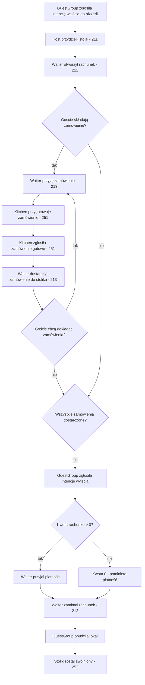

# Proces: Obsługa grupy gości w pizzerii (`GuestService`)

## Cel procesu

Proces opisuje kompletny cykl życia obsługi grupy gości w pizzerii — od momentu pojawienia się gości w lokalu, przez zajęcie stolika, składanie i realizację zamówień, aż po płatność i opuszczenie lokalu.

Sercem procesu jest rachunek (`Bill`), który agreguje zamówienia i determinuje, czy obsługa grupy gości jest jeszcze aktywna.

## Zakres

* **Początek procesu:** użytkownik symulacji definiuje `GuestGroup` (co najmniej liczbę osób w grupie) i zgłasza jej intencję wejścia do pizzerii.
* **Koniec procesu:** rachunek został zamknięty (`Closed`), goście opuścili lokal, stolik został zwolniony (`Free`).

## Role zaangażowane

* **GuestGroup** — grupa gości, wokół której toczą się wydarzenia.
* **Host** — przydziela stolik i inicjuje obsługę.
* **Waiter** — otwiera rachunek, przyjmuje zamówienia, dostarcza gotowe zamówienia, przyjmuje płatność i zamyka rachunek.
* **Kitchen** — realizuje zamówienie w kuchni (szczegóły w procesie wspierającym `251_kitchen_order_fulfillment.md`).
* **Manager** — pośrednio, poprzez wcześniejszą konfigurację stolików, menu i personelu.

## Fazy procesu

1. **Przyjęcie gości do lokalu** — szczegóły w `211_guest_arrival.md`.
2. **Zarządzanie rachunkiem** — otwarcie i zamknięcie rachunku; szczegóły w `212_bill_management.md`.
3. **Składanie zamówienia** — szczegóły w `213_ordering.md`. Proces jest powtarzalny — kolejne zamówienia tworzą nowe byty `Order` dodawane do tego samego rachunku.
4. **Zakończenie obsługi** (`ServiceCompletion`) — prośba o rachunek / intencja wyjścia, płatność, zamknięcie rachunku, opuszczenie lokalu i zwolnienie stolika. Główny proces obsługi gości koordynuje te kroki.

## Cykl życia rachunku (Bill)

Rachunek jest centralnym bytem finansowym obsługi grupy gości. Jako domena finansowa ma uproszczony cykl życia.

| Stan | Opis |
|------|------|
| `Open` | Rachunek został otwarty po przydzieleniu stolika. Można dodawać do niego pozycje zamówień. |
| `Closed` | Płatność została dokonana. Rachunek jest zakończony. |

Decyzję o tym, czy rachunek można zamknąć, podejmuje **główny proces obsługi gości**. Proces sprawdza, czy:
* wszystkie zamówienia powiązane z rachunkiem zostały dostarczone,
* goście zgłosili intencję wyjścia z lokalu,
* dokonano płatności (jeśli całkowita kwota rachunku jest większa od 0).

Rachunek sam w sobie nie posiada stanu „oczekuje na płatność" — jest to stan procesu, nie bytu finansowego.

## Cykl życia zamówienia (Order) w ramach obsługi gości

Każde zamówienie powiązane z rachunkiem przechodzi przez następujące stany:

| Stan | Opis |
|------|------|
| `Accepted` | Kelner przyjął zamówienie od gości. Zamówienie powstało jako byt, ale nie zostało jeszcze przekazane do kuchni. |
| `Submitted` | Kelner przekazał zamówienie do kuchni. Zamówienie oczekuje na przyjęcie przez kuchnię. |
| `InPreparation` | Kuchnia przyjmuje zamówienie i rozpoczyna przygotowanie. |
| `ReadyForDelivery` | Wszystkie pozycje zamówienia są gotowe; czeka na odbiór przez kelnera. |
| `Delivered` | Kelner dostarczył zamówienie do stolika. |

Statusy zamówienia są śledzone przez **główny proces obsługi gości**, nie przez rachunek. Rachunek jako domena finansowa zna wyłącznie pozycje zamówień i ich kwoty.

Zamówienie przyjęte przez kelnera musi zostać przekazane do kuchni i przejść przez pełny cykl życia aż do stanu `Delivered`. Model zakłada, że zamówienie zawsze dociera do kuchni.

## Zakończenie obsługi

Główny proces obsługi gości koordynuje zakończenie wizyty. Składa się ono z następujących kroków:

1. `GuestGroup` zgłasza intencję wyjścia z lokalu (może to być sformułowane jako prośba o rachunek).
2. Główny proces sprawdza, czy wszystkie zamówienia powiązane z rachunkiem są w stanie `Delivered`. Zamknięcie rachunku jest możliwe wyłącznie po dostarczeniu wszystkich zamówień.
3. `Waiter` przyjmuje płatność od `GuestGroup`.
   * Płatność musi być równa całkowitej kwocie rachunku.
   * Forma płatności nie ma znaczenia w uproszczonym modelu.
   * Jeśli kwota rachunku wynosi 0, płatność jest pomijana — rachunek zostaje zamknięty automatycznie.
4. `Waiter` zamyka rachunek. `Bill` przechodzi ze stanu `Open` do stanu `Closed`.
5. `GuestGroup` opuszcza lokal. Jako byt bez własnego cyklu życia, oznacza to koniec aktywności grupy w ramach bieżącego procesu obsługi.
6. Stolik zostaje zwolniony (`TableRelease`). Szczegóły zarządzania stanem stolika znajdują się w procesie wspierającym `252_table_management.md`.

Zamknięcie rachunku jest inicjowane przez główny proces, ale sama operacja zamknięcia należy do domeny finansowej rachunku (`212_bill_management.md`).

## GuestGroup w procesie

`GuestGroup` jest bytem tożsamościowym reprezentującym grupę gości, ale **nie posiada własnego cyklu życia**. Jest stałym odniesieniem dla wydarzeń toczących się wokół rachunku i zamówień.

Właściwości `GuestGroup` istotne dla procesu:
* liczba osób w grupie — wpływa na wybór stolika przez Hosta,
* tożsamość grupy — pozwala powiązać ją z rachunkiem, zamówieniami i stolikiem.

## Granice procesu

Proces obsługi gości **nie obejmuje**:
* zarządzania stanem stolika — to domena procesu wspierającego `252_table_management.md`,
* szczegółów pracy kuchni — to domena procesu wspierającego `251_kitchen_order_fulfillment.md`,
* konfiguracji menu, personelu i parametrów pizzerii — to domena procesów wspierających `253_menu_management.md`, `254_staff_management.md` i `255_pizzeria_lifecycle.md`.

## Mapa procesu

## Decyzje ostateczne

* ✅ **Czy rachunek może być zamknięty, jeśli goście nie złożyli żadnego zamówienia?** Tak. Rachunek może zostać zamknięty z kwotą 0, jeśli goście nie złożyli zamówień. W przypadku kwoty 0 rachunek zostaje zamknięty automatycznie po zgłoszeniu intencji wyjścia, bez konieczności płatności. Cykl obsługi musi się zakończyć, aby zwolnić stolik.
* ✅ ~~**Czy rachunek w stanie „Oczekuje na płatność" może przyjmować kolejne zamówienia?**~~ Pytanie nieaktualne. Rachunek nie posiada stanu „Oczekuje na płatność". Nowe zamówienia mogą być składane dopóki rachunek jest `Open` i goście nie zapłacili.
* ✅ **Czy kelner może zainicjować zamknięcie rachunku bez bezpośredniego żądania gości?** Nie. Zamknięcie rachunku wymaga zgłoszenia intencji wyjścia przez gości, dokonania płatności (jeśli kwota > 0) oraz akcji kelnera zamykającej rachunek. Wymuszone zamknięcie w celu zakończenia dnia wykracza poza uproszczony model.
* ✅ **Czy rachunek przechowuje informację o konkretnym stoliku, czy tylko o zamówieniach?** Rachunek **nie przechowuje** `tableId`. Stolik nie należy do domeny finansowej rachunku. Zamówienie również **nie zna** `tableId`. `tableId` jest przechowywany wyłącznie przez główny proces obsługi gości jako część stanu procesu wiążącego gości, stolik, rachunek i zamówienia.
* ✅ **Czy płatność jest częścią procesu głównego czy procesu zarządzania rachunkiem?** Płatność i zamknięcie rachunku są operacjami domeny finansowej realizowanymi w ramach `212_bill_management.md`. Główny proces obsługi gości decyduje **kiedy** zamknąć rachunek i koordynuje całe zakończenie obsługi, ale samo zamknięcie rachunku należy do `212`.
* ✅ **Czy płatność musi być równa kwocie rachunku?** Tak. Płatność musi pokrywać całkowitą kwotę rachunku. Nie modelujemy napiwków, reszty ani częściowych płatności.
* ✅ **Czy opuszczenie lokalu jest automatyczne po zamknięciu rachunku?** Nie. Opuszczenie lokalu i zamknięcie rachunku są osobnymi krokami. W uproszczonym modelu następują jeden po drugim, ale są to rozdzielone akcje.
* ✅ **Czy stolik może być zwolniony przed opuszczeniem lokalu przez gości?** Nie. Stolik jest zwalniany (`TableRelease`) dopiero po zamknięciu rachunku (`Closed`) i opuszczeniu lokalu przez gości. Szczegóły zarządzania stanem stolika znajdują się w `252_table_management.md`.

## Pytania do dalszej analizy

* Brak otwartych pytań w tym procesie.
