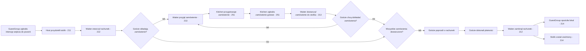

# Proces: Obsługa grupy gości w pizzerii

## Cel procesu

Proces opisuje kompletny cykl życia obsługi grupy gości w pizzerii — od momentu pojawienia się gości w lokalu, przez zajęcie stolika, składanie i realizację zamówień, aż po płatność i opuszczenie lokalu.

Sercem procesu jest rachunek (`Bill`), który agreguje zamówienia i determinuje, czy obsługa grupy gości jest jeszcze aktywna.

## Zakres

* **Początek procesu:** zgłoszenie intencji wejścia do pizzerii przez `GuestGroup`.
* **Koniec procesu:** rachunek został zamknięty, goście opuścili lokal, stolik został zwolniony.

## Role zaangażowane

* **GuestGroup** — grupa gości, wokół której toczą się wydarzenia.
* **Host** — przydziela stolik i inicjuje obsługę.
* **Waiter** — otwiera rachunek, przyjmuje zamówienia, dostarcza gotowe zamówienia, przyjmuje płatność i zamyka rachunek.
* **Kitchen** — realizuje zamówienie w kuchni (szczegóły w procesie wspierającym `251_kitchen_order_fulfillment.md`).
* **Manager** — pośrednio, poprzez wcześniejszą konfigurację stolików, menu i personelu.

## Fazy procesu

1. **Przyjęcie gości do lokalu** — szczegóły w `211_guest_arrival.md`.
2. **Zarządzanie rachunkiem** — otwarcie i zamknięcie rachunku; szczegóły w `212_bill_management.md`.
3. **Składanie zamówienia** — szczegóły w `213_ordering.md`. Proces jest powtarzalny — kolejne zamówienia tworzą nowe byty `Order` dodawane do tego samego rachunku.
4. **Płatność i opuszczenie lokalu** — szczegóły w `214_payment_and_departure.md`.

## Cykl życia rachunku (Bill)

Rachunek jest centralnym bytem finansowym obsługi grupy gości. Jako domena finansowa ma uproszczony cykl życia.

| Stan | Opis |
|------|------|
| **Otwarty** | Rachunek został otwarty po przydzieleniu stolika. Można dodawać do niego pozycje zamówień. |
| **Zamknięty** | Płatność została dokonana. Rachunek jest zakończony. |

Decyzję o tym, czy rachunek można zamknąć, podejmuje **główny proces obsługi gości**. Proces sprawdza, czy:
* wszystkie zamówienia powiązane z rachunkiem zostały dostarczone,
* goście dokonali płatności.

Rachunek sam w sobie nie posiada stanu „oczekuje na płatność" — jest to stan procesu, nie bytu finansowego.

## Cykl życia zamówienia (Order) z perspektywy rachunku

Każde zamówienie powiązane z rachunkiem przechodzi przez następujące stany:

| Stan | Opis |
|------|------|
| **Przyjęte** | Kelner przyjął zamówienie od gości. Zamówienie powstało jako byt, ale nie zostało jeszcze przekazane do kuchni. |
| **Zamówione** | Kelner przekazał zamówienie do kuchni. Zamówienie oczekuje na przyjęcie przez kuchnię. |
| **W realizacji** | Kuchnia przyjmuje zamówienie i rozpoczyna przygotowanie. |
| **Gotowe do odbioru** | Wszystkie pozycje zamówienia są gotowe; czeka na odbiór przez kelnera. |
| **Dostarczone** | Kelner dostarczył zamówienie do stolika. |

Statusy zamówienia są śledzone przez **główny proces obsługi gości**, nie przez rachunek. Rachunek jako domena finansowa zna wyłącznie pozycje zamówień i ich kwoty.

Zamówienie przyjęte przez kelnera musi zostać przekazane do kuchni i przejść przez pełny cykl życia aż do stanu **Dostarczone**. Model zakłada, że zamówienie zawsze dociera do kuchni. Zamknięcie rachunku jest możliwe dopiero wtedy, gdy proces stwierdzi, że wszystkie zamówienia powiązane z rachunkiem są w stanie **Dostarczone**, oraz gdy goście dokonali płatności.

## GuestGroup w procesie

`GuestGroup` jest bytem tożsamościowym reprezentującym grupę gości, ale **nie posiada własnego cyklu życia**. Jest stałym odniesieniem dla wydarzeń toczących się wokół rachunku i zamówień.

Właściwości `GuestGroup` istotne dla procesu:
* liczba osób w grupie — wpływa na wybór stolika przez Hosta,
* tożsamość grupy — pozwala powiązać ją z rachunkiem, zamówieniami i stolikiem.

## Granice procesu

Proces obsługi gości **nie obejmuje**:
* zarządzania stanem stolika — to domena procesu wspierającego `252_table_management.md`,
* szczegółów pracy kuchni — to domena procesu wspierającego `251_kitchen_order_fulfillment.md`,
* konfiguracji menu, personelu i parametrów pizzerii — to domena procesów wspierających `253_menu_management.md`, `254_staff_management.md` i `255_pizzeria_lifecycle.md`.

## Mapa procesu

## Pytania do dalszej analizy

* ✅ **Czy rachunek może być zamknięty, jeśli goście nie złożyli żadnego zamówienia?** Tak. Rachunek może zostać zamknięty z kwotą 0, jeśli goście nie złożyli zamówień. Cykl obsługi musi się zakończyć, aby zwolnić stolik.
* ✅ ~~**Czy rachunek w stanie „Oczekuje na płatność" może przyjmować kolejne zamówienia?**~~ Pytanie nieaktualne. Rachunek nie posiada stanu „Oczekuje na płatność". Nowe zamówienia mogą być składane dopóki rachunek jest **Otwarty** i goście nie zapłacili.
* ✅ **Czy kelner może zainicjować zamknięcie rachunku bez bezpośredniego żądania gości?** Nie. Zamknięcie rachunku wymaga prośby gości o rachunek, dokonania płatności przez gości oraz akcji kelnera zamykającej rachunek. Wymuszone zamknięcie w celu zakończenia dnia wykracza poza uproszczony model.
* ✅ **Czy rachunek przechowuje informację o konkretnym stoliku, czy tylko o zamówieniach?** Rachunek **nie przechowuje** `tableId`. Stolik nie należy do domeny finansowej rachunku. Zamówienie również **nie zna** `tableId`. `tableId` jest przechowywany wyłącznie przez główny proces obsługi gości jako część stanu procesu wiążącego gości, stolik, rachunek i zamówienia.
