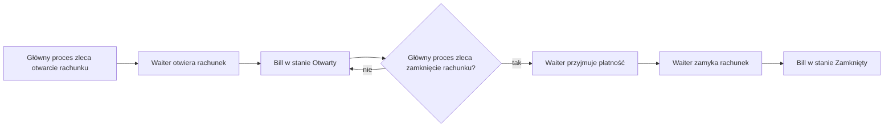

# Proces: Zarządzanie rachunkiem

## Cel procesu

Proces opisuje cykl życia rachunku (`Bill`) — od otwarcia po usadzeniu gości przy stoliku, przez gromadzenie pozycji zamówień, aż po zamknięcie po dokonaniu płatności.

## Zakres

* **Początek procesu:** główny proces obsługi gości zleca otwarcie rachunku dla usadzonej `GuestGroup`.
* **Koniec procesu:** rachunek został zamknięty.

## Role zaangażowane

* **Waiter** — kelner otwiera i zamyka rachunek na polecenie głównego procesu.
* **Bill** — byt finansowy reprezentujący rachunek.
* **GuestGroup** — grupa gości, której dotyczy rachunek (jako parametr wejściowy, nie aktywny aktor).

## Warunki początkowe

* `GuestGroup` została usadzona przy stoliku przez proces `211_guest_arrival.md`.
* Pizzeria jest w stanie **Otwarta** lub **Zamykana**.

## Cykl życia rachunku

| Stan | Opis |
|------|------|
| **Otwarty** | Rachunek został otwarty. Można dodawać do niego pozycje zamówień. |
| **Zamknięty** | Płatność została dokonana. Rachunek jest zakończony i nie przyjmuje nowych pozycji. |

## Przebieg procesu

## Szczegóły kroków

### 1. Otwarcie rachunku

Główny proces obsługi gości, po otrzymaniu potwierdzenia usadzenia `GuestGroup` przy stoliku, zleca `Waiter` otwarcie rachunku. `Waiter` tworzy `Bill` w stanie **Otwarty**.

Rachunek jest powiązany z `GuestGroup`, ale jako byt finansowy **nie przechowuje** `tableId`.

### 2. Gromadzenie pozycji

W trakcie trwania rachunku proces składania zamówienia (`213_ordering.md`) dodaje do rachunku pozycje (`OrderLine`). Każda pozycja jest dopisywana wraz z ceną pobraną z menu w chwili dodawania. Rachunek przelicza całkowitą kwotę do zapłaty.

W przyszłości polityka cen może zostać rozszerzona — np. w momencie prośby o rachunek system może porównać zapisane kwoty z aktualnym cennikiem i zastosować cenę korzystniejszą dla gościa. Na ten moment przyjmujemy uproszczony model bez dynamicznych gratyfikacji.

Zamówienia są powtarzalne — każde kolejne zamówienie tworzy nowy byt `Order` i jest agregowane przez ten sam rachunek.

Rachunek sam w sobie nie wie, czy zamówienie zostało dostarczone. Wie tylko, że pozycje zostały do niego dopisane.

### 3. Zamknięcie rachunku

Zamknięcie rachunku jest inicjowane przez główny proces, gdy spełnione zostaną warunki:
* wszystkie zamówienia powiązane z rachunkiem zostały dostarczone do stolika (decyzja procesu, nie rachunku),
* `GuestGroup` wyraziła intencję zapłaty (np. poprosiła o rachunek),
* `GuestGroup` dokonała płatności.

`Waiter` przyjmuje płatność i zamyka rachunek. Rachunek przechodzi w stan **Zamknięty**.

## Dane wyjściowe procesu

Po zamknięciu rachunku:
* `Bill` jest w stanie **Zamknięty**,
* rachunek zawiera ostateczną listę pozycji i kwotę do zapłaty,
* główny proces otrzymuje potwierdzenie zamknięcia rachunku.

## Granice procesu

Proces zarządzania rachunkiem **nie obejmuje**:
* przyjęcia gości i przydzielania stolika — to proces `211_guest_arrival.md`,
* składania zamówień — to proces `213_ordering.md` (proces jest powtarzalny; każde zamówienie to nowy byt `Order`),
* realizacji zamówień w kuchni — to proces `251_kitchen_order_fulfillment.md`,
* obsługi płatności poza zamknięciem rachunku — płatność jest integralną częścią zamknięcia.

## Decyzje domenowe zastosowane w tym procesie

* Rachunek to domena finansowa i nie przechowuje `tableId`.
* Rachunek ma uproszczony cykl życia: **Otwarty** / **Zamknięty**.
* Decyzję o zamknięciu rachunku podejmuje główny proces obsługi gości.
* Rachunek może być zamknięty z kwotą 0, jeśli nie powstały żadne zamówienia.

## Decyzje ostateczne

* ✅ **Czy rachunek powinien przechowywać informację o czasie otwarcia i zamknięcia?** Tak. Rachunek przechowuje czas otwarcia oraz czas zamknięcia. Informacje te mogą być wykorzystywane do analizy czasu obsługi i raportowania.
* ✅ **Czy kelner może anulować rachunek po jego otwarciu (przed dodaniem zamówień)?** Tak. Rachunek otwarty bez zamówień może zostać anulowany. W takim przypadku goście opuszczają stolik, a stolik zostaje zwolniony.
* ✅ **Czy płatność musi być dokonywana wyłącznie gotówką, czy model dopuszcza inne formy płatności?** W uproszczonym modelu forma płatności nie ma znaczenia. Rejestrowane jest jedynie zdarzenie „opłacono" jako warunek zamknięcia rachunku.

## Pytania do dalszej analizy

* Brak otwartych pytań w tym procesie.
