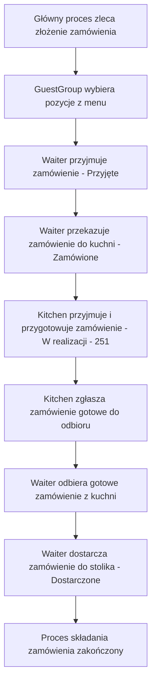

# Proces: Składanie zamówienia

## Cel procesu

Proces opisuje składanie zamówienia przez grupę gości, przyjęcie zamówienia przez kelnera oraz przekazanie go do kuchni w celu realizacji. Proces jest powtarzalny — w ramach jednego rachunku może powstać wiele niezależnych zamówień, każde jako osobny byt `Order`.

## Zakres

* **Początek procesu:** główny proces obsługi gości zleca złożenie zamówienia dla aktywnego rachunku.
* **Koniec procesu:** zamówienie zostało dostarczone do stolika.

## Role zaangażowane

* **GuestGroup** — grupa gości składająca zamówienie.
* **Waiter** — kelner przyjmujący zamówienie, przekazujący je do kuchni, odbierający gotowe zamówienie i dostarczający je do stolika.
* **Kitchen** — kuchnia przyjmująca zamówienie i przygotowująca je (szczegóły w procesie wspierającym `251_kitchen_order_fulfillment.md`).

## Warunki początkowe

* Dla `GuestGroup` istnieje otwarty rachunek (`Bill` w stanie **Otwarty**).
* `GuestGroup` jest usadzona przy stoliku.
* Pizzeria jest w stanie **Otwarta** lub **Zamykana**.
* Menu zawiera pozycje dostępne do zamówienia.

## Cykl życia zamówienia z perspektywy procesu składania

| Stan | Opis |
|------|------|
| **Przyjęte** | Kelner przyjął zamówienie od gości. Zamówienie powstało jako byt, ale nie zostało jeszcze przekazane do kuchni. |
| **Zamówione** | Kelner przekazał zamówienie do kuchni. Zamówienie oczekuje na przyjęcie przez kuchnię. |
| **W realizacji** | Kuchnia przyjęła zamówienie i rozpoczęła przygotowanie. |
| **Gotowe do odbioru** | Wszystkie pozycje zamówienia są gotowe; czeka na odbiór przez kelnera. |
| **Dostarczone** | Kelner dostarczył zamówienie do stolika. |

## Przebieg procesu

## Szczegóły kroków

### 1. Wybór pozycji przez gości

`GuestGroup` wybiera pozycje z aktualnego menu. Każda pozycja zamówienia (`OrderLine`) zawiera:
* identyfikator pozycji menu (`MenuItem`),
* ilość.

Goście mogą zamawiać wyłącznie pozycje dostępne w menu. Nie ma modyfikacji, dodatków ani zamówień spoza menu.

### 2. Przyjęcie zamówienia przez kelnera

`Waiter` przyjmuje zamówienie od `GuestGroup`. W tym momencie zamówienie powstaje jako byt i przechodzi w stan **Przyjęte**.

Zamówienie jest bytem domeny produktowej. Nie przechowuje `tableId` ani `billId` oraz nie przechowuje cen. Powiązanie zamówienia ze stolikiem i rachunkiem oraz polityka cen pozycji są zarządzane przez główny proces obsługi gości.

W momencie przyjęcia zamówienia pozycje zamówienia (`OrderLine`) wraz z aktualnymi cenami z menu zostają dopisane do otwartego rachunku (`Bill`). Rachunek przelicza całkowitą kwotę do zapłaty.

`Waiter` może poinformować gości o szacowanym czasie oczekiwania. Szacowany czas nie jest częścią modelu zamówienia — jest wartością wyliczaną na bieżąco przez `Kitchen` po przyjęciu zamówienia do realizacji.

### 3. Przekazanie zamówienia do kuchni

`Waiter` umieszcza zamówienie w kolejce kuchennej. Zamówienie trafia do kuchni jako całość i przechodzi w stan **Zamówione**.

### 4. Przyjęcie zamówienia przez kuchnię

`Kitchen` przyjmuje zamówienie do realizacji. Zamówienie przechodzi w stan **W realizacji**. Szczegóły przygotowania poszczególnych pizz znajdują się w procesie wspierającym `251_kitchen_order_fulfillment.md`.

Po przyjęciu zamówienia kuchnia szacuje czas potrzebny na wykonanie całego zamówienia i przekazuje tę informację kelnerowi. Szacunek opiera się na liczbie pozycji, aktualnym obciążeniu kuchni, liczbie aktywnych kucharzy oraz skonfigurowanym czasie przygotowania pojedynczej pizzy.

### 5. Zgłoszenie gotowości zamówienia

Gdy wszystkie pozycje zamówienia zostały przygotowane, `Kitchen` oznacza zamówienie jako **Gotowe do odbioru** i zgłasza tę gotowość kelnerowi.

### 6. Odbiór i dostawa zamówienia

`Waiter`, gdy ma dostępność w swojej kolejce zadań, odbiera gotowe zamówienie z kuchni i dostarcza je do stolika. Zamówienie przechodzi w stan **Dostarczone**.

## Dane wyjściowe procesu

Po zakończeniu procesu składania:
* `Order` zostało utworzone i dostarczone do stolika,
* pozycje zamówienia zostały dopisane do rachunku (`Bill`) wraz z aktualnymi cenami z menu,
* zamówienie jest w stanie **Dostarczone**,
* główny proces otrzymał informację o dostarczonym zamówieniu,
* pozycje zamówienia zostały już dopisane do rachunku w chwili przyjęcia zamówienia przez kelnera.

## Granice procesu

Proces składania zamówienia **nie obejmuje**:
* przyjęcia gości i przydzielania stolika — to proces `211_guest_arrival.md`,
* zarządzania rachunkiem — to proces `212_bill_management.md`,
* wewnętrznych mechanizmów realizacji zamówienia w kuchni — to proces `251_kitchen_order_fulfillment.md`,
* zarządzania menu — to proces `253_menu_management.md`.

## Decyzje domenowe zastosowane w tym procesie

* Goście zamawiają wyłącznie pozycje z menu.
* Zamówienie może obejmować jedną lub wiele pozycji (pizz).
* Zamówienie nie zawiera informacji o cenach — ceny pochodzą z menu i są dopisywane do rachunku.
* Zamówienie nie zna `tableId` — dostawa jest koordynowana przez główny proces.
* Zamówienie nie może być anulowane w żadnym momencie cyklu życia.

## Decyzje ostateczne

* ✅ **Czy kelner może odmówić przyjęcia zamówienia?** Zasady przyjmowania zamówień są uzależnione od statusu pizzerii (zapisane w `112_roles.md`). W stanie **Otwarta** i **Zamykana** zamówienia są przyjmowane. W stanie **Zamknięta** nowe zamówienia nie są przyjmowane.
* ✅ **Czy goście mogą złożyć zamówienie natychmiast po otwarciu rachunku?** Tak. Zamówienie może być złożone od razu po otwarciu rachunku, bez wymaganego czasu oczekiwania.
* ✅ **Czy zamówienie powinno mieć identyfikator generowany przez system czy przypisywany przez kelnera?** Identyfikator zamówienia (`orderId`) powstaje automatycznie w momencie przyjęcia zamówienia przez kelnera. Nie jest przypisywany przez kelnera.
* ✅ **Czy zamówienie może być anulowane?** Nie. Zamówienie nie może być anulowane w żadnym momencie cyklu życia — ani po przyjęciu przez kelnera, ani po przekazaniu do kuchni, ani w trakcie realizacji.
* ✅ **Czy zamówienie zna `tableId`?** Nie. Zamówienie jest bytem domeny produktowej i nie przechowuje `tableId`. Powiązanie zamówienia ze stolikiem oraz koordynacja dostawy należą do głównego procesu obsługi gości.
* ✅ **Czy zamówienie zawiera ceny pozycji?** Nie. Zamówienie przechowuje wyłącznie identyfikatory pozycji menu i ilości. Ceny są pobierane z menu w momencie przyjęcia zamówienia i dopisywane do rachunku.
* ✅ **Czy nowe zamówienia do istniejących rachunków są dozwolone, gdy pizzeria jest w stanie Zamykana?** Tak. Gdy pizzeria przechodzi w stan **Zamykana**, Host nie przyjmuje nowych grup gości, ale istniejące otwarte rachunki mogą otrzymywać kolejne zamówienia.
* ✅ **Kto określa szacowany czas oczekiwania na zamówienie?** Szacowany czas oczekiwania jest określany przez `Kitchen` po przyjęciu zamówienia do realizacji. Kuchnia szacuje czas potrzebny na wykonanie całego zamówienia na podstawie liczby pozycji, aktualnego obciążenia kuchni, liczby aktywnych kucharzy oraz skonfigurowanego czasu przygotowania pojedynczej pizzy.
* ✅ **Czy zamówienie w stanie Przyjęte może nigdy nie trafić do kuchni?** Nie. Zamówienie przyjęte przez kelnera musi zostać przekazane do kuchni i przejść przez pełny cykl życia. Model zakłada, że zamówienie zawsze dociera do kuchni.

## Pytania do dalszej analizy

* ✅ **Czy zamówienie wymaga natychmiastowego przekazania do kuchni po przyjęciu?** Nie. Między przyjęciem zamówienia przez kelnera a przekazaniem go do kuchni może upłynąć czas. Dlatego cykl życia zamówienia rozróżnia stany **Przyjęte** i **Zamówione**.
* Brak otwartych pytań w tym procesie.
