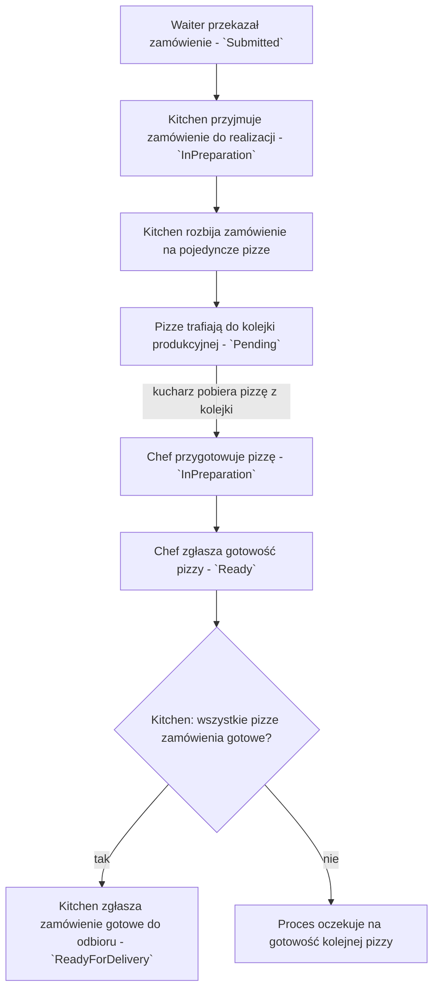

# Proces: Realizacja zamówienia w kuchni (`Order` — `Submitted` / `InPreparation` / `ReadyForDelivery`; `Pizza` — `Pending` / `InPreparation` / `Ready`)

## Cel procesu

Proces opisuje wewnętrzną realizację zamówienia (`Order`) w kuchni — od przyjęcia zamówienia jako całości, przez rozbicie na pojedyncze pizze, dystrybucję pracy między kucharzy, aż po zgłoszenie gotowości całego zamówienia do odbioru przez kelnera.

## Zakres

* **Początek procesu:** kuchnia otrzymała zamówienie od kelnera (zamówienie w stanie `Submitted` z perspektywy `213_ordering.md`).
* **Koniec procesu:** wszystkie pozycje zamówienia zostały przygotowane, a zamówienie zostało oznaczone jako `ReadyForDelivery`.

## Role zaangażowane

* **Kitchen** — rola koordynująca całą kuchnię; przyjmuje zamówienia, zarządza kolejką produkcyjną, dystrybuuje pizze do kucharzy, śledzi postęp i zgłasza gotowość zamówienia.
* **Chef** — kucharz pobierający pojedyncze pizze z kolejki i przygotowujący je zgodnie z recepturą.
* **Waiter** — kelner przekazujący zamówienie do kuchni i odbierający gotowe zamówienie (z perspektywy `213_ordering.md`).

## Warunki początkowe

* Zamówienie (`Order`) zostało przekazane do kuchni przez kelnera i znajduje się w stanie `Submitted`.
* Zamówienie zawiera co najmniej jedną pozycję (`OrderLine`).
* W kuchni jest co najmniej jeden aktywny kucharz (`Chef` w stanie `Active`).

## Cykl życia zamówienia z perspektywy kuchni

| Stan | Opis |
|------|------|
| `Submitted` | Zamówienie trafiło do kolejki kuchennej, ale kuchnia jeszcze go nie przyjęła do realizacji. |
| `InPreparation` | Kuchnia przyjęła zamówienie do realizacji i rozbija je na pojedyncze pizze — niekoniecznie oznacza to, że którakolwiek pizza jest już aktywnie przygotowywana przez kucharza (mogą wciąż czekać w kolejce w stanie `Pending`). |
| `ReadyForDelivery` | Wszystkie pizze z zamówienia zostały przygotowane. Zamówienie czeka na odbiór przez kelnera. |

## Cykl życia pojedynczej pizzy

| Stan | Opis |
|------|------|
| `Pending` | Pizza znajduje się w kolejce produkcyjnej kuchni i oczekuje na wolnego kucharza. |
| `InPreparation` | Kucharz pobrał pizzę z kolejki i ją przygotowuje. |
| `Ready` | Pizza została przygotowana. Kucharz zgłosił jej gotowość kuchni. |

## Przebieg procesu

## Szczegóły kroków

### 1. Przyjęcie zamówienia przez kuchnię

`Kitchen` przyjmuje zamówienie przekazane przez kelnera. Zamówienie przechodzi ze stanu `Submitted` do stanu `InPreparation`. W tym momencie kuchnia szacuje czas potrzebny na wykonanie całego zamówienia.

Szacunek czasu realizacji jest realizowany przez wyodrębnioną **politykę szacowania czasu**. Aktualnie przyjmujemy uproszczoną politykę, która bierze pod uwagę:
* liczbę pizz w zamówieniu,
* aktualne obciążenie kolejki produkcyjnej,
* liczbę aktywnych (`Active`) kucharzy,
* czas przygotowania pojedynczej pizzy — parametr kontekstu **Kitchen** zarządzany przez `Manager`.

Czas przygotowania pojedynczej pizzy jest własnością kontekstu **Kitchen**, nie Pizzeria Lifecycle. Jest on używany zarówno do szacowania czasu realizacji zamówień, jak i do sterowania symulacją przygotowywania pizz.

W przyszłości polityka szacowania czasu może zostać zmieniona lub rozszerzona — np. o priorytety zamówień, różne czasy dla różnych pizz, predykcję opartą na historii, czy ograniczenia sprzętowe kuchni. Wydzielenie polityki pozwala na takie zmiany bez ingerencji w główny przebieg procesu.

Szacowany czas jest przekazywany kelnerowi, który może poinformować o nim gości. Czas ten nie jest częścią modelu zamówienia — jest wartością wyliczaną na bieżąco.

### 2. Rozbicie zamówienia na pojedyncze pizze

`Kitchen` rozbija zamówienie na pojedyncze pizze na podstawie pozycji (`OrderLine`). Każda pozycja menu z określoną ilością generuje odpowiednią liczbę niezależnych zadań produkcyjnych.

Dla każdej pizzy kuchnia korzysta ze sposobu przygotowania / receptury zdefiniowanej w pozycji menu (`MenuItem`). W uproszczonym modelu czas przygotowania każdej pizzy jest stały, niezależnie od typu pizzy, ale receptura może zawierać informacje o kolejności kroków lub wskazówkach dla kucharza.

Pojedyncza pizza jest najmniejszą jednostką produkcyjną w kuchni. Kucharze nie przygotowują „zamówień" — przygotowują konkretne pizze.

### 3. Kolejkowanie pizz

Pizze trafiają do wspólnej kolejki produkcyjnej kuchni. Kolejka jest wspólna dla wszystkich zamówień i wszystkich kucharzy. Kolejność realizacji może być determinowana przez moment przybycia zamówienia, choć w przyszłości można rozważyć inne strategie (np. priorytety, rozmiar zamówienia).

W uproszczonym modelu kuchnia realizuje pizze w kolejności przybycia do kolejki.

### 4. Przygotowanie pizzy przez kucharza

`Chef` pobiera kolejną dostępną pizzę z wspólnej kolejki produkcyjnej. Każdy kucharz przygotowuje jedną pizzę naraz. Pizza przechodzi ze stanu `Pending` do `InPreparation`.

Czas przygotowania jednej pizzy jest stały i konfigurowalny przez `Manager` jako parametr kontekstu **Kitchen**. Wszystkie pizze mają ten sam czas przygotowania, niezależnie od typu.

Kucharz jest przypisany do kuchni jako całości, nie do konkretnego zamówienia. Liczba aktywnych (`Active`) kucharzy wpływa bezpośrednio na czas realizacji zamówień.

### 5. Zgłoszenie gotowości pizzy

Po zakończeniu przygotowania kucharz zgłasza gotowość pojedynczej pizzy. Pizza przechodzi ze stanu `InPreparation` do `Ready`. Kuchnia aktualizuje postęp realizacji zamówienia.

### 6. Zgłoszenie gotowości zamówienia

Gdy wszystkie pizze należące do zamówienia są w stanie `Ready`, `Kitchen` oznacza całe zamówienie jako `ReadyForDelivery` i zgłasza tę gotowość kelnerowi.

Zamówienie jest dostarczane do stolika jako całość dopiero po przygotowaniu wszystkich jego pozycji. Nie modelujemy częściowych dostaw.

## Dane wyjściowe procesu

Po zakończeniu procesu:
* wszystkie pizze z zamówienia są przygotowane,
* zamówienie jest w stanie `ReadyForDelivery`,
* kelner otrzymał informację o gotowości zamówienia do odbioru,
* kuchnia może kontynuować realizację kolejnych zamówień i pizz.

## Granice procesu

Proces realizacji zamówienia w kuchni **nie obejmuje**:
* składania zamówienia przez gości — to proces `213_ordering.md`,
* zarządzania menu — to proces `253_menu_management.md`,
* zarządzania personelem kuchennym — to proces `254_staff_management.md`,
* dostarczania zamówienia do stolika — to proces `213_ordering.md`,
* zarządzania składnikami i magazynem — to przyszła domena poza zakresem.

## Decyzje domenowe zastosowane w tym procesie

* Zamówienie trafia do kuchni jako całość.
* Kuchnia rozbija zamówienie na pojedyncze pizze.
* Pizze realizowane są we wspólnej kolejce produkcyjnej.
* Kucharze pobierają pizze z kolejki pojedynczo i przygotowują jedną pizzę naraz.
* Czas przygotowania pizzy jest stały i globalny dla całej pizzerii.
* Zamówienie jest gotowe dopiero wtedy, gdy wszystkie jego pizze są gotowe.
* Zamówienie jest dostarczane do stolika jako całość.

## Decyzje ostateczne

* ✅ **Czy kuchnia przyjmuje zamówienie automatycznie po przekazaniu przez kelnera, czy wymaga to osobnej akcji?** Kuchnia przyjmuje zamówienie do realizacji automatycznie po jego przekazaniu przez kelnera. Nie ma osobnej akcji „przyjęcia" wymagającej interakcji użytkownika.
* ✅ **Czy zamówienie w stanie `Submitted` może czekać w kolejce kuchennej przed rozpoczęciem realizacji?** Tak. Zamówienie może przebywać w stanie `Submitted` przed przyjęciem do realizacji, jednak model zakłada, że kuchnia przyjmuje je automatycznie. W praktyce stan ten reprezentuje zamówienie oczekujące na inicjalne rozbicie i wpisanie do kolejki.
* ✅ **Czy kucharze mają przypisane konkretne zamówienia?** Nie. Kucharze pobierają pojedyncze pizze z wspólnej kolejki produkcyjnej. Nie są przypisywani do konkretnych zamówień.
* ✅ **Czy wszystkie pizze mają ten sam czas przygotowania?** Tak. W uproszczonym modelu czas przygotowania pojedynczej pizzy jest stały dla całej kuchni.
* ✅ **Czy możliwa jest częściowa dostawa zamówienia?** Nie. Zamówienie jest oznaczane jako `ReadyForDelivery` dopiero wtedy, gdy wszystkie jego pizze zostały przygotowane. Kelner dostarcza zamówienie do stolika jako całość.
* ✅ **Kto określa szacowany czas realizacji zamówienia?** `Kitchen` szacuje czas po przyjęciu zamówienia na podstawie liczby pizz, obciążenia kolejki, liczby aktywnych (`Active`) kucharzy i skonfigurowanego czasu przygotowania jednej pizzy.
* ✅ **Czy `InPreparation` wymaga, aby co najmniej jedna pizza była już aktywnie przygotowywana przez kucharza?** Nie. Zamówienie przechodzi w stan `InPreparation` w momencie przyjęcia go przez kuchnię (rozbicia na `PizzaTask` i wpisania do kolejki), niezależnie od tego, czy którykolwiek kucharz już pobrał którąś z jego pizz — spójne z `322_entities.md` i `325_integration_events.md`, gdzie wyzwalaczem przejścia jest zdarzenie `OrderPreparationStarted`, publikowane od razu po przyjęciu zamówienia.

## Pytania do dalszej analizy

* Brak otwartych pytań w tym procesie.
