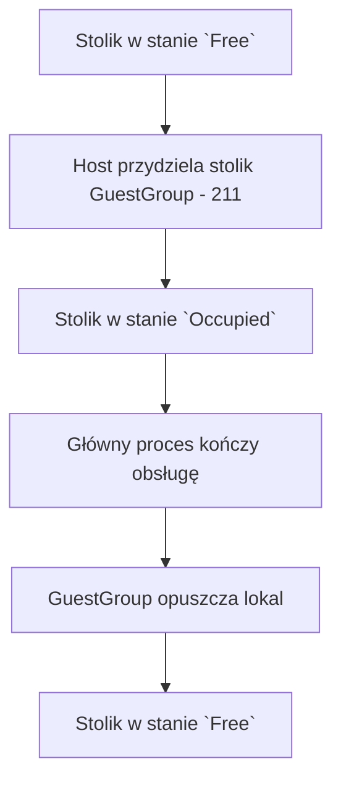

# Proces: Zarządzanie stolikami (`Table` — `Free` / `Occupied`)

## Cel procesu

Proces opisuje zarządzanie stolikami w pizzerii — ich definiowanie, przypisywanie do kelnerów oraz śledzenie stanu zajętości. Proces jest odpowiedzialny za zasób `Table`, który jest wykorzystywany przez główny proces obsługi gości (`200_guest_service.md`) oraz proces przyjęcia gości (`211_guest_arrival.md`).

## Zakres

* **Początek procesu:** `Manager` tworzy lub modyfikuje konfigurację stolików.
* **Koniec procesu:** stolik został zwolniony (`TableRelease`) po zakończeniu obsługi gości lub wycofany z konfiguracji przez `Manager` (gdy jest `Free`).

## Role zaangażowane

* **Manager** — definiuje stoliki, określa liczbę miejsc, przypisuje stoliki do kelnerów.
* **Host** — korzysta ze stolików podczas przyjmowania gości (z perspektywy `211_guest_arrival.md`).
* **Waiter** — obsługuje przypisane do niego stoliki.
* **Główny proces obsługi gości** — koordynuje `TableRelease` po zamknięciu rachunku i opuszczeniu lokalu.

## Cykl życia stolika

| Stan | Opis |
|------|------|
| `Free` | Stolik jest dostępny i może zostać przydzielony nowej grupie gości. |
| `Occupied` | Stolik jest aktualnie przypisany do obsługiwanej grupy gości. |

## Przebieg procesu operacyjnego

## Szczegóły kroków

### 1. Konfiguracja stolików przez Managera

`Manager` definiuje stoliki w pizzerii. Każdy stolik ma:
* unikalny identyfikator,
* unikalną nazwę (`name`), służącą wyłącznie do identyfikacji stolika w UI,
* liczbę miejsc,
* przypisanego kelnera.

Stolik może istnieć w konfiguracji bez przypisanego kelnera. Taki stolik nie bierze udziału w obsłudze gości. Host przyjmuje gości wyłącznie do stolików, które mają przypisanego aktywnego (`Active`) kelnera.

### 2. Przydzielenie stolika gościom

`Host` wyszukuje wolny (`Free`) stolik spełniający warunki opisane w `211_guest_arrival.md`:
* stolik jest w stanie `Free`,
* liczba miejsc jest wystarczająca dla liczby gości,
* stolik ma przypisanego aktywnego kelnera (w stanie `Active`).

Po wybraniu stolika `Host` zmienia jego stan na `Occupied`. Główny proces obsługi gości zapisuje powiązanie `GuestGroup` ↔ `Table`.

### 3. Zwalnianie stolika

Po zamknięciu rachunku i opuszczeniu lokalu przez gości główny proces zleca `TableRelease`. Stolik przechodzi ze stanu `Occupied` do stanu `Free` i może zostać ponownie przydzielony nowej grupie gości.

Szczegóły zwalniania stolika są realizowane w tym procesie, ale inicjowane przez główny proces obsługi gości (`200_guest_service.md`).

## Konfiguracja na żywo

`Manager` może modyfikować konfigurację stolików na żywo, jednak system blokuje zmiany naruszające aktualnie trwające procesy:

**Dozwolone na żywo:**
* dodawanie nowych stolików,
* przypisanie wolnego (`Free`) stolika do kelnera lub zmiana jego przypisania,
* edycja parametrów stolika, który nie jest aktualnie zajęty (`Occupied`).

**Zablokowane lub ograniczone:**
* usunięcie stolika w stanie `Occupied`,
* zmiana liczby miejsc przy zajętym (`Occupied`) stoliku,
* usunięcie ostatniego stolika w pizzerii,
* zmiana przypisania kelnera do zajętego (`Occupied`) stolika,
* pozostawienie zajętego (`Occupied`) stolika bez aktywnego (`Active`) kelnera (np. poprzez zwolnienie jedynego aktywnego kelnera tego stolika).

## Dane wyjściowe procesu

W wyniku zarządzania stolikami:
* stoliki są zdefiniowane w konfiguracji pizzerii,
* stoliki mogą istnieć bez przypisanego kelnera, ale tylko stoliki z aktywnym (`Active`) kelnerem mogą być używane w obsłudze gości,
* stoliki są w stanie `Free` lub `Occupied`,
* zwolnione (`Free`) stoliki mogą być ponownie przydzielone nowym gościom.

Z punktu widzenia procesu domenowego usunięcie stolika polega na jego wycofaniu z konfiguracji. Ewentualne przechowywanie historii usuniętych stolików dla celów raportowania, logów czy statystyk jest decyzją techniczną leżącą poza tym procesem.

## Granice procesu

Proces zarządzania stolikami **nie obejmuje**:
* przyjęcia gości do lokalu — to proces `211_guest_arrival.md`,
* zarządzania personelem i przypisaniami stolików do kelnerów — to proces `254_staff_management.md`,
* obsługi rachunków i zamówień — to procesy `212_bill_management.md` i `213_ordering.md`,
* zarządzania cyklem życia pizzerii — to proces `255_pizzeria_lifecycle.md`.

## Decyzje domenowe zastosowane w tym procesie

* Stolik posiada określoną liczbę miejsc.
* Stolik może być w stanie `Free` lub `Occupied`.
* Stolik może istnieć bez przypisanego kelnera, ale nie bierze wtedy udziału w obsłudze gości.
* Stolik zajęty (`Occupied`) nie może zostać usunięty ani zmodyfikowany w sposób naruszający trwającą obsługę.
* `TableRelease` następuje po zamknięciu rachunku i opuszczeniu lokalu przez gości.

## Decyzje ostateczne

* ✅ **Czy stolik może istnieć bez przypisanego kelnera?** Tak. Stolik może być zdefiniowany w konfiguracji bez przypisanego kelnera, ale nie bierze wtedy udziału w obsłudze gości. Host przydziela gościom wyłącznie stoliki z aktywnym (`Active`) kelnerem.
* ✅ **Czy stolik musi mieć przypisanego kelnera?** Nie. Przypisanie kelnera nie jest wymagane do istnienia stolika w konfiguracji, ale jest wymagane, aby stolik mógł być użyty w obsłudze gości.
* ✅ **Czy stolik może zmienić kelnera w trakcie dnia?** Tak, ale tylko gdy stolik jest wolny (`Free`). Zajętego (`Occupied`) stolika nie można przypisać do innego kelnera. Ponadto zajętego (`Occupied`) stolika nie można pozostawić bez aktywnego (`Active`) kelnera.
* ✅ **Czy liczba miejsc przy stoliku może być modyfikowana na żywo?** Tak, ale tylko dla wolnych (`Free`) stolików. Zmiana liczby miejsc przy zajętym (`Occupied`) stoliku jest zablokowana.
* ✅ **Czy można usunąć stolik, który jest aktualnie zajęty?** Nie. Usunięcie stolika z konfiguracji jest możliwe wyłącznie, gdy stolik jest wolny (`Free`).
* ✅ **Czy można usunąć ostatni stolik w pizzerii?** Nie. Pizzeria wymaga co najmniej jednego stolika do funkcjonowania. System blokuje usunięcie ostatniego aktywnego stolika.
* ✅ **Czy `TableRelease` jest częścią głównego procesu obsługi gości czy procesu zarządzania stolikami?** `TableRelease` jest operacją realizowaną w ramach procesu zarządzania stolikami (`252_table_management.md`), ale inicjowaną przez główny proces obsługi gości (`200_guest_service.md`) po zamknięciu rachunku i opuszczeniu lokalu.

## Pytania do dalszej analizy

* Brak otwartych pytań w tym procesie.
