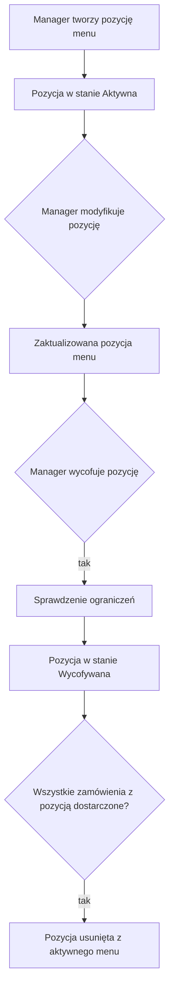

# Proces: Zarządzanie menu

## Cel procesu

Proces opisuje zarządzanie menu pizzerii — definiowanie, modyfikowanie i usuwanie pozycji menu (`MenuItem`) przez `Manager`. Menu jest zasobem konfiguracyjnym wykorzystywanym przez gości przy składaniu zamówień oraz przez kuchnię do przygotowywania pizz.

## Zakres

* **Początek procesu:** `Manager` podejmuje decyzję o zmianie menu.
* **Koniec procesu:** pozycja menu została dodana, zmodyfikowana lub usunięta zgodnie z ograniczeniami procesu.

## Role zaangażowane

* **Manager** — definiuje, modyfikuje i usuwa pozycje menu.
* **GuestGroup** — przegląda menu i wybiera pozycje do zamówienia (z perspektywy `213_ordering.md`).
* **Kitchen** — korzysta z menu do identyfikacji pizz do przygotowania (z perspektywy `251_kitchen_order_fulfillment.md`).

## Cykl życia pozycji menu

| Stan | Opis |
|------|------|
| **Aktywna** | Pozycja menu jest dostępna do zamówienia przez gości. |
| **Wycofywana** | Pozycja menu została wycofana z oferty dla nowych zamówień, ale nadal jest dostępna dla aktualnie realizowanych zamówień. |

Z punktu widzenia procesu domenowego pozycja menu może być dostępna do zamówienia, wycofywana lub usunięta z aktywnego menu. Ewentualne przechowywanie całkowicie usuniętych pozycji dla celów raportowania, historii zamówień i rachunków jest decyzją techniczną leżącą poza tym procesem.

## Przebieg procesu

## Szczegóły kroków

### 1. Tworzenie pozycji menu

`Manager` dodaje nową pozycję menu (`MenuItem`). Każda pozycja zawiera:
* nazwę,
* podstawowe składniki (opis),
* cenę.

Nowa pozycja powstaje w stanie **Aktywna** i jest od razu dostępna do zamówienia przez gości.

### 2. Modyfikacja pozycji menu

`Manager` może modyfikować istniejącą pozycję menu. W uproszczonym modelu modyfikacja może dotyczyć:
* nazwy,
* opisu / składników,
* ceny.

Modyfikacja ceny wpływa na nowe zamówienia. Pozycje już dopisane do otwartych lub zamkniętych rachunków zachowują cenę z momentu przyjęcia zamówienia.

### 3. Wycofanie pozycji menu

`Manager` może wycofać pozycję menu z oferty w dowolnym momencie. Pozycja przechodzi w stan **Wycofywana**.

Pozycja w stanie **Wycofywana**:
* nie jest widoczna dla gości jako dostępna do zamówienia,
* nadal może występować w otwartych rachunkach i aktualnie realizowanych zamówieniach,
* jest dostępna dla kuchni do przygotowania pizz w ramach istniejących zamówień.

Gdy wszystkie zamówienia zawierające daną pozycję zostaną dostarczone, pozycja może zostać usunięta z aktywnego menu. Ewentualne przechowywanie usuniętej pozycji dla celów historycznych i raportowania jest decyzją techniczną leżącą poza tym procesem.

## Zarządzanie menu na żywo

`Manager` może modyfikować menu na żywo, pod warunkiem że nie narusza to aktualnie trwających procesów:

**Dozwolone na żywo:**
* dodawanie nowych pozycji menu,
* modyfikacja nazwy i opisu pozycji menu,
* modyfikacja ceny pozycji menu (nowe zamówienia będą miały nową cenę),
* rozpoczęcie wycofywania pozycji menu w dowolnym momencie.

**Zablokowane lub ograniczone:**
* całkowite usunięcie pozycji menu z aktywnego menu, dopóki istnieją niedostarczone zamówienia ją zawierające.

## Dane wyjściowe procesu

W wyniku zarządzania menu:
* menu zawiera pozycje w stanach **Aktywna** i **Wycofywana**,
* goście widzą wyłącznie pozycje w stanie **Aktywna**,
* kuchnia widzi pełne szczegóły pozycji aktywnych oraz tych wycofywanych, które nadal znajdują się w realizacji zamówień.

## Granice procesu

Proces zarządzania menu **nie obejmuje**:
* składania zamówień przez gości — to proces `213_ordering.md`,
* przygotowywania pizz w kuchni — to proces `251_kitchen_order_fulfillment.md`,
* zarządzania personelem — to proces `254_staff_management.md`,
* zarządzania cyklem życia pizzerii — to proces `255_pizzeria_lifecycle.md`.

## Decyzje domenowe zastosowane w tym procesie

* Menu jest zarządzane wyłącznie przez `Manager`.
* Każda pozycja menu zawiera nazwę, składniki i cenę.
* Menu jest zarządzane wyłącznie przez `Manager`.
* Każda pozycja menu zawiera nazwę, składniki i cenę.
* Pozycja menu może być w stanie **Aktywna** lub **Wycofywana**.
* Goście widzą wyłącznie pozycje w stanie **Aktywna**.
* Kuchnia widzi pełne szczegóły pozycji (w tym składniki).
* Cena jest brana z menu w chwili przyjęcia zamówienia przez kelnera.
* Rozpoczęcie wycofywania pozycji może nastąpić w dowolnej chwili.
* Całkowite usunięcie pozycji z aktywnego menu możliwe jest dopiero po dostarczeniu wszystkich zamówień ją zawierających.

## Decyzje ostateczne

* ✅ **Czy pozycja menu może mieć status pośredni podczas wycofywania?** Tak. Pozycja może przejść w stan **Wycofywana**, w którym nie jest już dostępna dla nowych zamówień, ale nadal może występować w aktualnie realizowanych zamówieniach. Po dostarczeniu wszystkich zamówień z daną pozycją można ją usunąć z aktywnego menu.
* ✅ **Czy modyfikacja ceny wpływa na już otwarte rachunki?** Nie. Cena jest pobierana z menu w momencie przyjęcia zamówienia przez kelnera i dopisywana do rachunku. Zmiana ceny w menu nie wpływa na pozycje już znajdujące się w otwartych lub zamkniętych rachunkach.
* ✅ **Czy pozycję menu można wycofać, jeśli jest w aktywnym zamówieniu?** Tak. Rozpoczęcie wycofywania pozycji może nastąpić w dowolnej chwili. Pozycja przechodzi w stan **Wycofywana** i jest nadal realizowana w ramach istniejących zamówień. Całkowite usunięcie pozycji z aktywnego menu możliwe jest dopiero po dostarczeniu wszystkich zamówień ją zawierających.
* ✅ **Czy goście widzą wycofywane pozycje menu?** Nie. Goście widzą wyłącznie pozycje w stanie **Aktywna**.
* ✅ **Czy kuchnia widzi wycofywane pozycje menu?** Kuchnia widzi pozycje potrzebne do realizacji bieżących zamówień. W praktyce oznacza to pozycje w stanie **Aktywna** oraz te w stanie **Wycofywana**, które nadal znajdują się w realizacji.

## Pytania do dalszej analizy

* Brak otwartych pytań w tym procesie.
