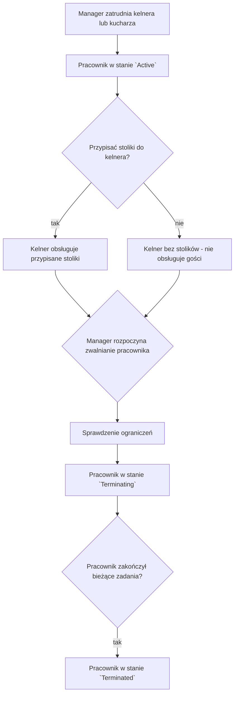

# Proces: Zarządzanie personelem (`Waiter` / `Chef` — `Active` / `Terminating` / `Terminated`)

## Cel procesu

Proces opisuje zarządzanie personelem pizzerii — zatrudnianie, zwalnianie oraz przypisywanie kelnerów do stolików i kucharzy do kuchni. Personel jest zasobem konfiguracyjnym wykorzystywanym przez procesy operacyjne obsługi gości.

## Zakres

* **Początek procesu:** `Manager` podejmuje decyzję o zmianie składu personelu lub jego przypisań.
* **Koniec procesu:** personel został zatrudniony, zwolniony (`Terminated`) lub jego przypisania zostały zaktualizowane zgodnie z ograniczeniami.

## Role zaangażowane

* **Manager** — zatrudnia, zwalnia i konfiguruje personel oraz jego przypisania.
* **Waiter** — kelner obsługujący przypisane do niego stoliki.
* **Chef** — kucharz pracujący we wspólnej kolejce produkcyjnej kuchni.

## Cykl życia pracownika

| Stan | Opis |
|------|------|
| `Active` | Pracownik jest zatrudniony, może pełnić swoją rolę i przyjmować nowe zadania. |
| `Terminating` | Rozpoczęto proces zwalniania. Pracownik dokończa bieżące zadania, ale nie przyjmuje nowych. |
| `Terminated` | Pracownik został zwolniony. Nie wykonuje zadań w tym stanie, ale `Manager` może go ponownie zatrudnić (`Terminated → Active`). |

## Przebieg procesu

## Szczegóły kroków

### 1. Zatrudnianie pracownika

`Manager` zatrudnia kelnera (`Waiter`) lub kucharza (`Chef`). Nowy pracownik powstaje w stanie `Active`.

* Kelner po zatrudnieniu może, ale nie musi mieć przypisanych stolików. Kelner bez przypisanych stolików istnieje w konfiguracji, ale nie bierze udziału w obsłudze gości. Przypisanie stolików może nastąpić w dowolnym momencie, gdy stolik jest wolny (`Free`).
* Kucharz po zatrudnieniu jest automatycznie dostępny w puli kucharzy kuchni. Nie wymaga dodatkowego przypisania do konkretnych zadań.

### 2. Przypisywanie stolików do kelnera

`Manager` przypisuje stoliki do kelnera. Każdy stolik może mieć przypisanego co najwyżej jednego aktywnego (`Active`) kelnera. Stolik bez przypisanego kelnera nie bierze udziału w obsłudze gości. Host przydziela gościom wyłącznie stoliki z aktywnym (`Active`) kelnerem.

Przypisanie stolika do kelnera jest operacją konfiguracyjną szczegółowo opisaną w `252_table_management.md`. Proces zarządzania personelem koordynuje tę operację z perspektywy pracownika.

### 3. Zwalnianie pracownika

`Manager` może rozpocząć zwalnianie pracownika poprzez ustawienie statusu `Terminating`. System wymusza następujące ograniczenia:

* Nie można ustawić statusu `Terminating` dla ostatniego aktywnego (`Active`) kelnera ani ostatniego aktywnego (`Active`) kucharza podczas pracy pizzerii.
* Kelner mający aktualnie otwarte (`Open`) rachunki może przejść w stan `Terminating` — dokończy obsługę tych rachunków, a dopiero potem jego status może zostać zmieniony na `Terminated`.
* Kucharz przygotowujący pizzę może przejść w stan `Terminating` — dokończy bieżącą pizzę, a dopiero potem jego status zostanie zmieniony na `Terminated`.

Pracownik w stanie `Terminating` dokończa bieżącą pracę, ale nie przyjmuje nowych zadań od nowych podmiotów.

Dla **kelnera** „dokończenie pracy" oznacza dokończenie obsługi wszystkich stolików, które są aktualnie przez niego obsługiwane. Obejmuje to:
* przyjmowanie kolejnych zamówień od gości już usadzonych przy przypisanych stolikach,
* dostarczanie gotowych zamówień do tych stolików,
* przyjmowanie płatności i zamykanie rachunków,
* `TableRelease` po opuszczeniu lokalu przez gości.

Kelner w stanie `Terminating` nie jest brany pod uwagę przy przydzielaniu nowych gości do swoich stolików (Host nie przydziela nowych `GuestGroup` do stolików obsługiwanych przez kelnera w stanie `Terminating`), ale nadal obsługuje gości aktualnie przy tych stolikach.

Dla **kucharza** „dokończenie pracy" oznacza dokończenie przygotowywania pizz, które aktualnie ma w toku. Kucharz w stanie `Terminating` nie pobiera nowych pizz z kolejki produkcyjnej.

Gdy pracownik zakończy wszystkie bieżące zadania, jego status może zostać automatycznie lub ręcznie zmieniony na `Terminated`. Pracownik w stanie `Terminated` nie wykonuje zadań, ale nie jest to stan ostateczny — `Manager` może go ponownie zatrudnić, przywracając status do `Active` (`Terminated → Active`). Ponownie zatrudniony pracownik zaczyna bez przypisanych stolików (dla kelnera) i wymaga ponownej konfiguracji przypisań, tak jak przy pierwszym zatrudnieniu.

## Zmiany przypisań na żywo

`Manager` może modyfikować przypisania personelu na żywo, pod warunkiem że nie naruszają one trwających procesów:

**Dozwolone na żywo:**
* zatrudnianie nowych kelnerów i kucharzy,
* przypisywanie wolnych (`Free`) stolików do kelnera (w stanie `Active` lub `Terminating`),
* zmiana przypisania wolnego (`Free`) stolika między kelnerami,
* pozostawienie stolika bez kelnera (jeśli stolik jest `Free`).

**Zablokowane lub ograniczone:**
* rozpoczęcie zwalniania ostatniego aktywnego (`Active`) kelnera lub kucharza podczas pracy pizzerii,
* natychmiastowe oznaczenie jako `Terminated` kelnera, który wciąż ma otwarte (`Open`) rachunki,
* natychmiastowe oznaczenie jako `Terminated` kucharza, który wciąż przygotowuje pizzę,
* przypisanie zajętego (`Occupied`) stolika do innego kelnera,
* pozostawienie zajętego (`Occupied`) stolika bez aktywnego (`Active`) kelnera.

## Dane wyjściowe procesu

W wyniku zarządzania personelem:
* kelnerzy i kucharze są w stanie `Active`, `Terminating` lub `Terminated`,
* kelner w stanie `Active` lub `Terminating` może mieć przypisane zero lub więcej stolików,
* stolik może mieć przypisanego co najwyżej jednego kelnera (w stanie `Active` lub `Terminating`),
* kuchnia ma co najmniej jednego aktywnego (`Active`) kucharza podczas pracy pizzerii.

## Granice procesu

Proces zarządzania personelem **nie obejmuje**:
* definiowania samych stolików — to proces `252_table_management.md`,
* zarządzania menu — to proces `253_menu_management.md`,
* zarządzania cyklem życia pizzerii — to proces `255_pizzeria_lifecycle.md`,
* bezpośredniej obsługi gości — to procesy `200_guest_service.md`, `211_guest_arrival.md`, `212_bill_management.md` i `213_ordering.md`.

## Decyzje domenowe zastosowane w tym procesie

* Manager zatrudnia i zwalnia personel.
* Kelner może być zatrudniony bez przypisanych stolików — wówczas nie uczestniczy w obsłudze gości.
* Każdy stolik może, ale nie musi mieć przypisanego kelnera. Stolik bez kelnera nie bierze udziału w obsłudze gości.
* Kelner może obsługiwać wyłącznie stoliki przypisane do niego przez Managera.
* Kucharze pracują we wspólnej puli kuchennej, nie są przypisywani do konkretnych zamówień.
* System blokuje rozpoczęcie zwalniania personelu, który jest niezbędny do aktualnie trwających procesów.

## Decyzje ostateczne

* ✅ **Czy kelner może być zatrudniony bez przypisanych stolików?** Tak. Kelner może istnieć w konfiguracji bez przypisanych stolików, ale wówczas nie bierze udziału w obsłudze gości. Przypisanie stolików może nastąpić w dowolnym momencie.
* ✅ **Czy stolik może istnieć bez przypisanego kelnera?** Tak. Stolik może być zdefiniowany bez kelnera, ale nie bierze wtedy udziału w obsłudze gości. Host przydziela gościom wyłącznie stoliki z aktywnym (`Active`) lub zwalnianym (`Terminating`) kelnerem, który jeszcze obsługuje bieżące zadania.
* ✅ **Czy kucharz wymaga przypisania do konkretnych zamówień?** Nie. Kucharze pracują we wspólnej puli kuchni i pobierają pizze z kolejki produkcyjnej. Nie są przypisywani do konkretnych zamówień.
* ✅ **Czy istnieje osobny status pośredni dla zwalnianego pracownika?** Tak. Pracownik może przejść w stan `Terminating`, w którym dokończa bieżące zadania, ale nie przyjmuje nowych. Po zakończeniu pracy przechodzi w stan `Terminated`.
* ✅ **Czy można rozpocząć zwalnianie ostatniego aktywnego kelnera lub kucharza podczas pracy pizzerii?** Nie. Pizzeria wymaga minimum jednego aktywnego (`Active`) kelnera i minimum jednego aktywnego (`Active`) kucharza do funkcjonowania. System blokuje rozpoczęcie zwalniania, które doprowadziłoby do braku przedstawiciela danej roli podczas otwartej (`Open`) pizzerii.
* ✅ **Czy można rozpocząć zwalnianie kelnera, który ma otwarte rachunki?** Tak. Kelner może przejść w stan `Terminating` pomimo otwartych (`Open`) rachunków. Dokończy ich obsługę, a dopiero potem status może zostać zmieniony na `Terminated`.
* ✅ **Czy można rozpocząć zwalnianie kucharza, który aktualnie przygotowuje pizzę?** Tak. Kucharz może przejść w stan `Terminating` w trakcie przygotowywania pizzy. Dokończy bieżącą pizzę, a dopiero potem jego status może zostać zmieniony na `Terminated`.
* ✅ **Czy przypisanie stolika do kelnera należy do tego procesu czy do zarządzania stolikami?** Przypisanie stolika do kelnera jest operacją widoczną z perspektywy zarządzania stolikami (`252_table_management.md`) oraz zarządzania personelem (`254_staff_management.md`). Manager podejmuje decyzję o przypisaniu w ramach konfiguracji personelu, a jej skutkiem jest aktualizacja stolika. W praktyce oba procesy opisują ten sam mechanizm konfiguracyjny z innej perspektywy.
* ✅ **Czy pracownik w stanie `Terminated` może zostać ponownie zatrudniony?** Tak, zarówno kelner, jak i kucharz. `Terminated` nie jest stanem ostatecznym — `Manager` może ponownie zatrudnić zwolnionego pracownika, przywracając go do stanu `Active` (`Terminated → Active`). Kelner ponownie zatrudniony nie ma automatycznie przywróconych poprzednich przypisań stolików — wymaga nowej konfiguracji, tak jak przy pierwszym zatrudnieniu.

## Pytania do dalszej analizy

* Brak otwartych pytań w tym procesie.
