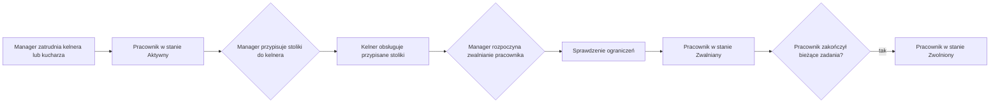

# Proces: Zarządzanie personelem

## Cel procesu

Proces opisuje zarządzanie personelem pizzerii — zatrudnianie, zwalnianie oraz przypisywanie kelnerów do stolików i kucharzy do kuchni. Personel jest zasobem konfiguracyjnym wykorzystywanym przez procesy operacyjne obsługi gości.

## Zakres

* **Początek procesu:** `Manager` podejmuje decyzję o zmianie składu personelu lub jego przypisań.
* **Koniec procesu:** personel został zatrudniony, zwolniony lub jego przypisania zostały zaktualizowane zgodnie z ograniczeniami.

## Role zaangażowane

* **Manager** — zatrudnia, zwalnia i konfiguruje personel oraz jego przypisania.
* **Waiter** — kelner obsługujący przypisane do niego stoliki.
* **Chef** — kucharz pracujący we wspólnej kolejce produkcyjnej kuchni.

## Cykl życia pracownika

| Stan | Opis |
|------|------|
| **Aktywny** | Pracownik jest zatrudniony, może pełnić swoją rolę i przyjmować nowe zadania. |
| **Zwalniany** | Rozpoczęto proces zwalniania. Pracownik dokończa bieżące zadania, ale nie przyjmuje nowych. |
| **Zwolniony** | Pracownik został zwolniony i nie może być ponownie przypisany do zadań. |

## Przebieg procesu

## Szczegóły kroków

### 1. Zatrudnianie pracownika

`Manager` zatrudnia kelnera (`Waiter`) lub kucharza (`Chef`). Nowy pracownik powstaje w stanie **Aktywny**.

* Kelner po zatrudnieniu może, ale nie musi mieć przypisanych stolików. Kelner bez przypisanych stolików istnieje w konfiguracji, ale nie bierze udziału w obsłudze gości. Przypisanie stolików może nastąpić w dowolnym momencie, gdy stolik jest wolny.
* Kucharz po zatrudnieniu jest automatycznie dostępny w puli kucharzy kuchni. Nie wymaga dodatkowego przypisania do konkretnych zadań.

### 2. Przypisywanie stolików do kelnera

`Manager` przypisuje stoliki do kelnera. Każdy stolik może mieć przypisanego co najwyżej jednego aktywnego kelnera. Stolik bez przypisanego kelnera nie bierze udziału w obsłudze gości. Host przydziela gościom wyłącznie stoliki z aktywnym kelnerem.

Przypisanie stolika do kelnera jest operacją konfiguracyjną szczegółowo opisaną w `252_table_management.md`. Proces zarządzania personelem koordynuje tę operację z perspektywy pracownika.

### 3. Zwalnianie pracownika

`Manager` może rozpocząć zwalnianie pracownika poprzez ustawienie statusu **Zwalniany**. System wymusza następujące ograniczenia:

* Nie można ustawić statusu **Zwalniany** dla ostatniego aktywnego kelnera ani ostatniego aktywnego kucharza podczas pracy pizzerii.
* Nie można ustawić statusu **Zwalniany** dla kelnera, który ma aktualnie otwarte rachunki przy przypisanych stolikach.
* Nie można ustawić statusu **Zwalniany** dla kucharza, który aktualnie przygotowuje pizzę.

Pracownik w stanie **Zwalniany** dokończa bieżącą pracę, ale nie przyjmuje nowych zadań od nowych podmiotów.

Dla **kelnera** „dokończenie pracy" oznacza dokończenie obsługi wszystkich stolików, które są aktualnie przez niego obsługiwane. Obejmuje to:
* przyjmowanie kolejnych zamówień od gości już usadzonych przy przypisanych stolikach,
* dostarczanie gotowych zamówień do tych stolików,
* przyjmowanie płatności i zamykanie rachunków,
* zwolnienie stolików po opuszczeniu lokalu przez gości.

Kelner w stanie **Zwalniany** nie jest brany pod uwagę przy przydzielaniu nowych gości do swoich stolików (Host nie przydziela nowych `GuestGroup` do stolików obsługiwanych przez kelnera w stanie **Zwalniany**), ale nadal obsługuje gości aktualnie przy tych stolikach.

Dla **kucharza** „dokończenie pracy" oznacza dokończenie przygotowywania pizz, które aktualnie ma w toku. Kucharz w stanie **Zwalniany** nie pobiera nowych pizz z kolejki produkcyjnej.

Gdy pracownik zakończy wszystkie bieżące zadania, jego status może zostać automatycznie lub ręcznie zmieniony na **Zwolniony**. Pracownik w stanie **Zwolniony** nie może być ponownie przypisany do zadań.

## Zmiany przypisań na żywo

`Manager` może modyfikować przypisania personelu na żywo, pod warunkiem że nie naruszają one trwających procesów:

**Dozwolone na żywo:**
* zatrudnianie nowych kelnerów i kucharzy,
* przypisywanie wolnych stolików do kelnera (w stanie **Aktywny** lub **Zwalniany**),
* zmiana przypisania wolnego stolika między kelnerami,
* pozostawienie stolika bez kelnera (jeśli stolik jest wolny).

**Zablokowane lub ograniczone:**
* rozpoczęcie zwalniania ostatniego aktywnego kelnera lub kucharza podczas pracy pizzerii,
* rozpoczęcie zwalniania kelnera z otwartymi rachunkami,
* rozpoczęcie zwalniania kucharza przygotowującego pizzę,
* przypisanie zajętego stolika do innego kelnera,
* pozostawienie zajętego stolika bez aktywnego kelnera.

## Dane wyjściowe procesu

W wyniku zarządzania personelem:
* kelnerzy i kucharze są w stanie **Aktywny**, **Zwalniany** lub **Zwolniony**,
* kelner w stanie **Aktywny** lub **Zwalniany** może mieć przypisane zero lub więcej stolików,
* stolik może mieć przypisanego co najwyżej jednego kelnera (w stanie **Aktywny** lub **Zwalniany**),
* kuchnia ma co najmniej jednego aktywnego kucharza podczas pracy pizzerii.

## Granice procesu

Proces zarządzania personelem **nie obejmuje**:
* definiowania samych stolików — to proces `252_table_management.md`,
* zarządzania menu — to proces `253_menu_management.md`,
* zarządzania cyklem życia pizzerii — to proces `255_pizzeria_lifecycle.md`,
* bezpośredniej obsługi gości — to procesy `200_guest_service.md`, `211_guest_arrival.md`, `212_bill_management.md` i `213_ordering.md`.

## Decyzje domenowe zastosowane w tym procesie

* Manager zatrudnia i zwalnia personel.
* Kelner może być zatrudniony bez przypisanych stolików — wówczas nie uczestniczy w obsłudze gości.
* Każdy stolik może, ale nie musi mieć przypisanego kelnera. Stolik bez kelnera nie bierze udziału w obsłudze gości.
* Kelner może obsługiwać wyłącznie stoliki przypisane do niego przez Managera.
* Kucharze pracują we wspólnej puli kuchennej, nie są przypisywani do konkretnych zamówień.
* System blokuje rozpoczęcie zwalniania personelu, który jest niezbędny do aktualnie trwających procesów.

## Decyzje ostateczne

* ✅ **Czy kelner może być zatrudniony bez przypisanych stolików?** Tak. Kelner może istnieć w konfiguracji bez przypisanych stolików, ale wówczas nie bierze udziału w obsłudze gości. Przypisanie stolików może nastąpić w dowolnym momencie.
* ✅ **Czy stolik może istnieć bez przypisanego kelnera?** Tak. Stolik może być zdefiniowany bez kelnera, ale nie bierze wtedy udziału w obsłudze gości. Host przydziela gościom wyłącznie stoliki z aktywnym lub zwalnianym kelnerem, który jeszcze obsługuje bieżące zadania.
* ✅ **Czy kucharz wymaga przypisania do konkretnych zamówień?** Nie. Kucharze pracują we wspólnej puli kuchni i pobierają pizze z kolejki produkcyjnej. Nie są przypisywani do konkretnych zamówień.
* ✅ **Czy istnieje osobny status pośredni dla zwalnianego pracownika?** Tak. Pracownik może przejść w stan **Zwalniany**, w którym dokończa bieżące zadania, ale nie przyjmuje nowych. Po zakończeniu pracy przechodzi w stan **Zwolniony**.
* ✅ **Czy można rozpocząć zwalnianie ostatniego aktywnego kelnera lub kucharza podczas pracy pizzerii?** Nie. Pizzeria wymaga minimum jednego aktywnego kelnera i minimum jednego aktywnego kucharza do funkcjonowania. System blokuje rozpoczęcie zwalniania, które doprowadziłoby do braku przedstawiciela danej roli podczas otwartej pizzerii.
* ✅ **Czy można rozpocząć zwalnianie kelnera, który ma otwarte rachunki?** Nie. Rozpoczęcie zwalniania kelnera, który ma aktualnie otwarte rachunki przy przypisanych stolikach, jest zablokowane.
* ✅ **Czy można rozpocząć zwalnianie kucharza, który aktualnie przygotowuje pizzę?** Nie. Rozpoczęcie zwalniania kucharza w trakcie przygotowywania pizzy jest zablokowane.
* ✅ **Czy przypisanie stolika do kelnera należy do tego procesu czy do zarządzania stolikami?** Przypisanie stolika do kelnera jest operacją widoczną z perspektywy zarządzania stolikami (`252_table_management.md`) oraz zarządzania personelem (`254_staff_management.md`). Manager podejmuje decyzję o przypisaniu w ramach konfiguracji personelu, a jej skutkiem jest aktualizacja stolika. W praktyce oba procesy opisują ten sam mechanizm konfiguracyjny z innej perspektywy.

## Pytania do dalszej analizy

* Brak otwartych pytań w tym procesie.
