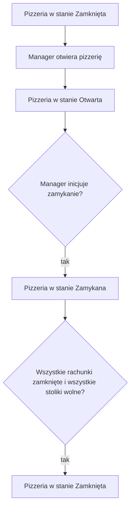

# Proces: Cykl życia pizzerii

## Cel procesu

Proces opisuje cykl życia pizzerii jako całości — jej otwarcie, funkcjonowanie w stanie otwartym, rozpoczęcie zamykania oraz przejście do stanu zamkniętego. Proces definiuje, które operacje są dozwolone w poszczególnych stanach pizzerii.

## Zakres

* **Początek procesu:** pizzeria znajduje się w stanie **Zamknięta** lub jest inicjowana po raz pierwszy.
* **Koniec procesu:** pizzeria została zamknięta i nie posiada aktywnych rachunków ani zamówień.

## Role zaangażowane

* **Manager** — zarządza cyklem życia pizzerii: otwiera ją, inicjuje zamykanie i potwierdza zamknięcie.
* **Główny proces obsługi gości** — reaguje na zmiany stanu pizzerii poprzez ograniczanie lub wznawianie obsługi nowych grup gości.
* **Host** — przestaje przyjmować nowe grupy gości w stanie **Zamykana**.

## Cykl życia pizzerii

| Stan | Opis |
|------|------|
| **Otwarta** | Pizzeria obsługuje gości, działają wszystkie procesy operacyjne. |
| **Zamykana** | Pizzeria nie przyjmuje nowych grup gości, ale obsługuje istniejące otwarte rachunki. |
| **Zamknięta** | Pizzeria nie przyjmuje nowych gości, nie ma aktywnych rachunków ani zamówień. |

## Przebieg procesu

## Szczegóły kroków

### 1. Otwarcie pizzerii

`Manager` otwiera pizzerię, przechodząc ze stanu **Zamknięta** do stanu **Otwarta**. Przed otwarciem `Manager` musi zapewnić:
* co najmniej jednego aktywnego kelnera,
* co najmniej jednego aktywnego kucharza,
* co najmniej jeden stolik w konfiguracji.

Stoliki nie muszą mieć przypisanego kelnera, ale tylko stoliki z aktywnym kelnerem mogą być używane w obsłudze gości. Jeśli brakuje któregokolwiek z wymaganych zasobów, otwarcie pizzerii jest blokowane.

### 2. Praca w stanie otwartym

W stanie **Otwarta** pizzeria działa normalnie:
* Host przyjmuje nowe grupy gości,
* kelnerzy i kucharze realizują zamówienia,
* Manager może modyfikować konfigurację na żywo z ograniczeniami opisanymi w innych procesach wspierających.

### 3. Inicjowanie zamykania pizzerii

`Manager` może zainicjować zamykanie pizzerii, przechodząc ze stanu **Otwarta** do stanu **Zamykana**. Stan **Zamykana** oznacza:
* Host nie przyjmuje nowych grup gości,
* istniejące otwarte rachunki mogą nadal otrzymywać zamówienia,
* kelnerzy i kucharze nadal obsługują otwarte rachunki,
* Manager może modyfikować konfigurację z ograniczeniami.

### 4. Automatyczne przejście do stanu zamkniętego

Pizzeria automatycznie przechodzi ze stanu **Zamykana** do **Zamknięta**, gdy:
* wszystkie rachunki zostały zamknięte,
* wszystkie stoliki są wolne,
* nie ma aktywnych zamówień.

W stanie **Zamknięta**:
* Host nie przyjmuje nowych gości,
* nie ma aktywnych rachunków ani zamówień,
* Manager może swobodnie modyfikować konfigurację: stoliki, menu, personel, parametry,
* dopuszczalne jest zwolnienie wszystkich kelnerów i kucharzy.

## Konsekwencje stanów pizzerii

| Stan | Nowe grupy gości | Nowe zamówienia do istniejących rachunków | Płatności | Konfiguracja na żywo |
|------|------------------|-------------------------------------------|-----------|----------------------|
| Otwarta | ✅ tak | ✅ tak | ✅ tak | ✅ z ograniczeniami |
| Zamykana | ❌ nie | ✅ tak | ✅ tak | ✅ z ograniczeniami |
| Zamknięta | ❌ nie | ❌ nie | ❌ nie | ✅ bez ograniczeń |

## Dane wyjściowe procesu

W wyniku cyklu życia pizzerii:
* pizzeria znajduje się w jednym ze stanów: **Otwarta**, **Zamykana**, **Zamknięta**,
* w stanie **Otwarta** mogą działać wszystkie procesy operacyjne,
* w stanie **Zamykana** kończone są istniejące obsługi, ale nie rozpoczynają się nowe,
* w stanie **Zamknięta** konfiguracja może być swobodnie modyfikowana.

## Granice procesu

Proces cyklu życia pizzerii **nie obejmuje**:
* szczegółów obsługi gości — to procesy `200_guest_service.md`, `211_guest_arrival.md`, `212_bill_management.md`, `213_ordering.md`,
* zarządzania menu — to proces `253_menu_management.md`,
* zarządzania stolikami — to proces `252_table_management.md`,
* zarządzania personelem — to proces `254_staff_management.md`.

## Decyzje domenowe zastosowane w tym procesie

* Pizzeria może znajdować się w trzech stanach: **Otwarta**, **Zamykana**, **Zamknięta**.
* Stan **Zamykana** pozwala dokończyć obsługę istniejących gości bez przyjmowania nowych.
* Przejście ze stanu **Zamykana** do **Zamknięta** jest automatyczne po zakończeniu wszystkich obsług.
* Otwarcie pizzerii wymaga minimum jednego kelnera, jednego kucharza i jednego stolika.

## Decyzje ostateczne

* ✅ **Czy przejście ze stanu Zamykana do Zamknięta jest automatyczne?** Tak. Pizzeria automatycznie przechodzi do stanu **Zamknięta**, gdy wszystkie rachunki są zamknięte, wszystkie stoliki są wolne i nie ma aktywnych zamówień.
* ✅ **Czy w stanie Zamykana można złożyć zamówienie do istniejącego rachunku?** Tak. Istniejące otwarte rachunki mogą nadal otrzymywać zamówienia, dopóki pizzeria nie przejdzie do stanu **Zamknięta**.
* ✅ **Czy w stanie Zamykana Host może przyjąć nową grupę gości?** Nie. Host nie przyjmuje nowych grup gości w stanie **Zamykana**.
* ✅ **Czy w stanie Zamknięta można zwolnić wszystkich kelnerów i kucharzy?** Tak. W stanie **Zamknięta** Manager może swobodnie modyfikować konfigurację, w tym zwalniać wszystkich pracowników.
* ✅ **Czy otwarcie pizzerii wymaga przypisanych stolików do kelnera?** Nie. Otwarcie pizzerii wymaga co najmniej jednego stolika w konfiguracji oraz co najmniej jednego aktywnego kelnera i kucharza. Stolik nie musi mieć przypisanego kelnera, ale tylko stoliki z aktywnym kelnerem mogą być używane w obsłudze gości.
* ✅ **Czy Manager może zmodyfikować konfigurację w stanie Zamknięta bez ograniczeń?** Tak. W stanie **Zamknięta** nie ma aktywnych rachunków ani zamówień, więc Manager może swobodnie zarządzać stolikami, menu i personelem.

## Pytania do dalszej analizy

* Brak otwartych pytań w tym procesie.
