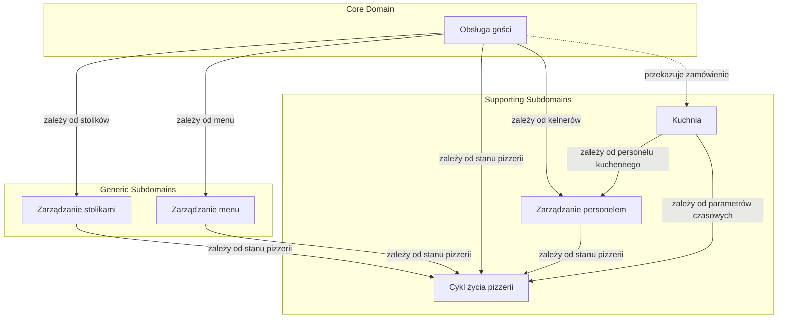

# Subdomeny

## Cel dokumentu

Dokument identyfikuje i opisuje subdomeny systemu Pizzeria na podstawie dotychczas odkrytych procesów biznesowych oraz decyzji domenowych. Subdomeny stanowią punkt wyjścia do definiowania Bounded Contexts i architektury systemu.

## Co to jest subdomena?

**Subdomena** to wyróżniony obszar problemu biznesowego, który wymaga specyficznej wiedzy domenowej, logiki i bytów. Subdomeny różnią się znaczeniem dla biznesu i poziomem złożoności.

W DDD rozróżniamy typy subdomen:
* **Core Domain** — kluczowa subdomena, w której organizacja wygrywa na rynku; zawiera najbardziej zaawansowaną logikę biznesową.
* **Supporting Subdomain** — subdomena wspierająca, potrzebna do działania Core Domain, ale nie wyróżniająca organizacji na rynku.
* **Generic Subdomain** — subdomena ogólna, rozwiązywana gotowymi rozwiązaniami; nie zawiera specyficznej logiki biznesowej.

## Identyfikacja subdomen

Na podstawie procesów odkrytych podczas Event Stormingu oraz decyzji domenowych zidentyfikowano następujące subdomeny:

| Subdomena | Typ | Uzasadnienie | Powiązane procesy |
|-----------|-----|--------------|-------------------|
| **Obsługa gości** | Core Domain | To serce domeny Pizzeria. Koordynacja przepływu grup gości przez stoliki, rachunki i zamówienia jest głównym problemem biznesowym symulacji. Tutaj znajduje się największa złożoność i najwięcej decyzji domenowych. | `200_guest_service.md`, `211_guest_arrival.md`, `212_bill_management.md`, `213_ordering.md` |
| **Kuchnia** | Supporting Subdomain | Przygotowywanie pizz jest niezbędne dla obsługi gości, ale w uproszczonym modelu jest to głównie mechanizm kolejkowania i czasu. Nie wyróżnia Pizzerii na rynku, ale jest kluczowe dla realizacji zamówień. | `251_kitchen_order_fulfillment.md` |
| **Zarządzanie stolikami** | Generic Subdomain | Definiowanie stolików, ich pojemności oraz przypisywanie ich do kelnerów to prosta konfiguracja zasobu przestrzennego. Mechanizm ten jest powtarzalny w wielu systemach rezerwacyjnych i lokalizacyjnych. | `252_table_management.md` |
| **Zarządzanie menu** | Generic Subdomain | Definiowanie pozycji menu, ich składników i cen to prosta konfiguracja oferty. Mechanizm ten jest powtarzalny w wielu systemach gastronomicznych i e-commerce. | `253_menu_management.md` |
| **Zarządzanie personelem** | Supporting Subdomain | Zatrudnianie, zwalnianie oraz przypisywanie kelnerów do stolików i kucharzy do kuchni wymaga specyficznych reguł dla pizzerii (np. stany Aktywny/Zwalniany/Zwolniony, blokada zwolnienia ostatniego pracownika, dopięcie bieżących zadań). | `254_staff_management.md` |
| **Cykl życia pizzerii** | Supporting Subdomain | Zarządzanie stanem otwarta/zamykana/zamknięta determinuje dostępność procesów operacyjnych i konfiguracyjnych. Mimo uproszczonej logiki stanów ma istotny wpływ na cały system. | `255_pizzeria_lifecycle.md` |

## Uzasadnienie podziału

### Obsługa gości jako Core Domain

Głównym problemem domenowym systemu Pizzeria jest koordynacja przepływu grup gości przez ograniczone zasoby lokalu w czasie rzeczywistym. W tym obszarze znajdują się kluczowe decyzje biznesowe:
* czy można zamknąć rachunek,
* kiedy można zwolnić stolik,
* czy wszystkie zamówienia zostały dostarczone,
* jak łączyć zamówienia z rachunkiem.

To właśnie ten obszar determinuje poprawność i spójność całej symulacji.

### Kuchnia jako Supporting Subdomain

Kuchnia jest ważna, ale w uproszczonym modelu jej logika sprowadza się do:
* kolejki produkcyjnej,
* przypisania pizz do kucharzy,
* szacowania czasu realizacji.

Te mechanizmy są potrzebne, ale nie stanowią unikalnej wartości biznesowej Pizzerii jako symulacji.

### Kuchnia jako Supporting Subdomain

Kuchnia jest ważna, ale w uproszczonym modelu jej logika sprowadza się do:
* kolejki produkcyjnej,
* przypisania pizz do kucharzy,
* szacowania czasu realizacji.

Te mechanizmy są potrzebne, ale nie stanowią unikalnej wartości biznesowej Pizzerii jako symulacji.

### Zarządzanie stolikami jako Generic Subdomain

Stolik jest zasobem przestrzennym pizzerii. Zarządzanie stolikami obejmuje definiowanie liczby miejsc, przypisywanie kelnerów oraz śledzenie stanu zajętości. Mechanizm ten jest powtarzalny w wielu systemach zarządzania zasobami przestrzennymi i nie zawiera specyficznej logiki biznesowej Pizzerii.

### Zarządzanie menu jako Generic Subdomain

Menu definiuje ofertę pizzerii. Zarządzanie menu obejmuje dodawanie, modyfikowanie i wycofywanie pozycji oraz ustalanie cen i składników. Mechanizm ten jest powtarzalny w wielu systemach gastronomicznych i e-commerce.

### Zarządzanie personelem jako Supporting Subdomain

Personel to zasób ludzki pizzerii. Zarządzanie personelem wymaga specyficznych reguł dla domeny Pizzerii:
* stany pracownika: Aktywny, Zwalniany, Zwolniony,
* blokada zwolnienia ostatniego kelnera/kucharza podczas pracy pizzerii,
* dopięcie bieżących zadań przed przejściem w stan Zwolniony,
* przypisanie stolików do kelnerów z uwzględnieniem stanu Zwalniany.

Te reguły są specyficzne dla symulacji Pizzerii i nie są generyczne.

### Cykl życia pizzerii jako Supporting Subdomain

Subdomena ta zarządza stanem całej pizzerii i jej globalnymi parametrami. Wpływa na dostępność procesów operacyjnych i konfiguracyjnych. Mimo uproszczonej logiki stanów ma istotny wpływ na cały system.

## Granice subdomen

### Obsługa gości

Obejmuje:
* `GuestGroup` — tożsamość grupy gości,
* `Table` — powiązanie gości ze stolikiem w ramach wizyty,
* `Bill` — cykl życia rachunku,
* `Order` — cykl życia zamówienia,
* procesy: przyjęcie gości, zarządzanie rachunkiem, składanie zamówienia, zakończenie obsługi.

Nie obejmuje:
* szczegółów pracy kuchni,
* konfiguracji menu, stolików, personelu.

### Kuchnia

Obejmuje:
* `Kitchen` — koordynacja przygotowania zamówień,
* `Chef` — praca kucharza nad pojedynczą pizzą,
* kolejka produkcyjna,
* szacowanie czasu realizacji.

Nie obejmuje:
* zamawiania przez gości,
* dostarczania zamówień do stolików,
* zarządzania menu.

### Zarządzanie stolikami

Obejmuje:
* `Table` — definicja, liczba miejsc, stan zajętości,
* przypisanie stolika do kelnera,
* `Manager` — operacje konfiguracyjne na stolikach.

Nie obejmuje:
* przyjęcia gości do lokalu,
* bezpośredniej obsługi gości przy stolikach.

### Zarządzanie menu

Obejmuje:
* `MenuItem` — nazwa, składniki, cena,
* stany pozycji menu (Aktywna, Wycofywana),
* `Manager` — operacje konfiguracyjne na menu.

Nie obejmuje:
* składania zamówień,
* realizacji zamówień w kuchni.

### Zarządzanie personelem

Obejmuje:
* `Waiter` — zatrudnianie, zwalnianie, przypisanie stolików,
* `Chef` — zatrudnianie, zwalnianie, pula kucharzy,
* stany pracownika (Aktywny, Zwalniany, Zwolniony),
* `Manager` — operacje konfiguracyjne na personelu.

Nie obejmuje:
* bezpośredniej obsługi gości,
* realizacji zamówień w kuchni.

### Cykl życia pizzerii

Obejmuje:
* stany pizzerii: **Otwarta**, **Zamykana**, **Zamknięta**,
* reguły przejść między stanami,
* wymagania dotyczące personelu i stolików przy otwarciu.

## Mapa subdomen

## Decyzje ostateczne

* ✅ **Czy Obsługa gości jest Core Domain?** Tak. Koordynacja przepływu gości przez pizzerię jest głównym problemem domenowym symulacji i zawiera największą złożoność biznesową.
* ✅ **Czy Kuchnia jest osobną subdomeną?** Tak. Mimo że jest ściśle powiązana z zamówieniami, ma własną logikę kolejkowania i realizacji, która może ewoluować niezależnie od obsługi gości.
* ✅ **Czy Zarządzanie stolikami i Zarządzanie menu są Generic czy Supporting?** Generic Subdomain. Są to proste konfiguracje zasobów i oferty, powtarzalne w wielu systemach.
* ✅ **Czy Zarządzanie personelem i Cykl życia pizzerii są Generic czy Supporting?** Supporting Subdomain. Oba obszary zawierają reguły specyficzne dla domeny Pizzerii (np. stany Zwalniany/Zwolniony, blokada ostatniego pracownika, stany pizzerii determinujące procesy).
* ✅ **Czy Zarządzanie zasobami lokalu to jedna subdomena, czy trzy osobne?** Trzy osobne subdomeny: Zarządzanie stolikami (Generic), Zarządzanie menu (Generic) oraz Zarządzanie personelem (Supporting). Każdy z tych obszarów ma własne byty, reguły i cykl życia. Wspólna rola `Manager` nie oznacza wspólnej subdomeny.
* ✅ **Czy Cykl życia pizzerii to osobna subdomena?** Tak. Zarządzanie stanem całej pizzerii oraz jej globalnymi parametrami jest odpowiedzialnością odrębną od obsługi gości i zarządzania zasobami, choć wpływa na wszystkie inne subdomeny.
* ✅ **Czy Raportowanie jest subdomeną na tym etapie?** Nie. Na obecnym etapie raportowanie nie jest modelowane jako osobna subdomena. Może pojawić się w przyszłości jako Generic Subdomain.
* ✅ **Jaką konwencję strzałek stosuje diagram subdomen?** Strzałka wskazuje kierunek zależności: `A --> B` oznacza, że subdomena A zależy od subdomeny B (A jest downstream, B jest upstream). Strzałka przerywana `-.->` oznacza przepływ danych/zamówień, a nie zależność.

## Pytania do dalszej analizy

* Brak otwartych pytań w tym dokumencie.
