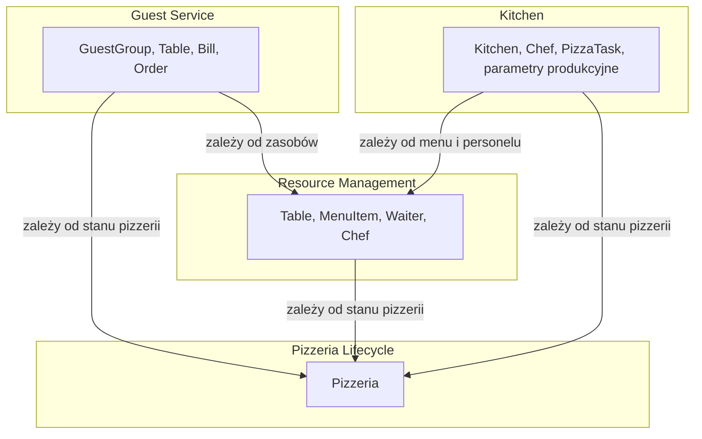

# Bounded Contexts

## Cel dokumentu

Dokument definiuje Bounded Contexty dla systemu Pizzeria na podstawie zidentyfikowanych subdomen. Bounded Contexty to wyraźne granice rozwiązania, w obrębie których obowiązuje spójny model domenowy i język wszechobecny (ubiquitous language).

## Zasady wydzielania Bounded Contextów

Bounded Contexty wydzielamy na podstawie:
* granic subdomen i ich modeli,
* potrzeby izolacji modeli domenowych,
* możliwości niezależnej implementacji i wdrażania mikrousług,
* spójności języka wszechobecnego w obrębie kontekstu.

Każdy Bounded Context:
* posiada własny model domenowy,
* definiuje własne widoki bytów i procesów,
* komunikuje się z innymi kontekstami przez jasno określone interfejsy,
* może być implementowany jako osobna mikrousługa w przyszłej architekturze.

## Proponowane Bounded Contexty

Na podstawie subdomen z `310_subdomains.md` proponujemy następujący podział na Bounded Contexty:

| Bounded Context | Mapowanie do subdomen | Uzasadnienie |
|-----------------|-----------------------|--------------|
| **Guest Service** | Obsługa gości (Core Domain) | Centralny kontekst domenowy. Zawiera modele `GuestGroup`, `Table` (w kontekście wizyty), `Bill`, `Order` oraz procesy ich cyklu życia. |
| **Kitchen** | Kuchnia (Supporting) | Osobny kontekst produkcyjny. Zawiera `Kitchen`, `Chef`, kolejkę produkcyjną i logikę realizacji zamówień. |
| **Resource Management** | Zarządzanie stolikami (Generic) + Zarządzanie menu (Generic) + Zarządzanie personelem (Supporting) | Wspólny kontekst konfiguracyjny zarządzany przez `Manager`. Zawiera `Table`, `MenuItem`, `Waiter`, `Chef` (w roli zasobu), stany pracowników i przypisania. |
| **Pizzeria Lifecycle** | Cykl życia pizzerii (Supporting) | Kontekst zarządzania stanem całej pizzerii (otwarta/zamykana/zamknięta). |

## Uzasadnienie połączenia zasobów w jeden kontekst

Zarządzanie stolikami, menu i personelem zostało połączone w jeden Bounded Context **Resource Management**, ponieważ:
* wszystkie są zarządzane przez tę samą rolę (`Manager`),
* wszystkie są operacjami konfiguracyjnymi na zasobach,
* współdzielą wspólny wzorzec CRUD ze specyficznymi regułami domenowymi,
* nie ma potrzeby rozdzielania ich na osobne mikrousługi w fazie monolitu — można to zrobić w przyszłości, gdyby któryś z obszarów się rozrósł.

Osobny Bounded Context dla Cyklu życia pizzerii jest uzasadniony, ponieważ stan pizzerii wpływa na wszystkie inne konteksty, a kontekst ten może być zarządzany niezależnie.

## Granice Bounded Contextów

### Guest Service

Odpowiedzialność:
* przyjęcie gości i przydzielenie stolika,
* zarządzanie rachunkiem,
* składanie zamówień,
* zakończenie obsługi (płatność, opuszczenie lokalu, zwolnienie stolika),
* śledzenie stanów zamówień z perspektywy obsługi gości.

Byty w kontekście:
* `GuestGroup` — tożsamość grupy gości w ramach wizyty. `GuestGroup` jest definiowana przez użytkownika symulacji poza domeną Pizzerii i traktowana przez `Guest Service` jako wejście do procesu,
* `Table` — powiązanie gości ze stolikiem (tylko w kontekście wizyty),
* `Bill` — rachunek,
* `Order` — zamówienie.

Zależności zewnętrzne:
* zależy od **Resource Management** dla informacji o stolikach, menu i kelnerach,
* zależy od **Pizzeria Lifecycle** dla stanu `Open`/`Closing`/`Closed`,
* przekazuje zamówienia do **Kitchen**.

### Kitchen

Odpowiedzialność:
* przyjmowanie zamówień do realizacji,
* rozbijanie zamówień na pizze,
* kolejkowanie i dystrybucja pizz do kucharzy,
* śledzenie postępu przygotowania,
* zgłaszanie gotowości zamówień.

Byty w kontekście:
* `Kitchen` — koordynator produkcji,
* `Chef` — kucharz w kontekście pracy produkcyjnej,
* `PizzaTask` — zadanie przygotowania pojedynczej pizzy (opcjonalnie),
* parametry produkcyjne, w tym czas przygotowania pojedynczej pizzy.

Zależności zewnętrzne:
* zależy od **Resource Management** dla menu (receptury) i personelu kuchennego,
* odbiera zamówienia od **Guest Service**.

### Resource Management

Odpowiedzialność:
* zarządzanie definicjami stolików i ich przypisaniami do kelnerów,
* zarządzanie menu (pozycje, składniki, receptury, ceny),
* zarządzanie personelem (zatrudnianie, zwalnianie, stany, przypisania).

Byty w kontekście:
* `Table` — definicja stolika,
* `MenuItem` — pozycja menu,
* `Waiter` — kelner jako zasób,
* `Chef` — kucharz jako zasób.

Zależności zewnętrzne:
* zależy od **Pizzeria Lifecycle** dla stanu pizzerii (np. ograniczenia przy otwartej pizzerii).

### Pizzeria Lifecycle

Odpowiedzialność:
* zarządzanie stanem `Open`/`Closing`/`Closed`,
* wymuszanie ograniczeń przy otwarciu/zamykaniu pizzerii.

Byty w kontekście:
* `Pizzeria` — stan pizzerii (`Open` / `Closing` / `Closed`).

## Mapa Bounded Contextów

## Decyzje ostateczne

* ✅ **Czy każda subdomena to osobny Bounded Context?** Nie. Zarządzanie stolikami, menu i personelem (trzy subdomeny) zostały połączone w jeden Bounded Context **Resource Management**, ponieważ mają wspólny charakter konfiguracyjny i są zarządzane przez `Manager`. Cykl życia pizzerii pozostaje osobnym kontekstem ze względu na swój globalny wpływ.
* ✅ **Czy Guest Service i Kitchen powinny być osobnymi kontekstami?** Tak. Guest Service koordynuje obsługę gości, a Kitchen realizuje zamówienia w kuchni. Mają odrębne modele, choć wymieniają zamówienia.
* ✅ **Czy Table występuje w dwóch kontekstach?** Tak. W **Guest Service** `Table` jest powiązaniem gości ze stolikiem w ramach wizyty. W **Resource Management** `Table` jest definicją zasobu przestrzennego. Są to różne modele tego samego zewnętrznego identyfikatora.
* ✅ **Czy Chef występuje w dwóch kontekstach?** Tak. W **Resource Management** `Chef` jest zasobem personelu. W **Kitchen** `Chef` jest aktorem produkcyjnym pobierającym pizze z kolejki.
* ✅ **Czy definicja GuestGroup należy do domeny Pizzerii?** Nie. `GuestGroup` jest definiowana przez użytkownika symulacji przed rozpoczęciem procesu obsługi. `Guest Service` traktuje ją jako byt wejściowy, a nie zarządza jej definicją.
* ✅ **Czy czas przygotowania pizzy należy do Pizzeria Lifecycle czy Kitchen?** Kitchen. Czas przygotowania pojedynczej pizzy jest własnością kontekstu produkcyjnego, używaną bezpośrednio przy realizacji zamówień. Pizzeria Lifecycle zarządza wyłącznie stanem `Open` / `Closing` / `Closed`.
* ✅ **Czy Pizzeria Lifecycle jest upstream dla wszystkich innych kontekstów?** Tak. Stan pizzerii wpływa na wszystkie pozostałe konteksty, więc Pizzeria Lifecycle jest wspólnym upstreamem. Nie zarządza jednak parametrami produkcyjnymi kuchni.

## Pytania do dalszej analizy

* Brak otwartych pytań w tym dokumencie.
