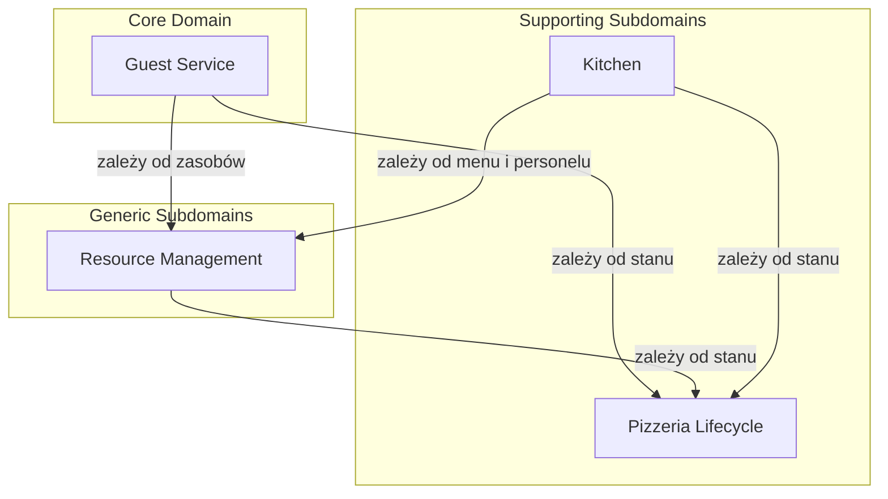

# Context Map

## Cel dokumentu

Dokument przedstawia relacje między Bounded Contextami zidentyfikowanymi w `311_bounded_contexts.md`. Context Map pokazuje, jak konteksty komunikują się ze sobą, jakie są ich zależności oraz jaki wzorzec integracji jest proponowany dla każdej relacji.

## Co to jest Context Map?

**Context Map** to diagram lub opis relacji między Bounded Contextami w systemie. Określa:
* kierunek zależności (upstream / downstream),
* wzorce integracji między kontekstami,
* sposób tłumaczenia modeli przy przekraczaniu granic kontekstów.

Podstawowe wzorce relacji według DDD:
* **Partnership** — współpraca dwóch kontekstów przy wspólnych zmianach.
* **Shared Kernel** — współdzielony fragment modelu między kontekstami.
* **Customer-Supplier** — jeden kontekst jest dostawcą (upstream), drugi odbiorcą (downstream).
* **Conformist** — downstream akceptuje model upstream bez wpływu na niego.
* **Anti-Corruption Layer** — downstream izoluje się od modelu upstream przez warstwę tłumaczenia.
* **Open Host Service** — upstream udostępnia zestaw usług dla wielu downstreamów.
* **Published Language** — wspólny język komunikacji między kontekstami.
* **Separate Ways** — konteksty nie komunikują się ze sobą.

## Bounded Contexty w systemie

Na podstawie `311_bounded_contexts.md` system składa się z czterech Bounded Contextów:

1. **Guest Service** — Core Domain, koordynacja obsługi gości.
2. **Kitchen** — Supporting, realizacja zamówień w kuchni.
3. **Resource Management** — Generic/Supporting, konfiguracja stolików, menu i personelu.
4. **Pizzeria Lifecycle** — Supporting, zarządzanie stanem całej pizzerii.

## Relacje między kontekstami

### Pizzeria Lifecycle → Guest Service

* **Kierunek zależności:** Guest Service jest downstream, Pizzeria Lifecycle jest upstream.
* **Opis:** Guest Service musi sprawdzać stan pizzerii przed przyjęciem nowych gości, złożeniem zamówień czy zamknięciem rachunku. Stan **Zamykana** blokuje nowe grupy gości, a **Zamknięta** blokuje wszystkie procesy operacyjne.
* **Wzorzec:** **Conformist**. Guest Service akceptuje model stanów pizzerii zdefiniowany przez Pizzeria Lifecycle bez wpływu na jego definicję.

### Pizzeria Lifecycle → Resource Management

* **Kierunek zależności:** Resource Management jest downstream, Pizzeria Lifecycle jest upstream.
* **Opis:** Resource Management musi respektować stan pizzerii przy modyfikacjach konfiguracji. Niektóre zmiany są zablokowane, gdy pizzeria jest w stanie **Otwarta** lub **Zamykana**.
* **Wzorzec:** **Conformist**. Resource Management akceptuje reguły stanów pizzerii zdefiniowane przez Pizzeria Lifecycle.

### Pizzeria Lifecycle → Kitchen

* **Kierunek zależności:** Kitchen jest downstream, Pizzeria Lifecycle jest upstream.
* **Opis:** Kitchen musi respektować stan pizzerii. W stanie **Zamknięta** kuchnia nie przyjmuje nowych zamówień. W stanie **Zamykana** kuchnia dokończa realizację istniejących zamówień.
* **Wzorzec:** **Conformist**. Kitchen akceptuje stan pizzerii zdefiniowany przez Pizzeria Lifecycle.

### Resource Management → Guest Service

* **Kierunek zależności:** Guest Service jest downstream, Resource Management jest upstream.
* **Opis:** Guest Service korzysta ze stolików, menu i informacji o kelnerach zdefiniowanych w Resource Management. Host przydziela tylko stoliki z aktywnym kelnerem. Menu jest używane przy składaniu zamówień.
* **Wzorzec:** **Open Host Service + Published Language**. Resource Management udostępnia standardowy zestaw informacji o zasobach (stoliki, menu, personel), z których korzysta Guest Service (i Kitchen).

### Resource Management → Kitchen

* **Kierunek zależności:** Kitchen jest downstream, Resource Management jest upstream.
* **Opis:** Kitchen korzysta z menu (receptury) oraz z personelu kuchennego zdefiniowanego w Resource Management. Każda pizza jest przygotowywana zgodnie z recepturą z `MenuItem`.
* **Wzorzec:** **Conformist** lub **Open Host Service**. Kitchen akceptuje model menu i personelu z Resource Management. Jeśli model ten ewoluuje, Kitchen dostosowuje się do zmian.

### Guest Service → Kitchen

* **Kierunek zależności:** Kitchen jest downstream, Guest Service jest upstream dla przepływu zamówień.
* **Opis:** Guest Service przekazuje zamówienia do Kitchen w celu realizacji. Kitchen nie zarządza zamówieniem jako takim — otrzymuje je do przygotowania i zgłasza gotowość.
* **Wzorzec:** **Customer-Supplier**. Guest Service jest klientem, który zleca przygotowanie zamówienia. Kitchen jest dostawcą usługi produkcyjnej.
* **Kierunek gotowości:** Gdy zamówienie jest gotowe, Kitchen zgłasza to z powrotem do Guest Service. Jest to asynchroniczne zdarzenie zwrotne.

## Legenda diagramu

Diagram Context Map używa pełnych strzałek (`-->`) do oznaczenia relacji zależności upstream/downstream. Strzałka wskazuje od upstreamu do downstreamu (downstream zależy od upstreamu). Przepływ komunikatów (command/event) między kontekstami nie jest przedstawiony na diagramie, ponieważ Context Map koncentruje się na relacjach zależności, a nie na szczegółach komunikacji.

## Diagram Context Map

## Podsumowanie wzorców integracji

| Relacja | Upstream | Downstream | Wzorzec |
|---------|----------|------------|---------|
| Pizzeria Lifecycle → Guest Service | Pizzeria Lifecycle | Guest Service | Conformist |
| Pizzeria Lifecycle → Resource Management | Pizzeria Lifecycle | Resource Management | Conformist |
| Pizzeria Lifecycle → Kitchen | Pizzeria Lifecycle | Kitchen | Conformist |
| Resource Management → Guest Service | Resource Management | Guest Service | Open Host Service + Published Language |
| Resource Management → Kitchen | Resource Management | Kitchen | Conformist / Open Host Service |
| Guest Service ↔ Kitchen | Guest Service (dla zamówień) / Kitchen (dla gotowości) | Kitchen / Guest Service | Customer-Supplier + async events |

## Przekraczanie granic kontekstów

### Zamówienie między Guest Service a Kitchen

W **Guest Service** zamówienie (`Order`) jest bytem produktowym z pozycjami menu i ilościami. W **Kitchen** zamówienie jest rozbijane na pojedyncze zadania produkcyjne (`PizzaTask`). Przy przekazywaniu zamówienia do kuchni następuje tłumaczenie modelu:
* Guest Service wysyła identyfikator zamówienia oraz listę pozycji menu z ilościami.
* Kitchen interpretuje pozycje jako zestaw pizz do przygotowania.
* Kitchen nie zna `tableId`, `billId` ani cen — korzysta wyłącznie z identyfikatorów menu.

### Stolik między Resource Management a Guest Service

W **Resource Management** stolik (`Table`) jest definicją zasobu z liczbą miejsc i przypisaniem do kelnera. W **Guest Service** stolik jest powiązaniem gości z zasobem w ramach konkretnej wizyty. Główny proces obsługi gości przechowuje to powiązanie, ale rachunek i zamówienie nie znają `tableId`.

### Menu między Resource Management a Kitchen / Guest Service

W **Resource Management** `MenuItem` zawiera pełne informacje: nazwę, składniki, recepturę, cenę. W **Guest Service** widoczne są tylko nazwa, składniki i cena. W **Kitchen** widoczne są nazwa, składniki i receptura. Cena jest ukrywana przed kuchnią.

### Pizzeria Lifecycle jako wspólny upstream

Stan pizzerii jest udostępniany wszystkim kontekstom. Każdy kontekst musi sprawdzać stan przed rozpoczęciem operacji, które są niemożliwe w danym stanie. Nie ma indywidualnych negocjacji — wszystkie konteksty stosują ten sam model stanów.

## Decyzje ostateczne

* ✅ **Czy Pizzeria Lifecycle jest wspólnym upstreamem dla wszystkich kontekstów?** Tak. Stan pizzerii jest współdzielony i respektowany przez Guest Service, Resource Management i Kitchen.
* ✅ **Czy Resource Management udostępnia usługi dla wielu downstreamów?** Tak. Resource Management jest upstreamem dla Guest Service i Kitchen, dostarczając informacje o stolikach, menu i personelu.
* ✅ **Czy Guest Service i Kitchen są w relacji Customer-Supplier?** Tak. Guest Service zleca kuchni przygotowanie zamówienia, a Kitchen zgłasza gotowość. Komunikacja jest asynchroniczna (zdarzenia).
* ✅ **Czy potrzebna jest Anti-Corruption Layer między kontekstami?** Na obecnym etapie nie. Modele są na tyle proste, że wystarczają proste tłumaczenia przy integracji. W przyszłości, przy rozroście modelu, można rozważyć wprowadzenie ACL.
* ✅ **Jaką konwencję strzałek stosuje diagram Context Map?** Pełna strzałka (`-->`) oznacza relację zależności: downstream zależy od upstreamu. Diagram nie przedstawia przepływów komunikatów (command/event), ponieważ Context Map koncentruje się na zależnościach między kontekstami.
* ✅ **Czy istnieje Shared Kernel między kontekstami?** Nie. Każdy kontekst posiada własny model. Wspólne są wyłącznie identyfikatory bytów (np. `orderId`, `tableId`, `menuItemId`) przekazywane jako wartości.

## Pytania do dalszej analizy

* Brak otwartych pytań w tym dokumencie.
