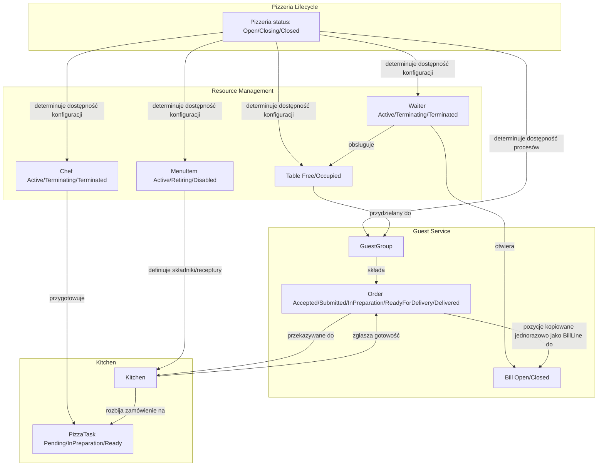

# Model domenowy (Domain Model)

## Cel dokumentu

Dokument przedstawia wstępny model domenowy systemu Pizzeria — zestaw bytów, wartości, agregatów oraz reguł wspólnych dla wszystkich Bounded Contextów. Model jest oparty na decyzjach domenowych, języku wszechobecnym oraz procesach opisanych w wcześniejszych dokumentach. Stanowi punkt wyjścia do szczegółowego projektowania agregatów, encji i obiektów wartości.

## Granica dokumentu

`320_domain_model.md` opisuje **co** istnieje w domenie oraz jakie są podstawowe reguły współdziałania. Nie definiuje jeszcze szczegółów implementacyjnych (metod, zdarzeń domenowych, repozytoriów) — te znajdą się w dokumentach taktycznych: `321_aggregates.md`, `322_entities.md`, `323_value_objects.md`, `324_domain_services.md`, `325_integration_events.md`.

## Zasady modelowania

* Każdy byt ma jednoznaczną nazwę z języka wszechobecnego.
* Stany cyklu życia są wyrażone za pomocą angielskich terminów gotowych do użycia w kodzie.
* Byty nie przechowują danych, które nie należą do ich odpowiedzialności (np. `Order` nie zna `tableId` ani `billId`).
* Relacje między bytami są minimalne — model priorytetowo traktuje spójność wewnątrz agregatu nad łatwością zapytań.

---

## Byty domenowe (Domain Entities)

> **Uwaga:** `Host` i `Manager` celowo nie występują w tej sekcji jako osobne byty. Zgodnie z `112_roles.md` obie role są „wbudowane" — w pizzerii istnieje dokładnie jedna instancja każdej, bez własnych atrybutów czy stanu do przechowania (w odróżnieniu od `Waiter`/`Chef`, którzy mają cykl życia `Active`/`Terminating`/`Terminated`). `Host` wykorzystuje wyłącznie dane `Table` i `GuestGroup` — jego polityka wyboru stolika (patrz `211_guest_arrival.md`) jest kandydatem na usługę domenową w `324_domain_services.md`, nie na encję. `Manager` inicjuje procesy konfiguracyjne opisane w `253_menu_management.md`–`255_pizzeria_lifecycle.md`, ale sam nie posiada stanu domenowego.

### `GuestGroup`

* **Rola:** główny aktor inicjujący obsługę.
* **Tożsamość:** definiowana przez użytkownika symulacji przed wejściem do pizzerii.
* **Atrybuty:**
  * `guestGroupId` — identyfikator,
  * `name` — nazwa wyświetlana w UI, unikalna, służy wyłącznie do identyfikacji grupy przez użytkownika symulacji,
  * `size` — liczba osób w grupie (wpływa na wybór stolika).
* **Cykl życia:** `GuestGroup` nie posiada własnego cyklu życia w domenie Pizzerii. Jest stałym odniesieniem dla procesu obsługi.
* **Konteksty:** występuje wyłącznie w `Guest Service` jako byt wejściowy.

### `Table`

* **Rola:** zasób przestrzenny pizzerii.
* **Tożsamość:** `tableId`.
* **Atrybuty:**
  * `name` — unikalna nazwa stolika, służy wyłącznie do identyfikacji w UI (analogicznie do `GuestGroup.name`),
  * `capacity` — liczba miejsc,
  * `waiterId` — opcjonalne przypisanie do kelnera (w `Resource Management`),
  * `status` — `Free` / `Occupied`.
* **Cykl życia:**
  * `Free` — dostępny dla nowej grupy gości,
  * `Occupied` — przypisany do aktualnie obsługiwanej grupy gości.
* **Konteksty:**
  * `Resource Management` — definicja zasobu, konfiguracja przez `Manager`,
  * `Guest Service` — powiązanie gości ze stolikiem w ramach wizyty.

### `Bill`

* **Rola:** rachunek finansowy grupy gości.
* **Tożsamość:** `billId`.
* **Atrybuty:**
  * `openedAt` — czas otwarcia,
  * `closedAt` — czas zamknięcia,
  * `lines` — lista `BillLine` (pozycje zamówień z cenami z momentu przyjęcia zamówienia),
  * `totalAmount` — całkowita kwota do zapłaty,
  * `status` — `Open` / `Closed`.
* **Cykl życia:**
  * `Open` — można dodawać pozycje zamówień,
  * `Closed` — płatność dokonana, rachunek zakończony.
* **Kontekst:** `Guest Service` (domena finansowa).
* **Ograniczenia:**
  * nie przechowuje `tableId`,
  * nie śledzi dostarczenia zamówień — to odpowiedzialność głównego procesu obsługi gości.

### `Order`

* **Rola:** zamówienie złożone przez grupę gości w jednym akcie.
* **Tożsamość:** `orderId` generowany automatycznie w momencie przyjęcia przez kelnera.
* **Atrybuty:**
  * `lines` — lista `OrderLine` (pozycja menu + liczba sztuk),
  * `status` — `Accepted` / `Submitted` / `InPreparation` / `ReadyForDelivery` / `Delivered`.
* **Cykl życia:**
  * `Accepted` — kelner przyjął zamówienie, nie zostało jeszcze przekazane do kuchni,
  * `Submitted` — zamówienie przekazane do kuchni,
  * `InPreparation` — kuchnia przyjęła zamówienie do realizacji,
  * `ReadyForDelivery` — wszystkie pozycje gotowe, czeka na odbiór przez kelnera,
  * `Delivered` — zamówienie dostarczone do stolika.
* **Kontekst:** `Guest Service` (z perspektywą przekazywania do `Kitchen`).
* **Ograniczenia:**
  * nie zna `tableId` ani `billId`,
  * nie przechowuje cen — ceny są pobierane z menu w momencie przyjęcia i dopisywane do rachunku,
  * nie może być anulowane w żadnym momencie cyklu życia.

> **Uwaga klasyfikacyjna:** `OrderLine` i `BillLine` nie mają własnej tożsamości (brak pola identyfikującego, w odróżnieniu od pozostałych bytów w tej sekcji) — są to obiekty wartości, nie encje. Pełny opis znajduje się w sekcji **Obiekty wartości** poniżej.

### `MenuItem`

* **Rola:** pozycja menu.
* **Tożsamość:** `menuItemId`.
* **Atrybuty:**
  * `name` — nazwa,
  * `ingredients` — składniki widoczne dla gości,
  * `recipe` — sposób przygotowania / receptura widoczna dla kuchni,
  * `price` — cena,
  * `status` — `Active` / `Retiring` / `Disabled`.
* **Cykl życia:**
  * `Active` — dostępna do zamówienia przez gości,
  * `Retiring` — wycofana z nowych zamówień, ale nadal realizowana w istniejących zamówieniach,
  * `Disabled` — miękkie usunięcie (soft delete) na poziomie aplikacji; pozycja jest całkowicie ukryta i nieużywalna, ale dane pozostają zachowane i mogą zostać przywrócone. Cykl `Active → Retiring → Disabled → Active` może się powtarzać wielokrotnie; powrót z `Disabled` do `Active` jest bezpośredni (bez przechodzenia ponownie przez `Retiring`).
* **Kontekst:** `Resource Management`.
* **Ograniczenia:**
  * goście widzą wyłącznie pozycje `Active` oraz wyłącznie nazwę, składniki i cenę,
  * kuchnia widzi pełne szczegóły pozycji `Active` oraz `Retiring` potrzebne do realizacji zamówień; pozycje `Disabled` są niewidoczne dla gości i kuchni.

### `Waiter`

* **Rola:** kelner jako zasób personelu.
* **Tożsamość:** `waiterId`.
* **Atrybuty:**
  * `name` — nazwa / identyfikator,
  * `status` — `Active` / `Terminating` / `Terminated`.
* **Uwaga:** `Waiter` celowo nie przechowuje listy przypisanych stolików. Zgodnie z rozstrzygnięciem w `321_aggregates.md`, `Table` jest jedynym źródłem prawdy relacji (`Table.waiterId`) — stoliki danego kelnera są zapytaniem do repozytorium `Table` (`findByWaiterId`), nie atrybutem `Waiter`.
* **Cykl życia:**
  * `Active` — może pełnić rolę i przyjmować nowe zadania,
  * `Terminating` — dokończa bieżące zadania, nie przyjmuje nowych,
  * `Terminated` — zwolniony, nie wykonuje zadań; nie jest to stan ostateczny — `Manager` może ponownie zatrudnić pracownika (`Terminated` → `Active`).
* **Kontekst:** `Resource Management`.
* **Ograniczenia:**
  * może być zatrudniony bez przypisanych stolików,
  * stolik może mieć przypisanego co najwyżej jednego kelnera,
  * `Manager` może rozpocząć zwalnianie (`Active` → `Terminating`) kelnera w dowolnym momencie, z wyjątkiem gdy jest ostatnim aktywnym (`Active`) kelnerem podczas pracy pizzerii (`Open` / `Closing`),
  * kelner w stanie `Terminating` dokończa bieżące zadania, ale nie przyjmuje nowych,
  * przejście z `Terminating` na `Terminated` jest możliwe dopiero po zamknięciu wszystkich otwartych (`Open`) rachunków kelnera.

### `Chef`

* **Rola:** kucharz jako zasób personelu i aktor produkcyjny.
* **Tożsamość:** `chefId`.
* **Atrybuty:**
  * `name` — nazwa / identyfikator,
  * `status` — `Active` / `Terminating` / `Terminated`.
* **Cykl życia:**
  * `Active` — dostępny w puli kucharzy,
  * `Terminating` — dokończa bieżące pizze, nie pobiera nowych,
  * `Terminated` — zwolniony, nie jest to stan ostateczny — `Manager` może ponownie zatrudnić kucharza (`Terminated` → `Active`).
* **Konteksty:**
  * `Resource Management` — zasób personelu zarządzany przez `Manager`,
  * `Kitchen` — aktor produkcyjny pobierający pizze z kolejki.
* **Ograniczenia:**
  * `Manager` może rozpocząć zwalnianie (`Active` → `Terminating`) kucharza w dowolnym momencie — kucharz w stanie `Terminating` dokończa bieżącą pizzę, a dopiero potem może przejść do `Terminated`,
  * nie można rozpocząć zwalniania ostatniego aktywnego (`Active`) kucharza podczas pracy pizzerii (`Open` / `Closing`),
  * nie można oznaczyć jako `Terminated` kucharza, który aktualnie przygotowuje pizzę (`InPreparation`).

### `Pizzeria`

* **Rola:** stan całej pizzerii.
* **Tożsamość:** singleton w ramach systemu.
* **Atrybuty:**
  * `status` — `Open` / `Closing` / `Closed`.
* **Cykl życia:**
  * `Closed` → `Open` — otwarcie przez `Manager`,
  * `Open` → `Closing` — inicjowanie zamykania przez `Manager`,
  * `Closing` → `Closed` — automatyczne, gdy wszystkie rachunki są `Closed`, wszystkie stoliki są `Free` i nie ma aktywnych zamówień.
* **Kontekst:** `Pizzeria Lifecycle`.

### `Kitchen` (koordynator)

* **Rola:** rola koordynująca produkcję w kuchni.
* **Atrybuty:**
  * kolejka produkcyjna pizz (`PizzaTask`),
  * referencje do aktywnych kucharzy (`chefId`) — `Chef` jako pełna encja pozostaje zasobem `Resource Management`; `Kitchen` przechowuje wyłącznie identyfikator potrzebny do dystrybucji pizz,
  * parametry produkcyjne, w tym `pizzaPreparationTime`.
* **Odpowiedzialności:**
  * przyjmowanie zamówień do realizacji,
  * rozbijanie zamówień na pojedyncze pizze,
  * dystrybucja pizz do kucharzy,
  * śledzenie postępu,
  * zgłaszanie gotowości zamówienia (`ReadyForDelivery`).
* **Kontekst:** `Kitchen`.

### `PizzaTask`

* **Rola:** zadanie przygotowania pojedynczej pizzy.
* **Tożsamość:** `pizzaTaskId`.
* **Atrybuty:**
  * `menuItemId` — pozycja menu,
  * `orderId` — zamówienie, do którego należy pizza,
  * `chefId` — opcjonalnie, kucharz przypisany do zadania,
  * `status` — `Pending` / `InPreparation` / `Ready`.
* **Cykl życia:**
  * `Pending` — oczekuje w kolejce produkcyjnej,
  * `InPreparation` — kucharz przygotowuje pizzę,
  * `Ready` — pizza przygotowana, kucharz zgłosił gotowość.
* **Kontekst:** `Kitchen`.

---

## Procesy domenowe (Domain Processes)

| Proces | Opis | Główne byty / role | Kontekst |
|----------|------|-------------------|----------|
| `GuestArrival` | Przyjęcie grupy gości i przydzielenie stolika przez `Host`. | `GuestGroup`, `Table`, `Host` | `Guest Service` |
| `BillOpening` | Otwarcie rachunku przez `Waiter` po usadzeniu gości. | `Bill`, `Waiter`, `GuestGroup` | `Guest Service` |
| `OrderPlacement` | Składanie zamówienia, przekazanie do kuchni, przygotowanie i dostawa. | `Order`, `OrderLine`, `Kitchen`, `Waiter` | `Guest Service` + `Kitchen` |
| `ServiceCompletion` | Prośba o rachunek, płatność, zamknięcie rachunku, opuszczenie lokalu i zwolnienie stolika. | `Bill`, `GuestGroup`, `Waiter`, `Table` | `Guest Service` |
| `MenuItemRetirement` | Wycofanie pozycji menu z oferty (`Active` → `Retiring`). | `MenuItem`, `Manager` | `Resource Management` |
| `MenuItemDisabling` | Miękkie usunięcie pozycji menu (`Retiring` → `Disabled`) po dostarczeniu wszystkich zamówień ją zawierających. | `MenuItem`, `Manager` | `Resource Management` |
| `TableRelease` | Zwolnienie stolika po zakończeniu obsługi (`Occupied` → `Free`). | `Table` | `Guest Service` + `Resource Management` |

Szczegóły przebiegów procesów znajdują się w dokumentach `200_guest_service.md`, `211_guest_arrival.md`, `212_bill_management.md`, `213_ordering.md`, `251_kitchen_order_fulfillment.md`, `252_table_management.md`, `253_menu_management.md`.

---

## Obiekty wartości (Value Objects) — wstępna lista

| Obiekt wartości | Składniki | Kontekst |
|-----------------|-----------|----------|
| `Money` | `amount`, `currency` | `Guest Service` |
| `OrderLine` | `menuItemId`, `quantity` | `Guest Service`, `Kitchen` |
| `BillLine` | `menuItemId`, `quantity`, `unitPrice`, `totalPrice` | `Guest Service` |
| `TableCapacity` | `value` (liczba miejsc) | `Resource Management`, `Guest Service` |
| `PreparationTime` | `value` (czas w jednostkach symulacji) | `Kitchen` |

**Zasada dot. `BillLine`:** `unitPrice` i `totalPrice` to kopia ceny z menu zrobiona w momencie przyjęcia zamówienia przez kelnera. `BillLine` nie jest bezpośrednio powiązany z konkretnym `Order` ani `OrderLine` — rachunek przechowuje wyłącznie zagregowane pozycje i kwoty; śledzenie pochodzenia pozycji z konkretnego zamówienia leży poza uproszczonym modelem finansowym.

Szczegółowy opis obiektów wartości znajduje się w `323_value_objects.md`.

---

## Agregaty (Aggregates) — wstępna identyfikacja

| Agregat | Główna encja | Encje wewnętrzne | Obiekty wartości | Kontekst |
|---------|--------------|------------------|------------------|----------|
| `Bill` | `Bill` | — | `BillLine`, `Money` | `Guest Service` |
| `Order` | `Order` | — | `OrderLine` | `Guest Service` |
| `Table` | `Table` | — | `TableCapacity` | `Resource Management` |
| `MenuItem` | `MenuItem` | — | — | `Resource Management` |
| `Waiter` | `Waiter` | — | — | `Resource Management` |
| `Chef` | `Chef` | — | — | `Resource Management` |
| `Pizzeria` | `Pizzeria` | — | — | `Pizzeria Lifecycle` |
| `Kitchen` | `Kitchen` | `PizzaTask` | `PreparationTime` | `Kitchen` |

`GuestGroup` celowo nie występuje w tej tabeli jako agregat — zgodnie z `111_domain_decisions.md` nie posiada własnego cyklu życia ani niezmienników do wymuszenia. Powiązanie `GuestGroup` z `Table`, `Bill` i `Order` koordynuje główny proces obsługi gości (`200_guest_service.md`), a nie pojedynczy agregat.

`Waiter` i `Chef` są modelowane jako osobne agregaty, a nie jako wspólny agregat „Staff" — termin „Staff" nie występuje w `313_ubiquitous_language.md`, a oba byty mają niezależne cykle życia i niezmienniki (np. blokada zwolnienia ostatniego aktywnego kelnera nie ma związku z analogiczną blokadą dla kucharza).

Agregat nazwany wcześniej „`Menu`" został skorygowany na `MenuItem` — w sekcji „Byty domenowe" nie istnieje osobny byt `Menu` z własną tożsamością; każda instancja `MenuItem` jest osobnym agregatem, a „menu" to potoczna nazwa ich zbioru.

Szczegółowy opis agregatów znajduje się w `321_aggregates.md`.

---

## Reguły domenowe wspólne dla wielu bytów

### Otwarcie pizzerii

Pizzerię można otworzyć (`Closed` → `Open`) tylko, gdy:
* istnieje co najmniej jeden aktywny (`Active`) kelner,
* istnieje co najmniej jeden aktywny (`Active`) kucharz,
* istnieje co najmniej jeden stolik w konfiguracji.

### Zamykanie pizzerii

Pizzeria przechodzi automatycznie z `Closing` do `Closed`, gdy:
* wszystkie rachunki są `Closed`,
* wszystkie stoliki są `Free`,
* nie ma aktywnych zamówień.

### Przyjęcie gości

Host może przydzielić stolik tylko, gdy:
* pizzeria jest w stanie `Open`,
* stolik jest `Free`,
* stolik ma wystarczającą pojemność,
* stolik ma przypisanego aktywnego (`Active`) kelnera.

### Zamówienia

Nowe zamówienie może być złożone tylko, gdy:
* istnieje otwarty (`Open`) rachunek,
* pizzeria jest w stanie `Open` lub `Closing`,
* zamawiane pozycje menu są w stanie `Active`.

Zamówienie nie może być anulowane — zawsze przechodzi przez pełny cykl do `Delivered`.

### Zamknięcie rachunku

Rachunek można zamknąć (`Open` → `Closed`) tylko, gdy:
* wszystkie powiązane zamówienia są w stanie `Delivered`,
* goście zgłosili intencję wyjścia,
* dokonano płatności równej kwocie rachunku (lub kwota wynosi 0).

### Zwalnianie pracowników

Można rozpocząć zwalnianie (`Terminating`) pracownika w trakcie pracy pizzerii, z wyjątkiem sytuacji, gdy jest ostatnim aktywnym (`Active`) kelnerem lub kucharzem w czasie pracy pizzerii (`Open` / `Closing`).

Przejście z `Terminating` na `Terminated` jest możliwe dopiero po zakończeniu bieżących zadań — dla kelnera zamknięciu wszystkich otwartych rachunków, dla kucharza zakończeniu przygotowywania aktualnej pizzy.

### Wycofywanie pozycji menu

Pozycję menu można wycofać (`Active` → `Retiring`) w dowolnym momencie. Przejście do `Disabled` (miękkie usunięcie) jest możliwe dopiero po dostarczeniu (`Delivered`) wszystkich zamówień zawierających tę pozycję. `Manager` może przywrócić pozycję z `Disabled` bezpośrednio do `Active` w dowolnym momencie.

---

## Mapa relacji między bytami

`Bill` nie przechowuje trwałej referencji do `Order` — strzałka `O --> B` przedstawia jednorazowe skopiowanie pozycji (`OrderLine` → `BillLine`) w momencie przyjęcia zamówienia przez kelnera, a nie stały związek strukturalny.

Diagram nie pokazuje odwrotnego kierunku spójności ostatecznej: `Bill`, `Table` i `Order` powiadamiają `Pizzeria` o zamknięciu rachunku, zwolnieniu stolika i dostarczeniu zamówienia, aby umożliwić automatyczne przejście `Closing → Closed` — szczegóły (nazwy zdarzeń integracyjnych, payloady) znajdują się w `325_integration_events.md`.

---

## Decyzje ostateczne

* ✅ **Czy model domenowy powinien być jednym wspólnym dokumentem?** Tak. Na tym etapie `320_domain_model.md` zawiera wstępny, wspólny przegląd bytów, wartości, agregatów i reguł. Szczegóły taktyczne są oddelegowane do kolejnych dokumentów.
* ✅ **Czy `GuestGroup` jest encją domenową?** Tak, jako byt wejściowy z tożsamością, ale nie posiada własnego cyklu życia w domenie Pizzerii.
* ✅ **Czy `Kitchen` jest encją czy usługą domenową?** Wstępnie modelowany jako koordynator / encja kontekstu `Kitchen`. Szczegółowa klasyfikacja znajdzie się w `321_aggregates.md` i `324_domain_services.md`.
* ✅ **Czy `PizzaTask` jest osobną encją?** Tak. Jest to najmniejsza jednostka produkcyjna w kuchni, śledzona osobno od `Order`.
* ✅ **Czy cena należy do `Order`?** Nie. `Order` przechowuje wyłącznie `OrderLine` z `menuItemId` i `quantity`. Ceny są pobierane z menu i zapisywane w `Bill` jako `BillLine`.
* ✅ **Czy `Order` zna `Bill`?** Nie. Powiązanie zamówień z rachunkiem zarządza główny proces obsługi gości — nie jest bezpośrednią referencją w modelu `Order`.
* ✅ **Czy `Bill` i `Order` powinny być jednym agregatem?** Nie. Mają niezależne cykle życia i własną tożsamość (`billId`, `orderId` — ten drugi referencjonowany również z kontekstu `Kitchen`), a `Order` nie zna `Bill`. Modelowane są jako osobne agregaty w ramach kontekstu `Guest Service`.
* ✅ **Czy `Waiter` i `Chef` powinny być jednym agregatem „Staff"?** Nie. Nie mają wspólnych niezmienników, a termin „Staff" nie jest częścią języka wszechobecnego (`313_ubiquitous_language.md`). Modelowane są jako osobne agregaty.

## Pytania do dalszej analizy

* Brak otwartych pytań w tym dokumencie. Pytanie o właściciela relacji stolik ↔ kelner (poprzednio otwarte w tej sekcji) zostało rozstrzygnięte w `321_aggregates.md`: `Table` jest jedynym źródłem prawdy (`waiterId`); `Waiter` nie przechowuje odwrotnej listy stolików.
