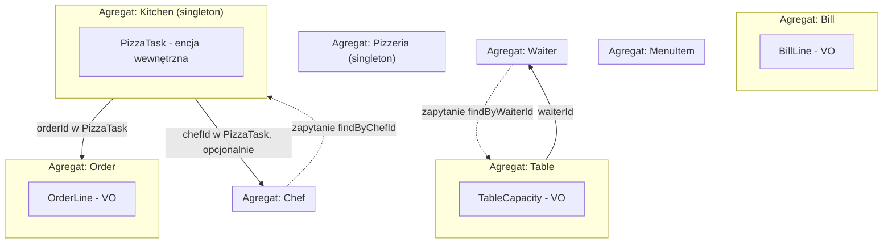

# Agregaty (Aggregates)

## Cel dokumentu

Dokument szczegółowo opisuje agregaty zidentyfikowane wstępnie w `320_domain_model.md` — ich granice transakcyjne, niezmienniki, referencje do innych agregatów oraz sposób zapewnienia spójności między nimi. Rozstrzyga też pytanie odłożone w `320_domain_model.md`: kto jest właścicielem relacji `Table` ↔ `Waiter`.

## Granica dokumentu

`321_aggregates.md` opisuje **granice** agregatów i **niezmienniki wymuszane w ich obrębie**. Nie opisuje szczegółowo pojedynczych encji i obiektów wartości (to `322_entities.md` i `323_value_objects.md`), metod usług domenowych (`324_domain_services.md`) ani zdarzeń integracyjnych publikowanych na zewnątrz Bounded Contextu (`325_integration_events.md`).

---

## Zasady projektowania agregatów

* Agregat jest granicą spójności transakcyjnej — jedna komenda modyfikuje dokładnie jedną instancję agregatu w jednej transakcji.
* Agregat root jest jedynym punktem wejścia — byty wewnętrzne agregatu (np. `BillLine`, `PizzaTask`) nie są dostępne ani modyfikowalne z zewnątrz bezpośrednio.
* Agregaty referencjonują się nawzajem wyłącznie przez identyfikator (`tableId`, `orderId`, `chefId` itd.), nigdy przez referencję obiektową.
* Niezmienniki obejmujące więcej niż jeden agregat (np. „stolik może być `Occupied` tylko, gdy jego kelner jest `Active`") nie są wymuszane atomowo wewnątrz jednego agregatu — są sprawdzane przez proces/usługę domenową w momencie wydawania komendy (spójność „na wejściu", nie twarda spójność transakcyjna) albo utrzymywane w spójności ostatecznej (eventual consistency) reagując na zdarzenia domenowe.
* Żaden agregat nie przechowuje odwrotnej referencji „dla wygody zapytań", jeśli nie jest ona potrzebna do wymuszenia własnego niezmiennika — takie zapytania realizuje repozytorium właściciela relacji (patrz rozstrzygnięcie `Table` ↔ `Waiter` poniżej).

---

## Agregaty — szczegółowy opis

### `Bill`

* **Aggregate root:** `Bill` (`billId`).
* **Zawartość:** lista `BillLine` (obiekty wartości), `Money` (w ramach `totalAmount`).
* **Niezmienniki:**
  * pozycje (`BillLine`) mogą być dopisywane wyłącznie, gdy `status = Open`,
  * `totalAmount` zawsze równa się sumie `totalPrice` wszystkich `BillLine`,
  * przejście `Open → Closed` wymaga, aby zarejestrowana płatność równała się `totalAmount` (lub `totalAmount = 0`),
  * `closedAt` jest ustawiane wyłącznie w momencie przejścia do `Closed`,
  * po zamknięciu (`Closed`) agregat jest niemodyfikowalny.
* **Referencje do innych agregatów:** brak. `Bill` nie przechowuje `guestGroupId`, `tableId` ani `orderId` — zgodnie z zasadą modelowania z `320_domain_model.md` („byty nie przechowują danych, które nie należą do ich odpowiedzialności"). Powiązanie `GuestGroup` ↔ `Bill` ↔ `Table` ↔ `Order` jest utrzymywane przez główny proces obsługi gości (poza agregatami, docelowo modelowany jako proces/saga w etapie architektury `340`).
* **Kontekst:** `Guest Service`.

### `Order`

* **Aggregate root:** `Order` (`orderId`).
* **Zawartość:** lista `OrderLine` (obiekty wartości).
* **Niezmienniki:**
  * `Order` nie może powstać bez co najmniej jednej pozycji `OrderLine`,
  * cykl życia jest ściśle liniowy i jednokierunkowy: `Accepted → Submitted → InPreparation → ReadyForDelivery → Delivered` — brak pomijania stanów, brak cofania, brak anulowania w dowolnym momencie,
  * po `Delivered` agregat jest niemodyfikowalny.
* **Referencje do innych agregatów:** brak (`Order` nie zna `tableId` ani `billId`, nie przechowuje cen).
* **Uwaga o spójności:** przejścia `Submitted → InPreparation` i `→ ReadyForDelivery` są inicjowane przez `Kitchen` — osobny agregat. Ponieważ jedna transakcja modyfikuje jeden agregat, te przejścia nie są wywoływane bezpośrednią metodą z `Kitchen` na `Order`, lecz efektem zdarzenia domenowego publikowanego przez `Kitchen` (np. `OrderReadyForDelivery`), które `Order` konsumuje w osobnej transakcji. Szczegóły zdarzeń w `325_integration_events.md`.
* **Kontekst:** `Guest Service` (z udziałem `Kitchen`).

### `Table`

* **Aggregate root:** `Table` (`tableId`).
* **Zawartość:** `TableCapacity` (obiekt wartości).
* **Niezmienniki:**
  * `waiterId` może zostać zmienione wyłącznie, gdy `status = Free` (zajętego stolika nie można przypisać do innego kelnera),
  * liczba miejc (`capacity`) może być modyfikowana wyłącznie, gdy `status = Free`,
  * stolik w stanie `Occupied` nie może zostać usunięty z konfiguracji,
  * ostatni stolik w konfiguracji pizzerii nie może zostać usunięty (niezmiennik sprawdzany na poziomie procesu/usługi domenowej, ponieważ wymaga policzenia innych instancji `Table` — poza granicą pojedynczego agregatu).
* **Referencje do innych agregatów:** `waiterId` (opcjonalne, referencja do `Waiter`).
* **Uwaga o spójności:** warunek „stolik może przejść w `Occupied` tylko, gdy jego kelner jest `Active`" wymaga odczytu stanu `Waiter` — sprawdzany jest przez `Host` (usługę domenową) w momencie przydzielania gości, tuż przed wydaniem komendy do `Table`, a nie jako atomowy niezmiennik wewnątrz `Table`.
* **Kontekst:** `Resource Management` (definicja zasobu), `Guest Service` (powiązanie z wizytą gości).

### `MenuItem`

* **Aggregate root:** `MenuItem` (`menuItemId`).
* **Zawartość:** brak encji wewnętrznych ani obiektów wartości poza własnymi atrybutami.
* **Niezmienniki:**
  * `status` przechodzi `Active ↔ Disabled` bezpośrednio w obie strony — cykl może się powtarzać wielokrotnie,
  * zmiana ceny nie wpływa na `BillLine` już zapisane w istniejących rachunkach (te są kopiami wykonanymi w momencie przyjęcia zamówienia),
  * wszystkie operacje na `MenuItem` (tworzenie, modyfikacja, `Active ↔ Disabled`) są dozwolone wyłącznie, gdy pizzeria jest w stanie `Closed` — sprawdzane przez proces/usługę domenową, ponieważ wymaga odczytu stanu agregatu `Pizzeria`, poza granicą `MenuItem` (`253_menu_management.md`, `255_pizzeria_lifecycle.md`). Skoro `Closed` gwarantuje brak jakichkolwiek aktywnych zamówień, usunięcie pozycji nie wymaga dodatkowego warunku ochronnego (nie ma już stanu pośredniego `Retiring`),
  * `Disabled` to miękkie usunięcie (soft delete) na poziomie aplikacji: pozycja jest całkowicie niewidoczna i nieużywalna dla gości i kuchni, ale dane pozostają zachowane (nie jest to trwałe usunięcie rekordu).
* **Referencje do innych agregatów:** brak.
* **Uwaga terminologiczna:** `320_domain_model.md` nazywa ten agregat „`Menu`", ale jedynym bytem z tożsamością w sekcji encji jest `MenuItem` — nie istnieje osobny byt `Menu` z własnym `menuItemId`/cyklem życia. Każda instancja `MenuItem` jest osobnym agregatem; „menu" to potoczna nazwa zbioru wszystkich instancji `MenuItem`, nie sam agregat. Nazwa skorygowana w `320_domain_model.md`.
* **Kontekst:** `Resource Management`.

### `Waiter`

* **Aggregate root:** `Waiter` (`waiterId`).
* **Zawartość:** brak encji wewnętrznych ani obiektów wartości poza własnymi atrybutami (patrz rozstrzygnięcie poniżej dot. `assignedTables`).
* **Niezmienniki:**
  * `status` przechodzi `Active → Terminating → Terminated`, a z `Terminated` można wrócić do `Active` (ponowne zatrudnienie) — `Terminated` nie jest stanem końcowym, cykl `Active → Terminating → Terminated → Active` może się powtarzać,
  * bezpośrednie przejście `Terminating → Active` nie jest dozwolone — powrót do `Active` jest możliwy wyłącznie z `Terminated` (kelner musi dokończyć zwalnianie, zanim zostanie ponownie zatrudniony).
* **Referencje do innych agregatów:** brak (patrz rozstrzygnięcie `Table` ↔ `Waiter` poniżej — `Waiter` nie przechowuje listy przypisanych stolików).
* **Uwaga o spójności:** blokada rozpoczęcia `Terminating` dla ostatniego aktywnego kelnera oraz blokada `Terminating → Terminated`, dopóki kelner ma przypisany zajęty (`Occupied`) stolik, wymagają odpytania agregatów `Table` (i licznika aktywnych kelnerów) — sprawdzane przez proces/usługę domenową zarządzania personelem, poza granicą `Waiter`.
* **Kontekst:** `Resource Management`.

### `Chef`

* **Aggregate root:** `Chef` (`chefId`).
* **Zawartość:** brak encji wewnętrznych ani obiektów wartości poza własnymi atrybutami.
* **Niezmienniki:**
  * `status` przechodzi `Active → Terminating → Terminated`, a z `Terminated` można wrócić do `Active` (ponowne zatrudnienie) — `Terminated` nie jest stanem końcowym, cykl `Active → Terminating → Terminated → Active` może się powtarzać,
  * bezpośrednie przejście `Terminating → Active` nie jest dozwolone — powrót do `Active` jest możliwy wyłącznie z `Terminated`.
* **Referencje do innych agregatów:** brak.
* **Uwaga o spójności:** blokada rozpoczęcia `Terminating` dla ostatniego aktywnego kucharza oraz blokada `Terminating → Terminated`, dopóki kucharz ma `PizzaTask` w stanie `InPreparation`, wymagają odpytania agregatu `Kitchen` (właściciela `PizzaTask`) — `Chef` sam nie wie, którą pizzę aktualnie przygotowuje. Sprawdzane przez proces/usługę domenową zarządzania personelem.
* **Kontekst:** `Resource Management` (zasób), `Kitchen` (aktor produkcyjny referencjonowany przez `chefId` w `PizzaTask`).

### `Pizzeria`

* **Aggregate root:** `Pizzeria` — singleton.
* **Zawartość:** brak encji wewnętrznych.
* **Niezmienniki:**
  * `status` przechodzi wyłącznie `Closed → Open → Closing → Closed`,
  * `Closed → Open` wymaga co najmniej jednego aktywnego kelnera, jednego aktywnego kucharza i jednego stolika w konfiguracji — sprawdzane przez proces/usługę domenową przy otwarciu (wymaga odpytania agregatów `Waiter`, `Chef`, `Table`),
  * `Closing → Closed` następuje automatycznie, gdy wszystkie `Bill` są `Closed`, wszystkie `Table` są `Free` i nie ma aktywnych `Order`.
* **Referencje do innych agregatów:** brak.
* **Uwaga o spójności:** automatyczne przejście `Closing → Closed` jest z natury spójnością ostateczną (eventual consistency) — `Pizzeria` reaguje na zdarzenia domenowe (zamknięcie ostatniego rachunku, zwolnienie ostatniego stolika) publikowane przez inne agregaty, a nie na bezpośrednie odpytanie w jednej transakcji.
* **Kontekst:** `Pizzeria Lifecycle`.

### `Kitchen`

* **Aggregate root:** `Kitchen` — singleton (jedna instancja koordynująca produkcję w ramach jednej pizzerii, analogicznie do `Pizzeria`).
* **Zawartość:** encje wewnętrzne `PizzaTask`, obiekt wartości `PreparationTime`.
* **Niezmienniki:**
  * każdy `PizzaTask` należy do dokładnie jednego `orderId`,
  * `PizzaTask.status` przechodzi wyłącznie `Pending → InPreparation → Ready`,
  * jeden `chefId` może mieć przypisany co najwyżej jeden `PizzaTask` w stanie `InPreparation` jednocześnie (OQ-004 w `111_domain_decisions.md`) — niezmiennik wymuszany wewnątrz `Kitchen`, ponieważ wszystkie `PizzaTask` żyją w tym samym agregacie,
  * `Order` (z perspektywy kuchni) jest `ReadyForDelivery` dopiero, gdy wszystkie jego `PizzaTask` są `Ready`.
* **Referencje do innych agregatów:** `orderId` (w każdym `PizzaTask`), `chefId` (opcjonalnie, w `PizzaTask` przypisanym do kucharza).
* **Uwaga o spójności:** przypisanie `PizzaTask` do konkretnego `chefId` wymaga, aby dany kucharz był `Active` — sprawdzane przez `Kitchen` w momencie dystrybucji na podstawie odczytu stanu `Chef` (odczyt, nie transakcja obejmująca oba agregaty).
* **Kontekst:** `Kitchen`.

---

## Rozstrzygnięcie: własność relacji `Table` ↔ `Waiter`

`320_domain_model.md` pozostawił otwarte pytanie: która strona jest źródłem prawdy dla relacji „kelner ma przypisane stoliki", skoro `Table.waiterId` i `Waiter.assignedTables` utrzymywały tę samą relację z dwóch stron.

**Decyzja:** `Table` jest jedynym źródłem prawdy. `Table.waiterId` pozostaje jedynym trwałym zapisem relacji. `Waiter` **nie przechowuje** `assignedTables` jako atrybutu.

**Uzasadnienie:**

* `Waiter` nie ma żadnego niezmiennika wymagającego znajomości własnej listy stolików — może istnieć z zero lub więcej przypisanymi stolikami, bez ograniczenia liczby.
* `Table` natomiast ma twardy niezmiennik wymagający dokładnie jednej wartości: „stolik ma co najwyżej jednego kelnera" — naturalnie wyrażony jako pojedyncze pole `waiterId`, a nie element listy po drugiej stronie.
* Przechowywanie relacji po obu stronach wymagałoby dwóch osobnych transakcji (jedna na `Table`, jedna na `Waiter`) synchronizowanych przy każdej zmianie przypisania, co tworzy ryzyko rozjazdu danych bez korzyści — żaden niezmiennik `Waiter` tego nie wymaga.
* Wszystkie miejsca w procesach (`211_guest_arrival.md`, `252_table_management.md`, `254_staff_management.md`), które potrzebują „stolików danego kelnera" (polityka wyboru stolika przez `Host`, sprawdzenie „czy kelner dokończył obsługę zajętych stolików" przed `Terminated`), realizują to jako **zapytanie** do repozytorium `Table` (`findByWaiterId`, opcjonalnie filtrowane po `status`), a nie jako odczyt atrybutu `Waiter`.

Ten sam wzorzec stosujemy konsekwentnie dla `Chef`: obciążenie kucharza („czy aktualnie przygotowuje pizzę") jest zapytaniem do `Kitchen`/`PizzaTask` (`findByChefId`, `status = InPreparation`), a nie atrybutem `Chef`.

**Zasada ogólna:** personel (`Waiter`, `Chef`) nigdy nie przechowuje odwrotnej referencji do przypisanych mu zasobów operacyjnych. Stan obciążenia jest zawsze wyliczany zapytaniem do agregatu będącego właścicielem zasobu (`Table` dla `Waiter`, `Kitchen` dla `Chef`), nigdy nie jest duplikowany jako pole encji personelu.

---

## Spójność między agregatami

Poniższa tabela mapuje reguły domenowe wspólne dla wielu bytów (`320_domain_model.md`, sekcja „Reguły domenowe wspólne dla wielu bytów") na mechanizm zapewnienia spójności:

| Reguła | Agregaty | Mechanizm |
|--------|----------|-----------|
| Otwarcie pizzerii wymaga aktywnego kelnera, kucharza i stolika | `Pizzeria`, `Waiter`, `Chef`, `Table` | Sprawdzenie „na wejściu" przez proces/usługę domenową w momencie komendy otwarcia. |
| Automatyczne zamknięcie pizzerii | `Pizzeria`, `Bill`, `Table`, `Order` | Spójność ostateczna — `Pizzeria` reaguje na zdarzenia zamknięcia rachunku / zwolnienia stolika. |
| Host przydziela stolik tylko z aktywnym kelnerem | `Table`, `Waiter` | Sprawdzenie „na wejściu" przez `Host` przed komendą `Table.assignGuestGroup`. |
| Zamknięcie rachunku wymaga dostarczenia wszystkich zamówień | `Bill`, `Order` | Sprawdzenie przez główny proces obsługi gości (poza agregatami — proces śledzi statusy `Order` samodzielnie, `Bill` ich nie zna). |
| Blokada zwolnienia ostatniego aktywnego kelnera/kucharza | `Waiter`, `Chef`, `Pizzeria` | Sprawdzenie „na wejściu" przez usługę domenową zarządzania personelem (liczy inne instancje `Waiter`/`Chef`). |
| `Terminating → Terminated` wymaga zakończenia bieżących zadań | `Waiter`↔`Table`, `Chef`↔`Kitchen` | Zapytanie o zasoby właściciela relacji (patrz rozstrzygnięcie powyżej). |
| Usunięcie pozycji menu wymaga dostarczenia wszystkich zamówień | `MenuItem`, `Order` | Sprawdzenie przez usługę domenową zarządzania menu. |

Żadna z powyższych reguł nie jest wymuszana jako pojedynczy, atomowy niezmiennik transakcyjny obejmujący dwa agregaty naraz — zgodnie z zasadą „jedna transakcja = jeden agregat" z sekcji **Zasady projektowania agregatów**.

---

## Mapa granic agregatów

Strzałki ciągłe (`-->`) to trwałe referencje przez ID przechowywane w agregacie. Strzałki przerywane (`-.->`) to zapytania odczytowe realizowane przez repozytorium właściciela relacji, bez trwałej referencji zwrotnej.

---

## Decyzje ostateczne

* ✅ **Kto jest właścicielem relacji `Table` ↔ `Waiter`?** `Table` — przez pole `waiterId`. `Waiter` nie przechowuje `assignedTables`; lista stolików kelnera jest zapytaniem do repozytorium `Table`.
* ✅ **Czy analogiczna zasada dotyczy `Chef` i `Kitchen`/`PizzaTask`?** Tak. `Chef` nie przechowuje listy przypisanych `PizzaTask` — obciążenie kucharza jest zapytaniem do `Kitchen`.
* ✅ **Czy `Bill` powinien przechowywać `guestGroupId`?** Nie. Zgodnie z zasadą modelowania z `320_domain_model.md`, powiązanie `GuestGroup` ↔ `Bill` jest utrzymywane przez główny proces obsługi gości, nie przez sam agregat `Bill`.
* ✅ **Czy „`Menu`" jest osobnym agregatem obok `MenuItem`?** Nie. Nazwa „`Menu`" w `320_domain_model.md` była nazwą potoczną zbioru instancji `MenuItem`, nie osobnym bytem — skorygowano w `320_domain_model.md`. Agregatem jest `MenuItem`.
* ✅ **Czy przejścia `Order` sterowane przez `Kitchen` (`Submitted → InPreparation → ReadyForDelivery`) są wywołaniem bezpośrednim czy zdarzeniem domenowym?** Zdarzeniem domenowym — `Kitchen` i `Order` to osobne agregaty, więc zmiana stanu `Order` w reakcji na postęp w `Kitchen` odbywa się w osobnej transakcji. Szczegóły w `325_integration_events.md`.
* ✅ **Czy `MenuItem` ma stan reprezentujący miękkie usunięcie?** Tak, `Disabled` — soft delete na poziomie aplikacji, osiągalny bezpośrednio z `Active` i odwracalny bezpośrednio z powrotem. Zaktualizowano `320_domain_model.md`, `253_menu_management.md`, `322_entities.md`.
* ✅ **Czy `MenuItem` ma stan pośredni `Retiring`?** Nie, usunięty. Istniał wyłącznie po to, by chronić już złożone zamówienia podczas wycofywania pozycji w trakcie serwisu. Skoro wszystkie operacje na `MenuItem` są teraz dozwolone wyłącznie w stanie `Closed` (gdzie z definicji nie ma aktywnych zamówień), nie ma niczego do ochrony — zaktualizowano `320_domain_model.md`, `253_menu_management.md`, `322_entities.md`.
* ✅ **Czy `Table` posiada nazwę widoczną w UI?** Tak, atrybut `name` (unikalny, wyłącznie do identyfikacji w UI, analogicznie do `GuestGroup.name`) — zaktualizowano `320_domain_model.md`, `252_table_management.md`, `322_entities.md`.
* ✅ **Czy `Terminated` jest stanem końcowym dla `Waiter` i `Chef`?** Nie. `Manager` może ponownie zatrudnić zwolnionego pracownika (`Terminated → Active`) — zaktualizowano też `320_domain_model.md` i `254_staff_management.md`. Bezpośrednie `Terminating → Active` pozostaje niedozwolone; powrót do `Active` prowadzi wyłącznie przez `Terminated`.

## Pytania do dalszej analizy

* Brak otwartych pytań w tym dokumencie.
